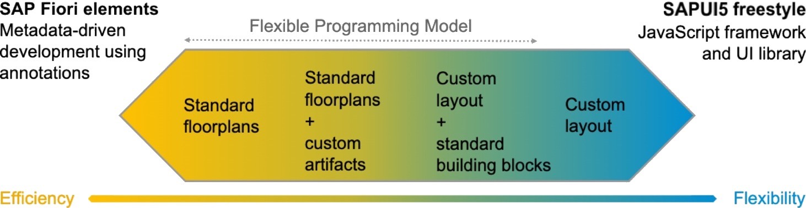
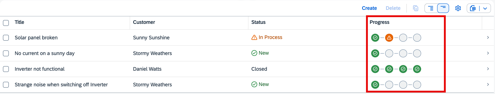
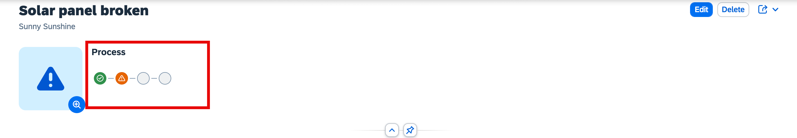
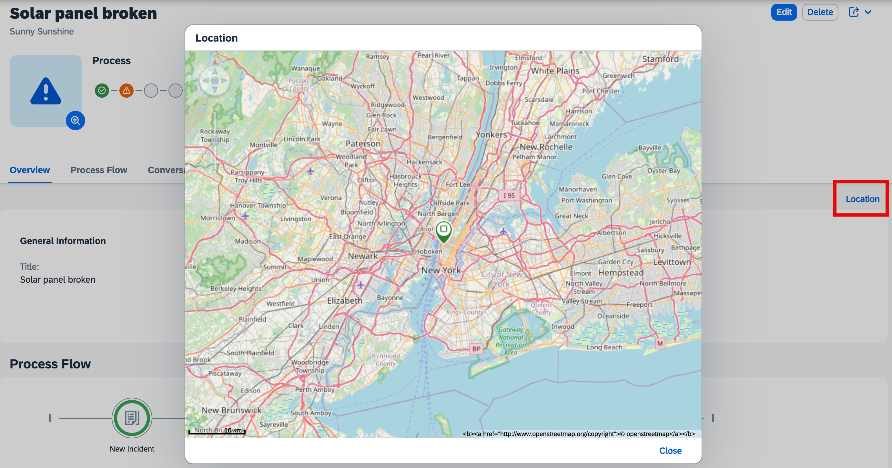
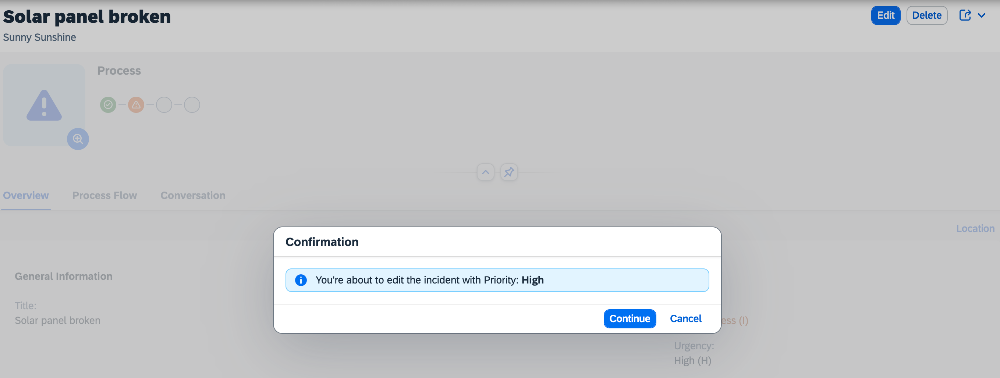

# Introduction

SAP Fiori elements for OData V4 offers multiple ways to extend applications according to your specific requirements.

The **Flexible Programming Model** offers various options, allowing developers to avoid a rigid choice between **SAP Fiori elements** and **freestyle SAPUI5** development. It provides the flexibility to use any SAPUI5 coding or controls within extension points, while also leveraging available building blocks and controller extensions to enhance applications. Additionally, it enables the creation of custom applications that run on the SAP Fiori elements framework, where all pages can be treated as custom pages.

# Flexible Programming Model

In this tutorial, we extend the Incident Management application using the flexible programming model to showcase the **Extension Points** and the **Controller Extensions**.

## Extension Points: Custom Column

In this section, we extend the Incidents table in the List Report Page with a custom column. This custom column is used to showcase the Micro Process Flow. The processor can use the  [MicroProcessFlow](https://sapui5.hana.ondemand.com/#/api/sap.suite.ui.commons.MicroProcessFlow) control to track the progress of an incident. 

## Extension Points: Custom Header Facet

In this section, we extend header section in the Object Page to add the custom header facet. This custom header facet is to showcase the Micro Process Flow. The processor can use the  [MicroProcessFlow](https://sapui5.hana.ondemand.com/#/api/sap.suite.ui.commons.MicroProcessFlow) control to track the progress of an incident.

## Extension Points: Custom Action

In this section, we add a custom action **Location** in the Object page. This custom action is to showcase the  location of the customer in a dialog using the [GeoMap](https://sapui5.hana.ondemand.com/#/api/sap.ui.vbm.GeoMap) control.

## Extension Points: Custom Section

In this chapter, we add a custom section **Process Flow** in the Object page. This custom section is to showcase the process flow of the incidents using the [ProcessFlow](https://sapui5.hana.ondemand.com/#/api/sap.suite.ui.commons.ProcessFlow) control.

## Controller Extension

In this section, we add a controller extension to showcase how we can extend the Fiori Elements Object Page controller and override the edit flow.

