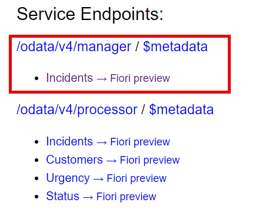

# Extend Incident Management Application with Manager Service

In this chapter, we extend the incident management application and create a new service for manager named as `ManagerService`.

## Create New Service

1. In the `srv` folder, create a new file named `manager-service.cds`.

2. Paste the following code snippet in the **manager-service.cds** file to create a new service named `ManagerService`.

```js
using { sap.capire.incidents as my } from '../db/schema';

service ManagerService {
  entity Incidents 
    as projection on my.Incidents {
    key Incidents.ID,
    title,
    customer.ID as customerID,
    customer.firstName || ' ' || customer.lastName as customer: String,
    customer.email as email,
    status.descr as status,
    urgency.code as urgency,
    createdAt,
    count(Incidents.conversation.message) as comments: Integer
    } group by ID, title, customer.ID, customer.firstName, customer.lastName, customer.email, status.descr, urgency.code, createdAt
}
```

This service adds a projection to the `Incidents` entity and provides data with the customer information and the number of comments.

## Test the service

1. While you are in the **incident-management folder**, choose the burger menu and then choose **Terminal** → **New Terminal**.

Now you can use the terminal to start a CAP server.

```bash
cds watch
```

2. If you open the link `http://localhost:4004` from SAP Business Application Studio in your browser, you’ll see the generic `index.html` page with the new service available:



3. You can test the service by clicking the **Incidents** entity link. You will see the following json response:

```json
{
  "@odata.context": "$metadata#Incidents",
  "value": [
    {
    "ID": "3583f982-d7df-4aad-ab26-301d4a157cd7",
    "title": "Solar panel broken",
    "customerID": "2b87f6ca-28a2-41d6-8c69-ccf16aa6389d",
    "customer": "Sunny Sunshine",
    "email": "sunny.sunshine@demo.com",
    "status": "In Process",
    "urgency": "H",
    "createdAt": "2024-03-04T06:23:57.563Z",
    "comments": 1
    },
    ...
  ]
}
```

You may have to stop the CAP server with Ctrl + C and start it again with the `cds watch` command.

## Summary

You have successfully created and tested a new service named `ManagerService`.