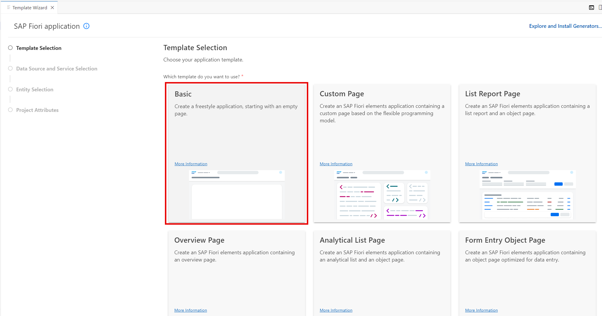
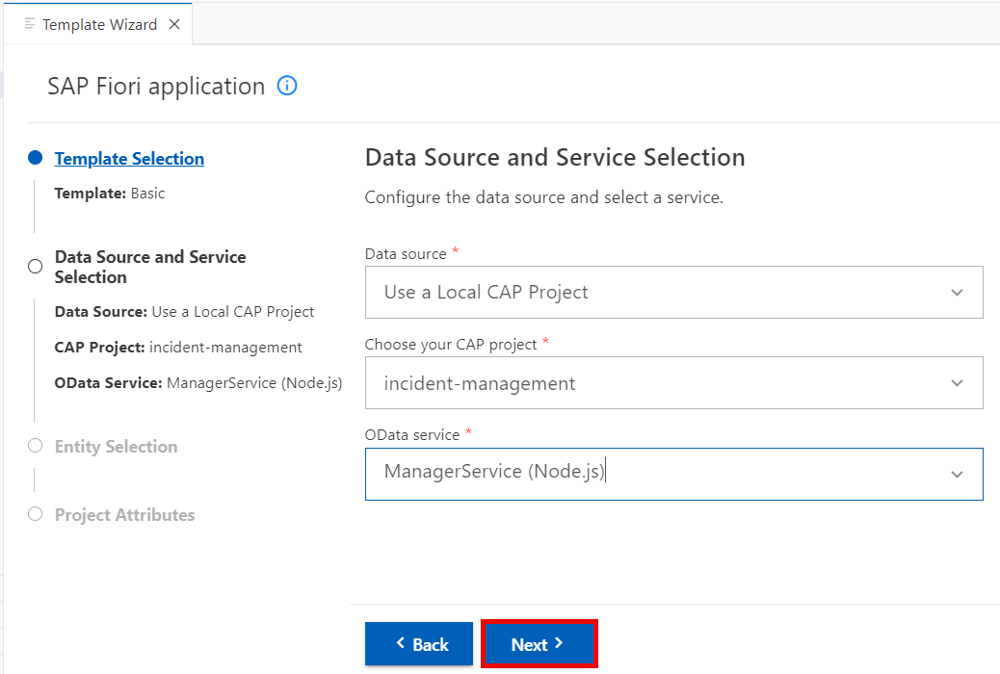
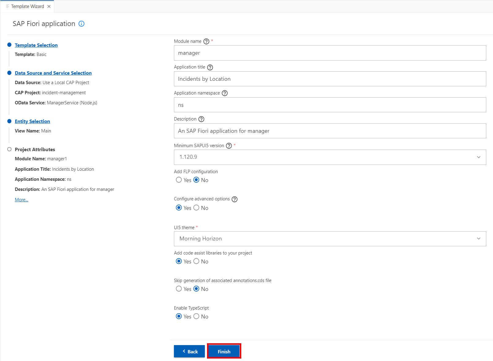

# Project Setup Using SAP Business Application Studio

Create a new SAPUI5 application based on a template provided by SAP Business Application Studio.

1. In SAP Business Application Studio, invoke the Command Palette ( **View** &rarr; **Command Palette** or <kbd>Shift</kbd> + <kbd>Command</kbd> + <kbd>P</kbd> for macOS / <kbd>Ctrl</kbd> + <kbd>Shift</kbd> + <kbd>P</kbd> for Windows) and choose **Fiori: Open Application Generator**.

2. Choose **Basic** template.

    

3. Choose **Next**.

4. In the next dialog, choose **Use a Local CAP Project** as your Data Source and choose your current **`incident-management`** project as the CAP project.

   > **Note:** In case you get the error: `Node module @sap/cds isn't found. Please install it and try again`, you have to install the corresponding CAP module which is also required   by the app generator as described in [Add CAP Tooling](https://cap.cloud.sap/docs/tools/#command-line-interface-cli). If not already done, please open a command line and run the following command:

    ```bash
    npm install --global @sap/cds-dk --@sap:registry=https://registry.npmjs.org/
    ```

   > See the [CAP Troubleshooting guide](https://cap.cloud.sap/docs/advanced/troubleshooting#npm-installation) for more details.
 

5. Select `ManagerService(Node.js)` as OData service and choose **Next**.

    

6. Enter **Main** as view name. Choose **Next**.

7. Enter the following in the Project Attributes

    |Name | value
    |--|:--:|
    | Module name | manager |
	| Application title | Incidents by Location |
	| Application Namespace | ns |
    | Description | An SAP Fiori application for managers |
    | Configure Advanced Options | Yes |
    | Add Code assist libraries to your project | Yes |
    | Enable TypeScript | Yes |
    | Add deployment configuration to MTA project | No |

> In this tutorial you use **TypeScript** for the custom code. TypeScript is a statically typed superset of JavaScript. It enhances JavaScript by adding optional static typing, allowing developers to define types for variables, parameters, and return values. TypeScript offers features like interfaces, enums, generics, and advanced type inference, facilitating code organization and maintenance. Its static type checking catches errors during development, reducing runtime issues and enhancing code reliability. TypeScript transpiles to plain JavaScript, ensuring compatibility with all JavaScript environments. Its tooling support, including code editors, linters, and debuggers, enhances productivity and code quality. TypeScript's adoption by major frameworks incl. SAPUI5 further solidifies its relevance in modern web development. Its popularity in large-scale projects and enterprise environments underscores its benefits for managing complex codebases. 

8. Leave the default values for all the other settings and choose **Finish**.

    

9. The project will be generated and a notification window will appear in the lower right corner once the process has completed. **Wait for the message that the project has been generated!**

## Summary

You have successfully created a new SAPUI5 application using SAP Business Application Studio.
