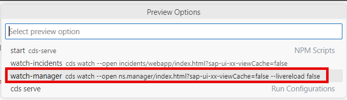
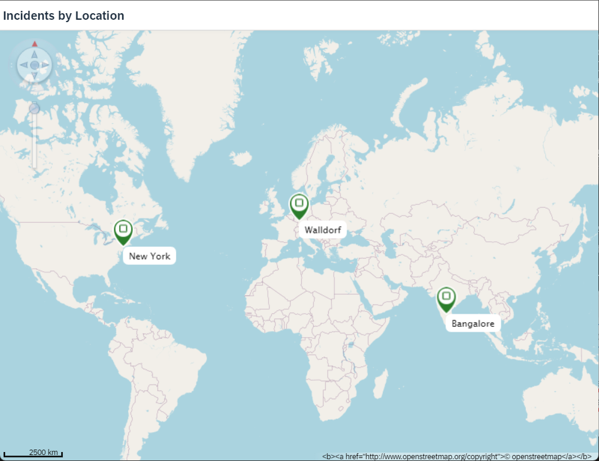

# Create the Main view

In this exercise you'll add Geo Map content to the main view of the application.

## Add Content to Main.view.xml

Lets add a map control to the `Main.view.xml` view by replacing its content as follows:

```xml
<mvc:View controllerName="ns.manager.controller.Main"
    xmlns:mvc="sap.ui.core.mvc" displayBlock="true"
    xmlns="sap.m"
    xmlns:vbm="sap.ui.vbm"
    >
    <Page id="page" title="{i18n>title}">
        <content>
            <vbm:GeoMap id="Map" width="100%" height="100%" mapConfiguration='{
                    "MapProvider": [{
                            "name": "Openstreetmap",
                            "copyright": "&lt;b&gt;&lt;a href=\"http://www.openstreetmap.org/copyright\"&gt;© openstreetmap&lt;/a&gt;&lt;/b&gt;",
                            "Source": [{
                                "id": "s1",
                                "url": "http://a.tile.openstreetmap.org/{LOD}/{X}/{Y}.png"
                            }, {
                                "id": "s2",
                                "url": "http://b.tile.openstreetmap.org/{LOD}/{X}/{Y}.png"
                            }, {
                                "id": "s3",
                                "url": "http://c.tile.openstreetmap.org/{LOD}/{X}/{Y}.png"
                        }]
                    }],
                    "MapLayerStacks": [{
                        "name": "DEFAULT",
                        "MapLayer": {
                            "name": "layer1",
                            "refMapProvider": "Openstreetmap",
                            "opacity": "1",
                            "colBkgnd": "RGB(255,255,255)"
                        }
                    }]
                }' refMapLayerStack="DEFAULT" initialZoom="1" initialPosition="8.6433518;49.3038134;0">
                <vbm:Spots items="{path: 'spotModel>/spots'}">
                        <vbm:Spot position="{spotModel>pos}" 
                                  tooltip="{spotModel>tooltip}" 
                                  type="Success"
                                  labelText="{spotModel>label}" 
                                  click="navToSpotStatus" />
                </vbm:Spots>
            </vbm:GeoMap>
        </content>
    </Page>
</mvc:View>
```

We have a basic [MVC View](https://sapui5.hana.ondemand.com/sdk/#/api/sap.ui.core.mvc.View%23overview). The controller for this view is specified as `ns.manager.controller.Main`, indicating that the logic for this view is implemented in the Main controller of the **manager** namespace. [Namespaces](https://sapui5.hana.ondemand.com/sdk/#/topic/2421a2c9fa574b2e937461b5313671f0.html) for UI controls are declared. The default namespace for controls is `sap.m` (the main SAPUI5 controls [library](https://sapui5.hana.ondemand.com/sdk/#/api/sap.m)), and the **vbm** namespace for controls related to the Visual Business Maps (VBM) library is also declared. Later those namespaces will be used before the control name to identify a corresponding control library.

Inside the view, there's a Page control. Its title is bound to the resource model using `{i18n>title}`. The [resource model](https://sapui5.hana.ondemand.com/sdk/#/topic/91f122a36f4d1014b6dd926db0e91070.html#loio91f122a36f4d1014b6dd926db0e91070) is used as a wrapper for resource bundles. In data binding you use the resource model instance, for example, to bind texts of a control to language-dependent resource bundle properties.

> When defining a [binding](https://sapui5.hana.ondemand.com/sdk/#/topic/68b9644a253741e8a4b9e4279a35c247) path for a control, a binding context is created which connects this control to a data model. The UI control then gets the data through that context and displays it on the screen. To reference model data in a view , you can use the simple binding syntax `{/path/to/data}`.

Within the Page's content, there's a [GeoMap control](https://sapui5.hana.ondemand.com/#/entity/sap.ui.vbm.GeoMap). The GeoMap control shows an image based map loaded from one or more configurable external providers. Here it's configured to display a geographical map using [OpenStreetMap](www.openstreetmap.org) tiles. The map is initialized with a specific zoom level (**initialZoom**) and position (**initialPosition**). The map also has a default layer (**MapLayer**) configured with **OpenStreetMap** as the reference map provider.

Inside the GeoMap control, there's a collection of spots. These spots are bound to a model with `spotModel>/spots`. The data in the spots model is taken from the JSON file which we have created before. Each spot is represented by a [Spot control](https://sapui5.hana.ondemand.com/sdk/#/api/sap.ui.vbm.Spot). A Spot is actually an image drawn at the given position. The position, tooltip, and label text are bound to properties from the **spotModel**. Next step, you will define a click event handler `navToSpotStatus` in the corresponding controller.


## Adjusting the view controller

1. Open `Main.controller.ts` in the `app/manager/webapp/controller/` folder and replace its content as follows:

```ts
import UIComponent from "sap/ui/core/UIComponent";
import Controller from "sap/ui/core/mvc/Controller";
import { GeoMap$KeyPressEvent } from "sap/ui/vbm/GeoMap";

/**
 * @namespace ns.manager.controller
 */
export default class Main extends Controller {
    navToSpotStatus(event: GeoMap$KeyPressEvent) {
        const spotIndex = event.getSource().getBindingContext("spotModel")?.getProperty("customerID");
        UIComponent.getRouterFor(this).navTo("RouteSpotStatus", {index: spotIndex});
    }
}
```

The controller code defines a class named **Main** that extends the **Controller** class from `sap.ui.core.mvc` library. This class serves as the controller for a specific view in the application.

The method **navToSpotStatus** takes an event parameter of type **[GeoMap$KeyPressEvent](https://sapui5.hana.ondemand.com/sdk/#/api/sap.ui.vbm.GeoMap%23events/keyPress)**. This method is invoked on click event of the **Spot** control defined in the **Main** view. The method retrieves the customer ID of the clicked spot from the event's source binding context, assuming that there's a property named **customerID** in the **spotModel** binding context. Then it [navigates](https://sapui5.hana.ondemand.com/sdk/#/api/sap.ui.core.routing.Router%23methods/navTo) to a specific route named **RouteSpotStatus**, passing the customer ID as a parameter. This route will be defined later in the tutorial.

## Test the result

1. In SAP Business Application Studio, invoke the Command Palette ( **View** &rarr; **Command Palette** or <kbd>Shift</kbd> + <kbd>Command</kbd> + <kbd>P</kbd> for macOS / <kbd>Ctrl</kbd> + <kbd>Shift</kbd> + <kbd>P</kbd> for Windows) and choose **Fiori: Preview Application**.

2. Select the **watch-manager** npm script.



This script runs the service in an application modeler terminal session and automatically starts the SAP Fiori application in a new browser session.

3. You should see a map with the markers as follows:



## Summary

You have successfully created the main view and the controller.
