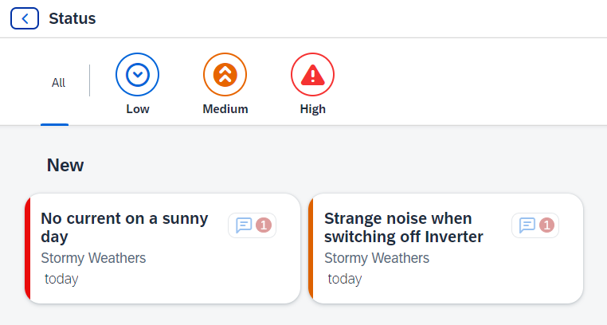

# Add Formatters and maintain Localization (i18n)

## Add Formatters

1. Within the `app/manager/webapp`, create a new folder named `format` and inside it, create a new file named `util.ts`. This file should be located at `app/manager/webapp/format/util.ts`.

2. Add the following content

```ts
import  MessageType from "sap/ui/core/message/MessageType";
import DateFormat from "sap/ui/core/format/DateFormat";

export enum Urgency {
    High = "H",
    Medium = "M",
    Low = "L"
}

export function formatHighlightColor(urgency: Urgency): MessageType {

    if (urgency === Urgency.High) {return MessageType.Error;}
    else if (urgency === Urgency.Medium) {return MessageType.Warning;}
    return MessageType.Information;

}

export function formatDaysAgo(createdAt: string): string {
    const oDateTimeWithTimezoneFormat = DateFormat.getDateTimeWithTimezoneInstance();
    const since = oDateTimeWithTimezoneFormat.parse(createdAt);
    const oDateFormat = DateFormat.getDateInstance({relative: true});
    return oDateFormat.format(since![0] as Date);
}
```

This TypeScript code defines a utility module containing formatter functions for formatting data in SAPUI5 applications. It contains the following parts:

Imports:

- **Urgency Enum**: Defines an enum named **Urgency**, which represents different levels of urgency. It includes values for *High*, *Medium*, and *Low* urgencies.

- **formatHighlightColor Function**: Defines a function named **formatHighlightColor** that accepts an urgency level and returns a message type based on the urgency level.

- **formatDaysAgo Function**: Defines a function named **formatDaysAgo** that formats a date string representing the creation date of an item into a relative date format (e.g., "2 days ago"). It uses SAPUI5's [DateFormat](https://sapui5.hana.ondemand.com/sdk/#/topic/91f2eba36f4d1014b6dd926db0e91070) class to parse and format the date string. This formatter is used to display the relative time since an incident was created.

### Maintain translations

Files in the `i18n` folder in SAPUI5 store translations for text labels and messages, enabling localization and multilingual support. These files are text files containing name-value pairs, where the translated text is assigned to a translation key. These keys are then used in the view, fragments, etc., for displaying the appropriate translated text. Multiple files exist for different languages and they are loaded as [resource bundles](https://sapui5.hana.ondemand.com/sdk/#/topic/91f225ce6f4d1014b6dd926db0e91070.html), which support dynamic language switching.

1. Open file `i18n.properties` from the `app/manager/webapp/i18n` folder.

2. Add the following data at the end of the file:

```properties
#Texts for the SpotStatus view
titleSpotStatus=Status
msgFilterAll=All
msgFilterLow=Low
msgFilterMedium=Medium
msgFilterHigh=High
noIncidents=No Incidents
```

### Test

1. Start the preview as described previously.

2. Now by clicking at any marker you will see all the incidents for the selected customer. 



You can filter the incident list by selecting the filter icons.

## Summary

You have added formatters for enhanced data display and maintained translatable UI texts. All in all, you have now created a freestyle SAPUI5 application.