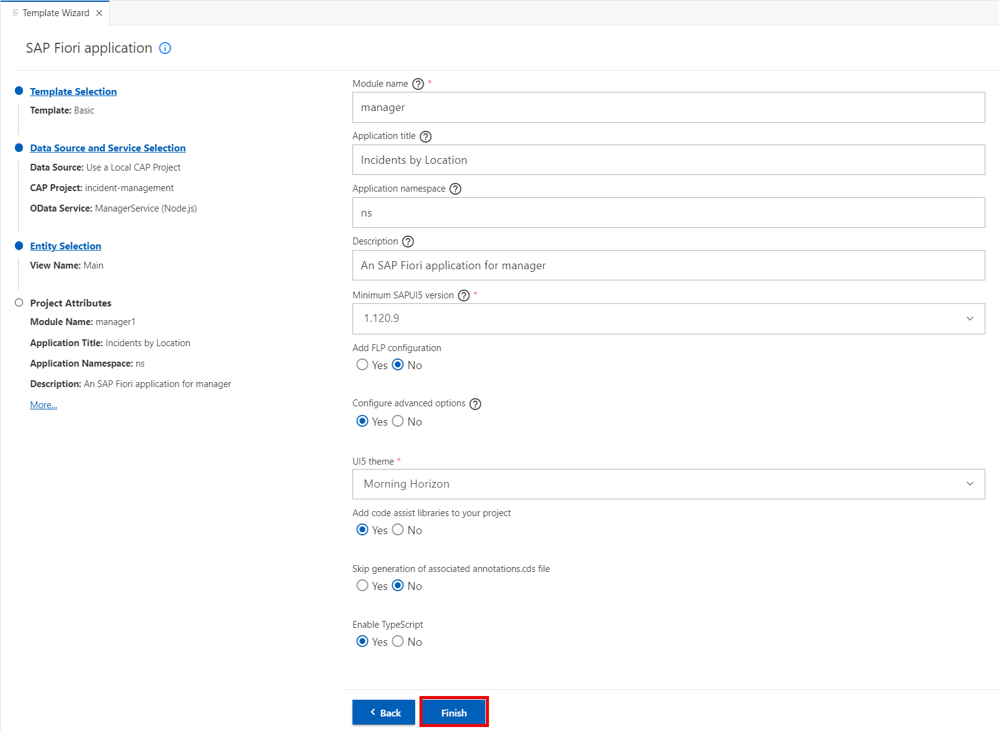

# Implement Freestyle SAPUI5 Application

## Project Setup using SAP Business Application Studio

Create a new SAPUI5 application based on a template provided by SAP Business Application Studio.

1. In SAP Business Application Studio, invoke the Command Palette ( **View** &rarr; **Command Palette** or <kbd>Shift</kbd> + <kbd>Command</kbd> + <kbd>P</kbd> for macOS / <kbd>Ctrl</kbd> + <kbd>Shift</kbd> + <kbd>P</kbd> for Windows) and choose **Fiori: Open Application Generator**.

2. Choose **Basic** template.

    

3. Choose **Next**.

4. In the next dialog, choose **Use a Local CAP Project** as your Data Source and choose your current **`incident-management`** project as the CAP project.

    ::: tip
   In case you get the error: `Node module @sap/cds isn't found. Please install it and try again`, you have to install the corresponding CAP module which is also required   by the app generator as described in [Add CAP Tooling](https://cap.cloud.sap/docs/tools/#command-line-interface-cli)
    If not already done, please open a command line and run the following command:

    ```bash
    npm install --global @sap/cds-dk --@sap:registry=https://registry.npmjs.org/
    ```

    See the [CAP Troubleshooting guide](https://cap.cloud.sap/docs/advanced/troubleshooting#npm-installation) for more details.
    :::

5. Select `ManagerService(Node.js)` as OData service and choose **Next**.

    

6. Enter **Main** as view name. Choose **Next**.

7. Enter the following in the Project Attributes

    |Name | value
    |--|:--:|
    | Module name | manager |
	| Application title | Incidents by Location |
	| Application Namespace | ns |
    | Description | An SAP Fiori application for manager |
    | Configure Advanced Options | Yes |
    | Add Code assist libraries to your project | Yes |
    | Enable TypeScript | Yes |

> In this tutorial we will use **TypeScript** for the custom code. TypeScript is a statically typed superset of JavaScript. It enhances JavaScript by adding optional static typing, allowing developers to define types for variables, parameters, and return values. TypeScript offers features like interfaces, enums, generics, and advanced type inference, facilitating code organization and maintenance. Its static type checking catches errors during development, reducing runtime issues and enhancing code reliability. TypeScript transpiles to plain JavaScript, ensuring compatibility with all JavaScript environments. Its tooling support, including code editors, linters, and debuggers, enhances productivity and code quality. TypeScript's adoption by major frameworks incl. SAPUI5 further solidifies its relevance in modern web development. Its popularity in large-scale projects and enterprise environments underscores its benefits for managing complex codebases. 

8. Leave the default values for all the other settings and choose **Finish**.

    

9. The project is now being generated, and a notification window will appear in the lower right corner once the process has completed. **Wait for the message that the project has been generated!**

## Adjusting the first view

### Add dependencies

In addition to the main SAPUI5 library `sap.m`, you will use other control libraries like `sap.ui.layout` and `sap.ui.vbm` in your application. The central point for configuring your SAPUI5 application is the `manifest.json` file, which is located at `manager/webapp/manifest.json`

1. Open `manifest.json` file

2. Go to the section `sap.ui5` and add the following libraries in `dependencies/libs` section

```json
    "dependencies": {
        ... ,
        "libs": {
          ... ,
          "sap.ui.layout": {},
          "sap.ui.vbm": {}
        }
      },
```

### Import Data

> In this exercise we assume that the geo data of the customers is stored separately in some other service. We mock the data in local JSON file for the simplicity reason. 

Add a local data source to the application and display the data on the further enhanced SAPUI5 view.

1. Right-click on the `manager/webapp/` folder and select **New Folder**.

2. Enter `localData` as the folder name and confirm by pressing **Enter**.

3. Right-click on the `localData` folder and select New File.

4. Enter `spots.json` as file name and confirm by pressing **Enter**.

5. Copy the following content into `spots.json`.

```json
{
  "spots": [
    {
      "pos": "8.641622;49.293696;0",
      "tooltip": "Walldorf, Germany",
      "label": "Walldorf",
      "customerID": "1004155"
    },
    {
      "pos": "77.714421;12.977788;0",
      "tooltip": "Bangalore, India",
      "label": "Bangalore",
      "customerID": "1004161"
    },
    {
      "pos": "-74.000380;40.753616;0",
      "tooltip": "New York, USA",
      "label": "New York",
      "customerID": "1004100"
    }
  ]
}
```

### Configure Data Source

After adding the spots data to your application, you'll need to configure the data source which provides the spots data.

1. Open `manifest.json` file.

2. Go to the section `sap.app`. Add a new **spotService** data source to the  **dataSources** section as follows:

```json
    "sap.app": {
        ... ,
        "dataSources": {
            ... ,
            "spotService": {
                "type": "JSON",
                "uri": "./localData/spots.json"
            }
        }
    }
```

3. Go to the section `sap.ui5`. Add a **spotModel** model to the **models** section as follows:

```json
"sap.ui5": {
  ... ,
  "models": {
    ... ,
    "spotModel":{
        "type": "sap.ui.model.json.JSONModel",
        "dataSource": "spotService",
        "preload": true
    }
  },
```

4. Since we does not use flexibility services, disable them by changing the first entry in the `sap.ui5` section as follows:

```json
    "sap.ui5": {
      "flexEnabled": false,
    ...
```

### Add Content to Main.view.xml

Lets add a map control to the `Main.view.xml` view by replacing its content as follows:

```xml
<mvc:View controllerName="ns.manager.controller.Main"
    xmlns:mvc="sap.ui.core.mvc" displayBlock="true"
    xmlns="sap.m"
    xmlns:vbm="sap.ui.vbm"
    >
    <Page id="page" title="{i18n>title}">
        <content>
            <vbm:GeoMap id="Map" width="100%" height="100%" mapConfiguration='{
                    "MapProvider": [{
                            "name": "Openstreetmap",
                            "copyright": "&lt;b&gt;&lt;a href=\"http://www.openstreetmap.org/copyright\"&gt;© openstreetmap&lt;/a&gt;&lt;/b&gt;",
                            "Source": [{
                                "id": "s1",
                                "url": "http://a.tile.openstreetmap.org/{LOD}/{X}/{Y}.png"
                            }, {
                                "id": "s2",
                                "url": "http://b.tile.openstreetmap.org/{LOD}/{X}/{Y}.png"
                            }, {
                                "id": "s3",
                                "url": "http://c.tile.openstreetmap.org/{LOD}/{X}/{Y}.png"
                        }]
                    }],
                    "MapLayerStacks": [{
                        "name": "DEFAULT",
                        "MapLayer": {
                            "name": "layer1",
                            "refMapProvider": "Openstreetmap",
                            "opacity": "1",
                            "colBkgnd": "RGB(255,255,255)"
                        }
                    }]
                }' refMapLayerStack="DEFAULT" initialZoom="1" initialPosition="8.6433518;49.3038134;0">
                <vbm:Spots items="{path: 'spotModel>/spots'}">
                        <vbm:Spot position="{spotModel>pos}" 
                                  tooltip="{spotModel>tooltip}" 
                                  type="Success"
                                  labelText="{spotModel>label}" 
                                  click="navToSpotStatus" />
                </vbm:Spots>
            </vbm:GeoMap>
        </content>
    </Page>
</mvc:View>
```

We have a basic [MVC View](https://sapui5.hana.ondemand.com/sdk/#/api/sap.ui.core.mvc.View%23overview). The controller for this view is specified as `ns.manager.controller.Main`, indicating that the logic for this view is implemented in the Main controller of the **manager** namespace. [Namespaces](https://sapui5.hana.ondemand.com/sdk/#/topic/2421a2c9fa574b2e937461b5313671f0.html) for UI controls are declared. The default namespace for controls is `sap.m` (the main SAPUI5 controls [library](https://sapui5.hana.ondemand.com/sdk/#/api/sap.m)), and the **vbm** namespace for controls related to the Visual Business Maps (VBM) library is also declared. Later those namespaces will be used before the control name to identify a corresponding control library.

Inside the view, there's a Page control. Its title is bound to the resource model using `{i18n>title}`. The [resource model](https://sapui5.hana.ondemand.com/sdk/#/topic/91f122a36f4d1014b6dd926db0e91070.html#loio91f122a36f4d1014b6dd926db0e91070) is used as a wrapper for resource bundles. In data binding you use the resource model instance, for example, to bind texts of a control to language-dependent resource bundle properties.

> When defining a [binding](https://sapui5.hana.ondemand.com/sdk/#/topic/68b9644a253741e8a4b9e4279a35c247) path for a control, a binding context is created which connects this control to a data model. The UI control then gets the data through that context and displays it on the screen. To reference model data in a view , you can use the simple binding syntax `{/path/to/data}`.

Within the Page's content, there's a [GeoMap control](https://sapui5.hana.ondemand.com/#/entity/sap.ui.vbm.GeoMap). The GeoMap control shows an image based map loaded from one or more configurable external providers. Here it's configured to display a geographical map using [OpenStreetMap](www.openstreetmap.org) tiles. The map is initialized with a specific zoom level (**initialZoom**) and position (**initialPosition**). The map also has a default layer (**MapLayer**) configured with **OpenStreetMap** as the reference map provider.

Inside the GeoMap control, there's a collection of spots. These spots are bound to a model with `spotModel>/spots`. The data in the spots model is taken from the JSON file which we have created before. Each spot is represented by a [Spot control](https://sapui5.hana.ondemand.com/sdk/#/api/sap.ui.vbm.Spot). A Spot is actually an image drawn at the given position. The position, tooltip, and label text are bound to properties from the **spotModel**. Click event handler `navToSpotStatus` will be defined in the corresponding controller.


### Adjusting the view controller

1. Open `Main.controller.ts` in the `app/manager/webapp/controller/` folder and replace its content as follows:

```ts
import UIComponent from "sap/ui/core/UIComponent";
import Controller from "sap/ui/core/mvc/Controller";
import { GeoMap$KeyPressEvent } from "sap/ui/vbm/GeoMap";

/**
 * @namespace ns.manager.controller
 */
export default class Main extends Controller {
    navToSpotStatus(event: GeoMap$KeyPressEvent) {
        const spotIndex = event.getSource().getBindingContext("spotModel")?.getProperty("customerID");
        UIComponent.getRouterFor(this).navTo("RouteSpotStatus", {index: spotIndex});
    }
}
```

The controller code defines a class named **Main** that extends the **Controller** class from `sap.ui.core.mvc` library. This class serves as the controller for a specific view in the application.

The method **navToSpotStatus** takes an event parameter of type **[GeoMap$KeyPressEvent](https://sapui5.hana.ondemand.com/sdk/#/api/sap.ui.vbm.GeoMap%23events/keyPress)**. This method is invoked on click event of the **Spot** control defined in the **Main** view. The method retrieves the customer ID of the clicked spot from the event's source binding context, assuming that there's a property named **customerID** in the **spotModel** binding context. Then it [navigates](https://sapui5.hana.ondemand.com/sdk/#/api/sap.ui.core.routing.Router%23methods/navTo) to a specific route named **RouteSpotStatus**, passing the customer ID as a parameter. This route will be defined later in the tutorial.

### Test the result

1. In SAP Business Application Studio, invoke the Command Palette ( **View** &rarr; **Command Palette** or <kbd>Shift</kbd> + <kbd>Command</kbd> + <kbd>P</kbd> for macOS / <kbd>Ctrl</kbd> + <kbd>Shift</kbd> + <kbd>P</kbd> for Windows) and choose **Fiori: Preview Application**.

2. Select the **watch-manager** npm script.


This script runs the service in an application modeler terminal session and automatically starts the SAP Fiori application in a new browser session.

3. You should see a map with the markers as follows:


## Creating the second view

### Configure routes

1. Open `manifest.json` file from the `app/manager/webapp` folder.

2. Go to section `sap.ui5`/`routing`/`routes`.

3. Add the second route named `RouteSpotStatus` to the `routes` section with following content

```json
"routes": [
    ... ,
    {
    "name": "RouteSpotStatus",
    "pattern": "spot/{index}",
    "target": ["TargetSpotStatus"]
    }
]
```

A route is a way to address a specific part or state of an application with a specific URL hash pattern. The default route with empty pattern (or optional query as in this case) is what is displayed by default, the new route has the pattern spot/{index}, so a URL hash starting with "spot/" will trigger navigation to the target of this new route (target will be defined below). The path segment {index} in curly braces is variable and used to transport a value to the target, in this case which spot should be displayed in detail.

4. Scroll to the section below `sap.ui5`/`routing`/`targets`

5. Add a new entry to the targets configuration. This is the target of the newly added route and defines `SpotStatus` as the name of the view to display. It also defines the `viewLevel`, which helps routing to understand the navigation direction and displaying the correct transition animation. Add the corresponding `viewLevel` to the TargetMain. In total, the targets section now needs to look like this:

```json
"targets": {
    ... ,
    "TargetSpotStatus": {
        "viewId": "spotStatus",
        "viewName": "SpotStatus",
        "viewLevel": 2
    }
}
```
A target defines a view that is displayed, it can be referenced by one or more routes. Whenever a target is displayed, the corresponding view is loaded and shown in the app. The two targets point to the two content views which will be available in the application.

### Add a new view

1. Create a new view file named `SpotStatus.view.xml` in the location `app/manager/webapp/view/SpotStatus.view.xml`.

2. Add the following content

```xml
<mvc:View
    displayBlock="true"
    controllerName="ns.manager.controller.SpotStatus"
    xmlns:mvc="sap.ui.core.mvc"
    xmlns:f="sap.f"
    xmlns:cssgrid="sap.ui.layout.cssgrid"
    xmlns:core="sap.ui.core"
    core:require="{
        util: 'ns/manager/format/util'
    }"
    xmlns="sap.m">
    <Page
        id="SpotStatusPage"
        title="{i18n>titleSpotStatus}"
        showNavButton="true"
        navButtonPress=".navToMain">
        <content>
            <IconTabBar id="iconTabBar" select=".onFilterSelect" class="sapUiResponsiveContentPadding">
                <items>
                    <IconTabFilter showAll="true" text="{i18n>msgFilterAll}" key="All"/>
                    <IconTabSeparator/>
                    <IconTabFilter icon="sap-icon://arrow-down" iconColor="Default" text="{i18n>msgFilterLow}" key="L"/>
                    <IconTabFilter icon="sap-icon://system-exit-2" iconColor="Critical" text="{i18n>msgFilterMedium}" key="M"/>
                    <IconTabFilter icon="sap-icon://warning" iconColor="Negative" text="{i18n>msgFilterHigh}" key="H"/>
                </items>
                <content>
                    <f:GridList id="incidentList"
                                items="{path: '/Incidents', sorter: {path:'status', group: true, descending: true}}"
                                noDataText="No incidents">
                                <f:customLayout>
                                    <cssgrid:GridBoxLayout boxesPerRowConfig="XL7 L4 M3 S1" />
                                </f:customLayout>
                        <f:items>
                            <f:GridListItem type="Active" highlight="{path: 'urgency', formatter:'util.formatHighlightColor'}">
                                <HBox justifyContent="SpaceBetween"
                                    class="sapUiSmallMargin">
                                    <VBox>
                                        <Title text="{title}" wrapping="true" />
                                        <Label text="{customer}" wrapping="true" />
                                        <Label text="{status}" wrapping="true" visible="false"/>
                                        <ObjectNumber
                                            unit="{path: 'createdAt', formatter: 'util.formatDaysAgo'}"/>
                                    </VBox>

                                    <Button
                                        id="BadgedButton"
                                        class="sapUiTinyMarginBeginEnd"
                                        icon="sap-icon://comment"
                                        type="Default"
                                        enabled="false">
                                        <customData>
                                            <BadgeCustomData
                                                key="badge"
                                                value="{comments}"
                                                visible="true"/>
                                        </customData>
                                    </Button>
                                </HBox>
                            </f:GridListItem>
                        </f:items>
                        <f:noData>
                            <IllustratedMessage enableVerticalResponsiveness="true" illustrationType="sapIllus-EmptyList"/>
                        </f:noData>
                    </f:GridList>
                </content>
            </IconTabBar>
        </content>
    </Page>
</mvc:View>
```

This view is also defined using the XML namespace **mvc**, indicating the use of the Model-View-Controller (MVC) pattern. The controller for this view is specified as `ns.manager.controller.SpotStatus`, indicating that the logic for this view is implemented in the SpotStatus controller within the **manager** namespace.

Namespaces for UI controls are declared. Here, namespaces for **sap.f** ([SAP Fiori Controls](https://sapui5.hana.ondemand.com/sdk/#/api/sap.f)), **sap.ui.layout.cssgrid** ([Flexible Grid Layout](https://experience.sap.com/fiori-design-web/flexible-grid/)), and **sap.ui.core** are declared. While **sap.ui.core** is required for the `require` utility, which can be used to import arbitrary modules. This utility enables the use of methods within these modules, such as `formatters`. 

Additionally, a custom namespace **util** is declared for custom utility functions, which are defined later in this tutorial.

Inside the view, there's a **Page** control. Its title is bound to a resource bundle using `{i18n>titleSpotStatus}`. It also has a navigation button that triggers the **navToMain** function when pressed.

Within the Page's content, there's an **[IconTabBar](https://sapui5.hana.ondemand.com/sdk/#/entity/sap.m.IconTabBar)** control. It represents a collection of tabs with associated content. The control contains several **[IconTabFilter](https://sapui5.hana.ondemand.com/sdk/#/entity/sap.m.IconTabFilter)** controls, each representing a filter option. The function called **onFilterSelect** is assigned as a handler for the **[select](https://sapui5.hana.ondemand.com/sdk/#/api/sap.m.IconTabBar%23events/select)** event which fires when an item is selected.

Inside the icon tab bar content, there's a **[GridList](https://sapui5.hana.ondemand.com/#/entity/sap.f.GridList)** control which represents a list-based control with grid layout capabilities. It displays a list of incidents from the default model. Each incident is represented by a **GridListItem**. The items are sorted based on the **status** property in descending order.

The **GridList** uses a custom layout defined by **[GridBoxLayout](https://sapui5.hana.ondemand.com/#/api/sap.ui.layout.cssgrid.GridBoxLayout%23methods/Summary)**, which specifies the number of boxes per row for extra large, large, medium and small screens. 

Inside each **GridListItem**, there are **[HBox](https://sapui5.hana.ondemand.com/sdk/#/api/sap.m.HBox)** and a **[VBox](https://sapui5.hana.ondemand.com/sdk/#/api/sap.m.VBox)** components representing a horizontal and vertical flexible box layouts, respectively. This contains various controls such as **Title**, **Label**, **ObjectNumber**, and a **Button**. These controls display information about each `incident`, including its title, customer name, status, and creation date. The **Button** is disabled and includes custom data with a badge representing the number of comments.

Some view properties are defined via [formatters](https://sapui5.hana.ondemand.com/sdk/#/topic/07e4b920f5734fd78fdaa236f26236d8.html). Formatters are used to define the formatting of data on the UI, while data types work in both directions: they format the data on the UI and parse and validate user input that is entered. You can either use standard formatters and data types or define your own custom objects. Here in the current view a color of every **GridListItem** is determined by the formatter function **formatHighlightColor** from the `utils` module (which will be added later). Similarly, the creation date of the incident is presented in the human-readable manner using the **formatDaysAgo** formatter.

If there are no incidents to display, an **[IllustratedMessage](https://sapui5.hana.ondemand.com/#/entity/sap.f.IllustratedMessage)** is shown with an empty list illustration.

### Add a view controller

1. Create a new view file named `SpotStatus.controller.ts` in the location `app/manager/webapp/controller/SpotStatus.controller.ts`.

2. Add the following content

```ts
import Controller from "sap/ui/core/mvc/Controller";
import UIComponent from "sap/ui/core/UIComponent";
import Filter from "sap/ui/model/Filter";
import FilterOperator from "sap/ui/model/FilterOperator";
import { IconTabBar$SelectEvent } from "sap/m/IconTabBar";
import IconTabBar from "sap/m/IconTabBar";
import ListBinding from "sap/ui/model/ListBinding";
import { Urgency } from "../format/util";
import { Route$MatchedEvent } from "sap/ui/core/routing/Route"; 

/**
 * @namespace ns.manager.controller
 */
export default class SpotStatus extends Controller {
    
    private defaultFilter: Filter;

    getUrgencyFilter(key: string): Filter[]{
        return (Object.values(Urgency) as Array<string>).includes(key) ? [new Filter("urgency", FilterOperator.EQ, key, false)] : [];
    }

    onFilterSelect(event: IconTabBar$SelectEvent): void {
        const key = event.getParameter("key");
        this.setFilter(key);
    }

    navToMain() {
        UIComponent.getRouterFor(this).navTo("RouteMain");
    }

    onInit() {
        const oRouter = (this.getOwnerComponent() as UIComponent)?.getRouter();
        oRouter.getRoute("RouteSpotStatus")!.attachMatched(this.onRouteMatched, this);
    }

    private onRouteMatched(event: Route$MatchedEvent): void {
        const oParameters: any = event.getParameters();
        const customerId = oParameters.arguments.index;
        this.defaultFilter = new Filter("customerID", FilterOperator.EQ, customerId, false);
        this.setFilter((this.getView()?.byId("iconTabBar") as IconTabBar)?.getSelectedKey());
    }

    private setFilter(key: string | undefined): void {
        let statusFilters: Filter[] = [];
        const listBinding = this.getView()?.byId("incidentList")?.getBinding("items") as ListBinding;      
        if (key) {
            statusFilters = this.getUrgencyFilter(key);
        }
        listBinding.filter([this.defaultFilter, ...statusFilters]);        
    }

}
```

The controller contains the following functions:

- **navToMain**: Navigates back to the main view via the **RouteMain** route.

- **onInit**: Lifecycle hook method called when the controller is initialized. It sets a handler for the **[routeMatched](https://sapui5.hana.ondemand.com/sdk/#/api/sap.ui.core.routing.Router%23events/Summary)** event. The **routeMatched** event is fired, when the current URL hash matches the pattern of the route or its subroutes.

- **onRouteMatched**: Event handler method called when the **RouteSpotStatus** route is matched. It retrieves the customer ID from the route parameters and adjusts the default filter accordingly (private class property **defaultFilter**). Then the default filter is used as the active one.

- **setFilter**: Sets the active filter for the list based on the selected key in the **IconTabBar**.

- **getUrgencyFilter**: Returns an array of **Filter** objects based on the provided key (urgency level).

- **onFilterSelect**: Event handler method triggered when an item is selected in the **IconTabBar** control. It sets the filter based on the selected key.

Overall, this controller gets the information of the routing by using **onRouteMatched** event. This data is stored as a default filter for the **Icon Tab Bar** component. Additional filters will be applied by clicking the corresponding **Icon Tab Filter**.

### Add Formatters

1. Within the `app/manager/webapp`, create a new folder named `format` and inside it, create a new file named `util.ts`. This file should be located at `app/manager/webapp/format/util.ts`.

2. Add the following content

```ts
import  MessageType from "sap/ui/core/message/MessageType";
import DateFormat from "sap/ui/core/format/DateFormat";

export enum Urgency {
    High = "H",
    Medium = "M",
    Low = "L"
}

export function formatHighlightColor(urgency: Urgency): MessageType {

    if (urgency === Urgency.High) {return MessageType.Error;}
    else if (urgency === Urgency.Medium) {return MessageType.Warning;}
    return MessageType.Information;

}

export function formatDaysAgo(createdAt: string): string {
    const oDateTimeWithTimezoneFormat = DateFormat.getDateTimeWithTimezoneInstance();
    const since = oDateTimeWithTimezoneFormat.parse(createdAt);
    const oDateFormat = DateFormat.getDateInstance({relative: true});
    return oDateFormat.format(since![0] as Date);
}
```

This TypeScript code defines a utility module containing formatter functions for formatting data in SAPUI5 applications. It contains the following parts:

Imports:

- **Urgency Enum**: Defines an enum named **Urgency**, which represents different levels of urgency. It includes values for *High*, *Medium*, and *Low* urgencies.

- **formatHighlightColor Function**: Defines a function named **formatHighlightColor** that accepts an urgency level and returns a message type based on the urgency level.

- **formatDaysAgo Function**: Defines a function named **formatDaysAgo** that formats a date string representing the creation date of an item into a relative date format (e.g., "2 days ago"). It uses SAPUI5's [DateFormat](https://sapui5.hana.ondemand.com/sdk/#/topic/91f2eba36f4d1014b6dd926db0e91070) class to parse and format the date string. This formatter is used to display the relative time since an incident was created.

### Maintain translations

Files in the `i18n` folder in SAPUI5 store translations for text labels and messages, enabling localization and multilingual support. These files are text files containing name-value pairs, where the translated text is assigned to a translation key. These keys are then used in the view, fragments, etc., for displaying the appropriate translated text. Multiple files exist for different languages and they are loaded as [resource bundles](https://sapui5.hana.ondemand.com/sdk/#/topic/91f225ce6f4d1014b6dd926db0e91070.html), which support dynamic language switching.

1. Open file `i18n.properties` from the `app/manager/webapp/i18n` folder.

2. Add the following data at the end of the file:

~~~
#Texts for the SpotStatus view
titleSpotStatus=Status
msgFilterAll=All
msgFilterLow=Low
msgFilterMedium=Medium
msgFilterHigh=High
noIncidents=No Incidents
~~~

### Test

1. Start the preview as was described previously.

2. Now by clicking at any marker you will see all the incidents for the selected customer. 


You can filter the incident list by selecting the filter icons.

## Summary

You have created a freestyle SAP Fiori app with 2 views.