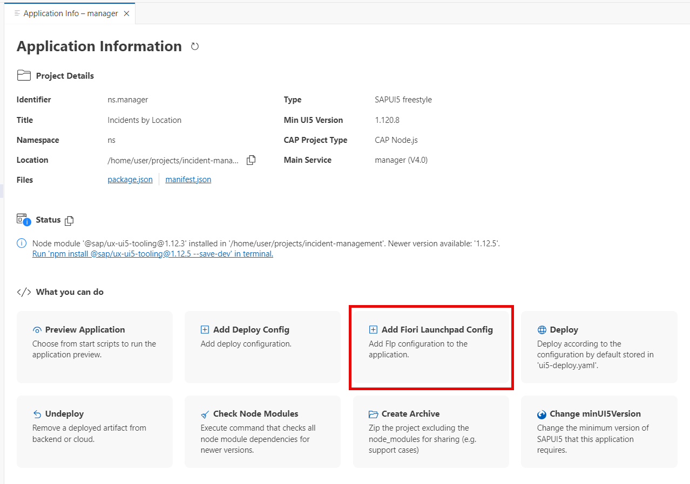
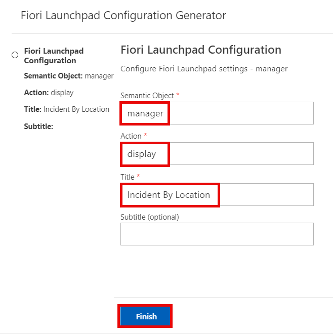
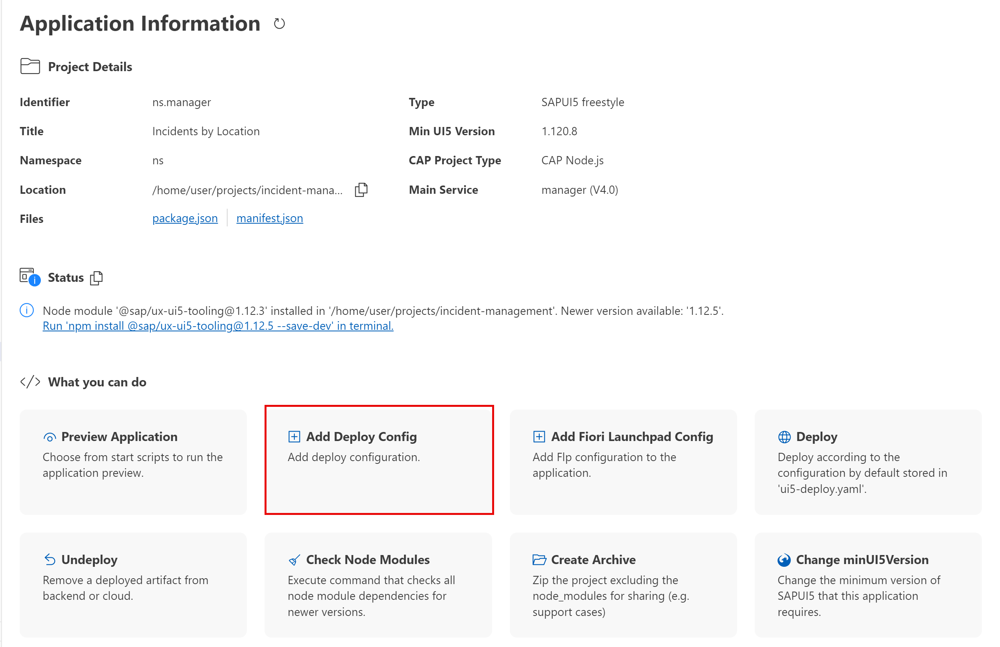
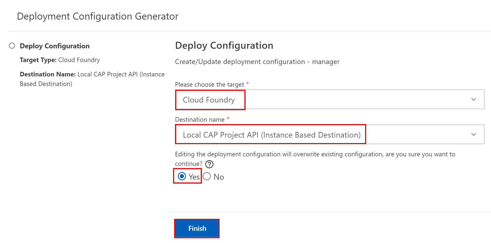
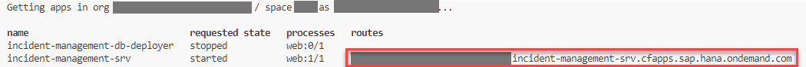
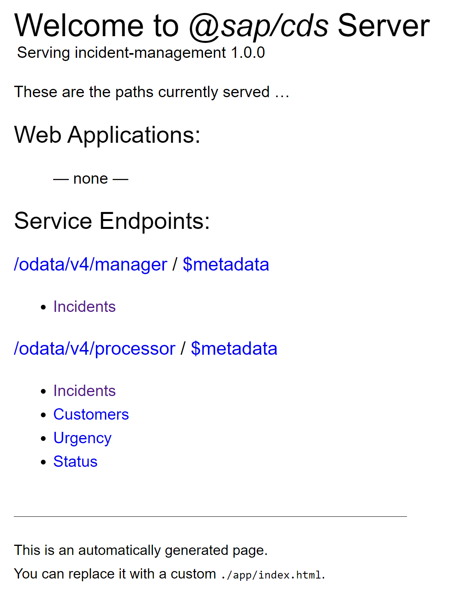
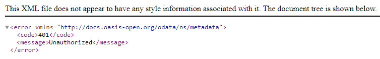

# Deploy and Run the application on SAP BTP, Cloud Foundry

## Introduction

The SAP BTP, Cloud Foundry environment allows you to create polyglot cloud applications in Cloud Foundry. It contains the SAP BTP, Cloud Foundry runtime, which is based on the open-source application platform managed by the Cloud Foundry Foundation.

The SAP BTP, Cloud Foundry environment enables you to develop new business applications and business services, supporting multiple runtimes, programming languages, libraries, and services.

For more information about the Cloud Foundry environment, see [Cloud Foundry Environment](https://help.sap.com/docs/btp/sap-business-technology-platform/cloud-foundry-environment).

## Prerequisites

* You have prepared the project for productive usage.

## Add Navigation target for Manager UI

Navigation targets are required to navigate between applications and to start applications from SAP Build Work Zone, standard edition. In this step, you create and add the navigation target **manager-display** to the application manifest file **manifest.json**.

1. In the **Application Info - manager** tab, choose the **Add Fiori Launchpad Config** tile.

    > To open the **Application Info - manager** tab: 
    >
    >1. Invoke the Command Palette - **View** &rarr; **Command Palette** or <kbd>Command</kbd> + <kbd>Shift</kbd> + <kbd>P</kbd> for macOS / <kbd>Ctrl</kbd> + <kbd>Shift</kbd> + <kbd>P</kbd> for Windows. 
    >2. Choose **Fiori: Open Application Info**.
    >3. In the next popup select `manager` app.

    

2. In the **Fiori Launchpad Configuration** dialog:

      - Enter **manager** as the **Semantic Object**.
      - Enter **display** as the **Action**.
      - Enter **Incident By Location** as the **Title**.
      - Choose **Finish**.

      

This navigation configuration adds the following section in **app/manager/webapp/manifest.json**:

```json[10-23]
"sap.app": {
  "id": "ns.manager",
  ...
  "sourceTemplate": {
    ...
  },
  "dataSources": {
    ...
  },
  "crossNavigation": {
    "inbounds": {
      "manager-display": {
        "semanticObject": "manager",
        "action": "display",
        "title": "{{flpTitle}}",
        "signature": {
          "parameters": {},
          "additionalParameters": "allowed"
        }
      }
    }
  }
...
}
```

## Using MTA

The tool will deploy the modules and services in the deployment descriptor file **mta.yaml**.

You’ll deploy your app with the [Cloud MTA Build Tool](https://sap.github.io/cloud-mta-build-tool/). The tool will deploy the modules and services in the deployment descriptor file **mta.yaml**.

If you don't have the `mta.yaml` file in the project already then run the following command to generate it:

```
  cds add mta
```

## Add the UI application

1. Under **Application Info - manager**, choose the **Add Deploy Config** tile.

    

    > To open the **Application Info - manager** tab: 
    >
    >1. Invoke the Command Palette - **View** &rarr; **Command Palette** or <kbd>Command</kbd> + <kbd>Shift</kbd> + <kbd>P</kbd> for macOS / <kbd>Ctrl</kbd> + <kbd>Shift</kbd> + <kbd>P</kbd> for Windows. 
    >2. Choose **Fiori: Open Application Info**.
    >3. In the next popup select `manager` app.

2. In the **Deploy Configuration** dialog:

      - Choose option **Cloud Foundry** in the dropdown menu under **Please choose the target**.
      - Choose option **Local CAP Project API (Instance Based Destination)** In the dropdown menu under **Destination name**.
      - Choose the **Yes** option under **Editing the deployment configuration will overwrite existing configuration, are you sure you want to continue?**.
      - Choose **Finish**.

    

This adds the SAP Cloud service configuration at the end of the **app/manager/webapp/manifest.json** file:

```json
 "sap.cloud": {
    "public": true,
    "service": "incidents"
  }
```

It also generates new modules and updates the corresponding resources in the **mta.yaml** file.

```yaml[5-28, 36-51, 57, 61]
_schema-version: '3.1'
...
module:
  ...
- name: incident-management-app-content
  type: com.sap.application.content
  path: .
  requires:
  - name: incident-management_html_repo_host
    parameters:
      content-target: true
  build-parameters:
    build-result: resources
    requires:
    - artifacts:
      - nsincidents.zip
      name: nsincidents
      target-path: resources/
    - artifacts:
      - nsmanager.zip
      name: nsmanager
      target-path: resources/
- name: nsincidents
  type: html5
  path: app/incidents
  build-parameters:
    build-result: dist
    builder: custom
    commands:
    - npm install
    - npm run build:cf
    supported-platforms: []
- name: nsmanager
  type: html5
  path: app/manager
  build-parameters:
    build-result: dist
    builder: custom
    commands:
    - npm install
    - npm run build:cf
    supported-platforms: []
resources:
... 
- name: incident-management-destination-service
  type: org.cloudfoundry.managed-service
  parameters:
    config:
      HTML5Runtime_enabled: true
      init_data:
        instance:
          destinations:
          - Authentication: NoAuthentication
            Name: ui5
            ProxyType: Internet
            Type: HTTP
            URL: https://ui5.sap.com
          - Authentication: NoAuthentication
            HTML5.DynamicDestination: true
            HTML5.ForwardAuthToken: true
            Name: incident-management-srv-api
            ProxyType: Internet
            Type: HTTP
            URL: ~{srv-api/srv-url}
          existing_destinations_policy: update
      version: 1.0.0
    service: destination
    service-name: incident-management-destination-service
    service-plan: lite
  requires:
  - name: srv-api
- name: incident-management_html_repo_host
  ...
parameters:
  deploy_mode: html5-repo
  ...  
```

> This configuration includes your UI application as the HTML5 module **nsmanager**.

## Assemble with the Cloud MTA Build Tool

Run the following command to assemble everything into a single **mta.tar** archive:

```bash
mbt build
```

See [Multitarget Applications in the Cloud Foundry Environment](https://help.sap.com/products/BTP/65de2977205c403bbc107264b8eccf4b/d04fc0e2ad894545aebfd7126384307c.html?locale=en-US) to learn more about MTA-based deployment.

## Deploy to the SAP BTP, Cloud Foundry runtime

1. From the root of the **INCIDENT-MANAGEMENT** project, choose the burger menu, and then choose **Terminal** &rarr; **New Terminal**.

2. Log in to your subaccount in SAP BTP:

    ```bash
    cf api <API-ENDPOINT>
    cf login
    cf target -o <ORG> -s <SPACE>
    ```

    > You can find the API endpoint in the **Overview** section of your subaccount in the SAP BTP cockpit.

3. Run the following command to deploy the generated archive:

    ```bash
    cf deploy mta_archives/incident-management_1.0.0.mtar 
    ```

4. Check if all services have been created:

    ```bash 
    cf services
    ```

    You should see the following services in your space:

    

5. Check if the apps are running:

    ```bash
    cf apps
    ```

  

6. Enter the route displayed for **incident-management-srv** in your browser.

    

    You see the CAP start page:

   

7. When you choose the **Incidents** service entity, you will see an error message. 

    

This is because your request is missing the required authentication and authorizations for the service. In the next tutorial, you will access your UIs from SAP Build Work Zone, standard edition which will provide the required access information.


