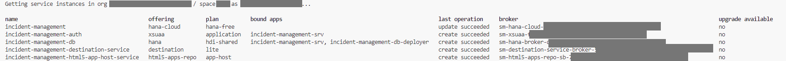
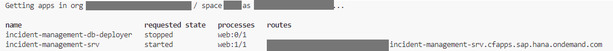

# Deploy and Run the application on SAP BTP, Cloud Foundry

## Introduction

The SAP BTP, Cloud Foundry environment allows you to create polyglot cloud applications in Cloud Foundry. It contains the SAP BTP, Cloud Foundry runtime, which is based on the open-source application platform managed by the Cloud Foundry Foundation.

The SAP BTP, Cloud Foundry environment enables you to develop new business applications and business services, supporting multiple runtimes, programming languages, libraries, and services.

For more information about the Cloud Foundry environment, see [Cloud Foundry Environment](https://help.sap.com/docs/btp/sap-business-technology-platform/cloud-foundry-environment).

## Prerequisites

* You have prepared the project for productive usage.

## Using MTA

The tool will deploy the modules and services in the deployment descriptor file **mta.yaml**.

You’ll deploy your app with the [Cloud MTA Build Tool](https://sap.github.io/cloud-mta-build-tool/). The tool will deploy the modules and services in the deployment descriptor file **mta.yaml**.

If you don't have the `mta.yaml` file in the project already then run the following command to generate it:

```
  cds add mta
```

## Assemble with the Cloud MTA Build Tool

Run the following command to assemble everything into a single **mta.tar** archive:

```bash
mbt build
```

See [Multitarget Applications in the Cloud Foundry Environment](https://help.sap.com/products/BTP/65de2977205c403bbc107264b8eccf4b/d04fc0e2ad894545aebfd7126384307c.html?locale=en-US) to learn more about MTA-based deployment.

## Deploy to the SAP BTP, Cloud Foundry runtime

1. From the root of the **INCIDENT-MANAGEMENT** project, choose the burger menu, and then choose **Terminal** &rarr; **New Terminal**.

2. Log in to your subaccount in SAP BTP:

    ```bash
    cf api <API-ENDPOINT>
    cf login
    cf target -o <ORG> -s <SPACE>
    ```

    > You can find the API endpoint in the **Overview** section of your subaccount in the SAP BTP cockpit.

3. Run the following command to deploy the generated archive:

    ```bash
    cf deploy mta_archives/incident-management_1.0.0.mtar 
    ```

4. Check if all services have been created:

    ```bash 
    cf services
    ```

    You should see the following services in your space:

    

5. Check if the apps are running:

    ```bash
    cf apps
    ```

  


