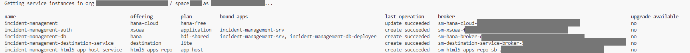
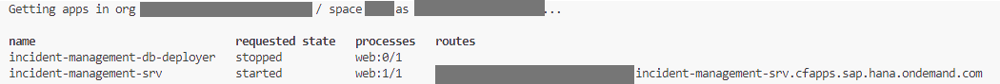

# Deploy and Run the application on SAP BTP, Cloud Foundry

## Introduction

The SAP BTP, Cloud Foundry environment allows you to create polyglot cloud applications in Cloud Foundry. It contains the SAP BTP, Cloud Foundry runtime, which is based on the open-source application platform managed by the Cloud Foundry Foundation.

The SAP BTP, Cloud Foundry environment enables you to develop new business applications and business services, supporting multiple runtimes, programming languages, libraries, and services.

For more information about the Cloud Foundry environment, see [Cloud Foundry Environment](https://help.sap.com/docs/btp/sap-business-technology-platform/cloud-foundry-environment).

## Prerequisites

* You have prepared the project for productive usage.

## Using MTA

The tool will deploy the modules and services in the deployment descriptor file **mta.yaml**.

You’ll deploy your app with the [Cloud MTA Build Tool](https://sap.github.io/cloud-mta-build-tool/). The tool will deploy the modules and services in the deployment descriptor file **mta.yaml**.

If you don't have the `mta.yaml` file in the project already then run the following command to generate it:

```shell
cds add mta
```
### Configuration Updates

**Changes that need to be made in the mta.yaml**

The following snippet needs to be added at modules->- name: incident-management-app-deployer->build-parameters->requires

```yaml
- name: incidentmanagementmanager
  artifacts:
    - manager.zip
  target-path: resources/
```

> [!TIP]
> **Note 2:** In `manifest.json` (`dataSources -> mainService`), change:

```json
"url": "/odata/v4/manager/"
```

to

```json
"url": "odata/v4/manager/"
```

> [!IMPORTANT]
>
> **`manager.zip` not generated on Windows:** The `zip` shell command does not exist on Windows. `cds add html5-repo` generates `app/manager/ui5.yaml` with the `ui5-task-zipper` task, which handles zip creation on all platforms. If `manager.zip` is still not produced after the build:
>
> 1. Verify that `app/manager/ui5.yaml` contains the `ui5-task-zipper` entry under `builder.customTasks` (see [Prepare HTML5 Applications](./9-prep-for-production.md)).
> 2. If it is missing, re-run `cds add html5-repo` from the project root to regenerate it.
> 3. If re-running does not add it (for example, because the file already exists and is not overwritten), add the entry manually:
>
>    ```yaml
>    builder:
>      customTasks:
>        - name: ui5-task-zipper
>          afterTask: generateVersionInfo
>          configuration:
>            archiveName: manager
>            relativePaths: true
>            additionalFiles:
>              - xs-app.json
>    ```
>

1. Run the build for the manager app and verify that `app/manager/dist/manager.zip` is created before proceeding to the MTA build:

    ```bash
    cd app/manager
    npm run build
    ```

    > [!NOTE]
    > If you have not yet run `npm install` in `app/manager`, do so before the build.

## Assemble with the Cloud MTA Build Tool

Run the following command to assemble everything into a single **mta.tar** archive:

```shell
mbt build
```

See [Multitarget Applications in the Cloud Foundry Environment](https://help.sap.com/products/BTP/65de2977205c403bbc107264b8eccf4b/d04fc0e2ad894545aebfd7126384307c.html?locale=en-US) to learn more about MTA-based deployment.

## Deploy to the SAP BTP, Cloud Foundry runtime

1. From the root of the **INCIDENT-MANAGEMENT** project, choose the burger menu, and then choose **Terminal** &rarr; **New Terminal**.

2. Log in to your subaccount in SAP BTP:

    ```shell
    cf api <API-ENDPOINT>
    cf login
    cf target -o <ORG> -s <SPACE>
    ```

    > You can find the API endpoint in the **Overview** section of your subaccount in the SAP BTP cockpit.

3. Run the following command to deploy the generated archive:

    ```shell
    cf deploy mta_archives/incident-management_1.0.0.mtar 
    ```

4. Check if all services have been created:

    ```shell
    cf services
    ```

    You should see the following services in your space:

    

5. Check if the apps are running:

    ```shell
    cf apps
    ```

    


