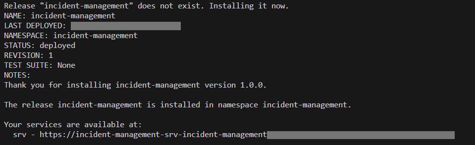

# Deploy and Run the Application on Kyma with SAP S/4HANA Cloud Backend

## Usage Scenario

Deploy the project to Kyma using Helm configurations.

## Build Images

To transform source code (or artifacts) into container images, we recommend using [Cloud Native Buildpacks](https://buildpacks.io/).
For local development scenarios, you can use the [pack](https://buildpacks.io/docs/tools/pack/) CLI to consume Cloud Native Buildpacks. 
For more information, see [About Cloud Native Buildpacks](https://cap.cloud.sap/docs/guides/deployment/deploy-to-kyma?impl-variant=node#about-cloud-native-buildpacks).

Log in to your container registry:

```sh
docker login docker.io -u <your-user>
```
## Before You Begin

Please note:

If you're using any device with a non-x86 processor (Most recent MacBooks have non-x86 M1/M2 processors), you need to instruct the Docker to use x86 images by setting the **DOCKER_DEFAULT_PLATFORM** environment variable: *export DOCKER_DEFAULT_PLATFORM=linux/amd64*.
See [Environment variables](https://docs.docker.com/engine/reference/commandline/cli/#environment-variables).

### Build CAP Node.js Image

1. Do the productive build for your application, which writes into the `gen/srv` folder:

    ```sh
    cds build --production
    ```

2. Build the image after updating version `<image-version>` to reflect the change in incident-management-srv app.

    ```sh
    pack build <your-container-registry>/incident-management-srv:<image-version> \
        --path gen/srv \
        --builder paketobuildpacks/builder-jammy-base \
        --publish
    ```

3. Build the DB deployer image

  ```sh
  pack build <your-container-registry>/incident-management-hana-deployer:<image-version> \
      --path gen/db \
      --builder paketobuildpacks/builder-jammy-base \
      --publish
  ```

**Info**
The pack CLI builds the image that contains the build result in the *gen/srv* folder and the required *npm* packages by using the [Packeto Jammy Base Builder](https://github.com/paketo-buildpacks/builder-jammy-base).

### Build UI Deployer image

1. Create a new folder named `ui-resources` at the root directory of the project.

2. In the`ui-resources` folder, create a new `package.json` file with the following content:

```json
  {
    "name": "incident-management",
    "version": "0.0.1",
    "description": "A Fiori application.",
    "keywords": [
        "ui5",
        "openui5",
        "sapui5"
    ],
    "scripts": {
        "start": "node node_modules/@sap/html5-app-deployer/index.js",
        "build:ui5": "npm run build --prefix ../ --workspaces --if-present",
        "copyzips": "copyfiles -f ../app/*/dist/*.zip ./resources/",
        "package": "run-s build:ui5 copyzips"
    },
    "dependencies": { 
        "@sap/html5-app-deployer": "^6.2.0" 
      },
    "devDependencies": {
        "copyfiles": "^2.4.1",
        "npm-run-all": "^4.1.5"
     }
  }

```

3. Navigate to the `ui-resources` folder in the terminal and run the following command.

```sh
  npm install && npm run package
```
This will build the the application into an archive called  `nsmanager.zip` and puts it in the `ui-resources/resources` folder.


4. Navigate back to the root folder in the terminal and then build the image using the following command:

    ```sh
    pack build <your-container-registry>/incident-management-html5-deployer:<image-version> \
        --path ui-resources \
        --builder paketobuildpacks/builder-jammy-base \
        --publish
    ```

### Build Database Image 

To build the database image, run:

```sh
pack build <your-container-registry>/incident-management-hana-deployer:<image-version> \
     --path gen/db \
     --builder paketobuildpacks/builder-jammy-base \
     --publish
```

## Deploy Helm Chart

Once your cluster is prepared, your container images are built and uploaded to a registry, and your Helm chart is created, you're almost set for deploying your Kyma application.

### Configure Access to Your Container Images

1. Add your container image settings to your `chart/values.yaml`:

```yaml{4,7,8,9,13,14,18,19,23,24}
...
global:
  imagePullSecret:
    name: [<image pull secret name>] 
...
srv:
  image:
    repository: <your-container-registry>/incident-management-srv
    tag: <srv-image-version>
...
hana-deployer:
  image:
    repository: <your-container-registry>/incident-management-hana-deployer
    tag: <db-deployer-image-version>
...
html5-apps-deployer:
  image:
    repository: <your-container-registry>/incident-management-html5-deployer
    tag: <html5apps-deployer-image-version>

```

## Deploy CAP Helm Chart

* Log in to your Kyma cluster, if you don’t know how then follow the login step described in the [tutorial](https://developers.sap.com/tutorials/deploy-to-kyma.html#50005bff-f490-4abf-813d-d18ad7672bfe).

2. Deploy using Helm command:

  ```sh
  helm upgrade --install incident-management --namespace incidents-namespace ./chart \
  --set-file xsuaa.jsonParameters=xs-security.json --set-file s4-hana-cloud.jsonParameters=bupa.json
  ```
This installs the Helm chart from the chart folder with the release name ***incident-management*** in the namespace ***incidents-namespace***.

```info
With the ***helm upgrade --install*** command, you can install a new chart as well as upgrade an existing chart.
```

The outcome of installation looks similar to this:



To be able to access the application via the URL, you have to [Assign Application Roles](https://developers.sap.com/tutorials/user-role-assignment.html).

As a next step, to access the application in launchpad, proceed to [Integrate with SAP Build Workzone](https://developers.sap.com/tutorials/integrate-with-work-zone.html).
