# Integrate Your Application with SAP Build Workzone

## Prerequisites

* You have deployed the application
* You have already integrated the **Incident Management** application with SAP Build Workzone. See [Integrate Your Application with SAP Build Work Zone, Standard Edition](https://developers.sap.com/tutorials/integrate-with-work-zone.html).

## Integrate with SAP Build Workzone

### Update content

1. Open your subaccount and navigate to **Instances and Subscriptions**.

2. Choose the application **SAP Build Work Zone, standard edition**.

  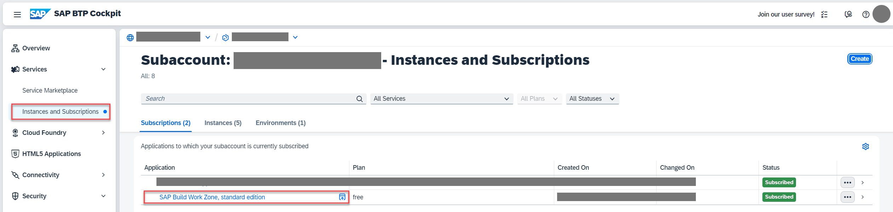

3. In the menu on the left side, choose the icon for **Channel Manager**.

4. Choose the refresh icon to fetch the updated content.

  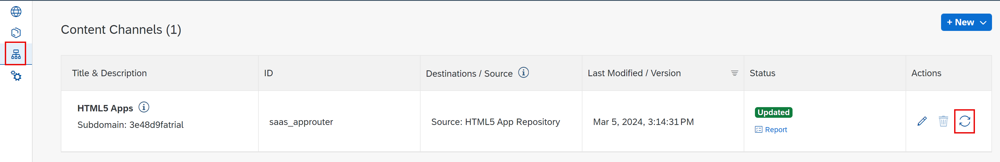

### Add application to Content Explorer

1. Choose **Content Manager** in the menu on the left and choose the **Content Explorer** button.

  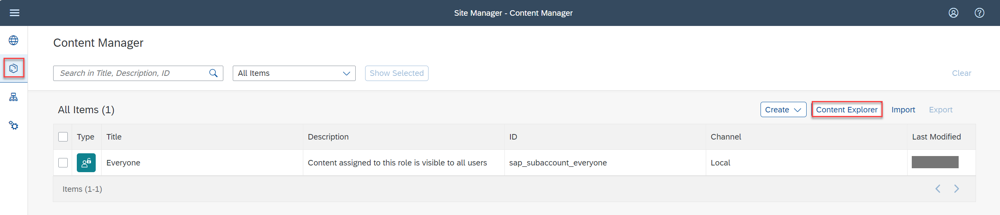

2. Select the tile **HTML5 Apps** with your respective subdomain name.

  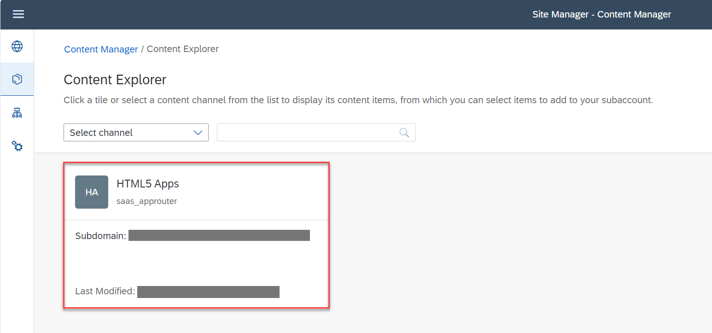

3. In the items table, set checkmark for the app **Incidents By Location** and choose the button **Add**.

  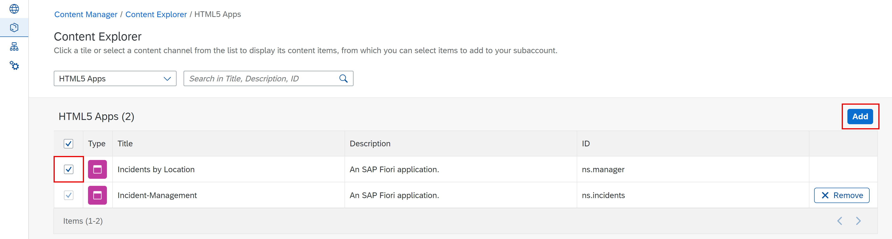

### Update Group Content

1. Go back to the **Content Manager**, and choose the **Incident Management Group**.

  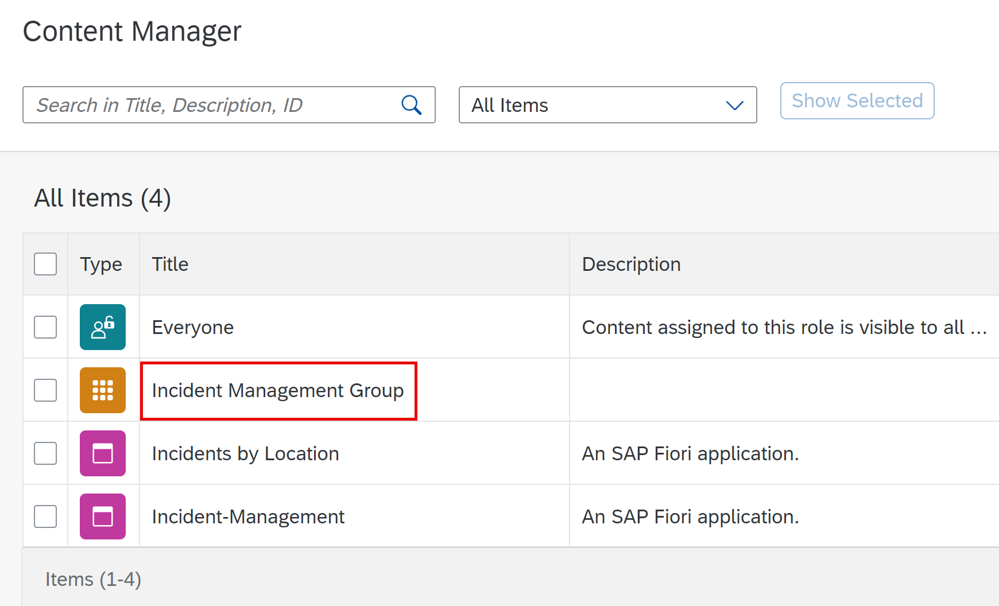

2. In the **Assignment Status**, choose the slider to assign the **Incidents By Location** app to the group.

  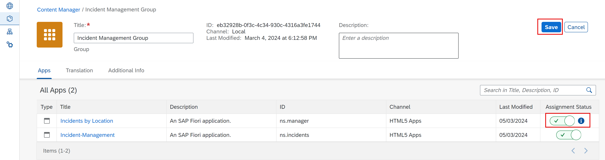

3. Choose **Save**.

### Add application to the Everyone role

1. Back in the **Content Manager**, choose role **Everyone** and choose Edit.

2. In the **Assignment Status**, choose the slider to assign the **Incidents By Location** app to the role.

3. Choose **Save**.

  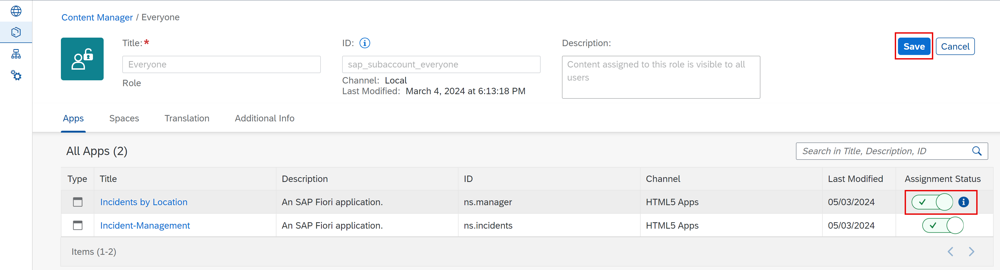

### Test your site

1. Navigate to **Site Directory** and find your site.

  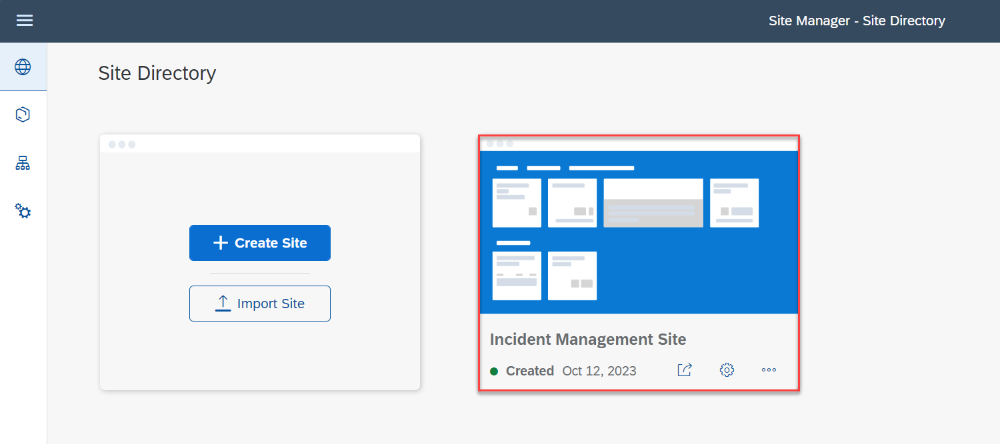

2. Choose **Go to site**.

  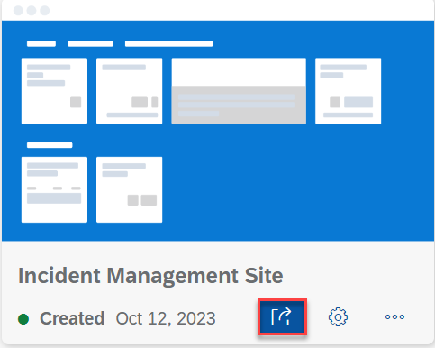

3. You should be able now to see tiles of your both applications:

  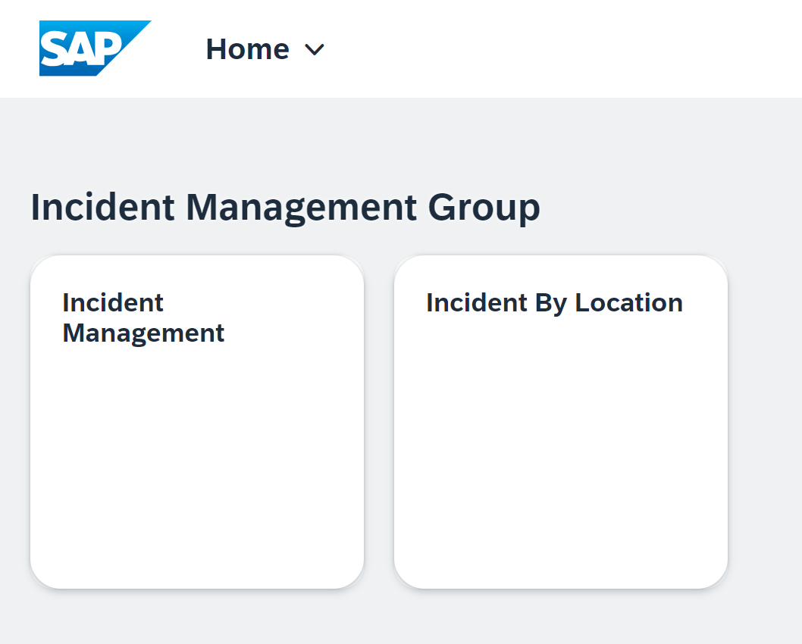

## Summary 

You have integrated SAP Build Work Zone, standard edition service, to have one central entry point to show all of your SAP BTP applications.