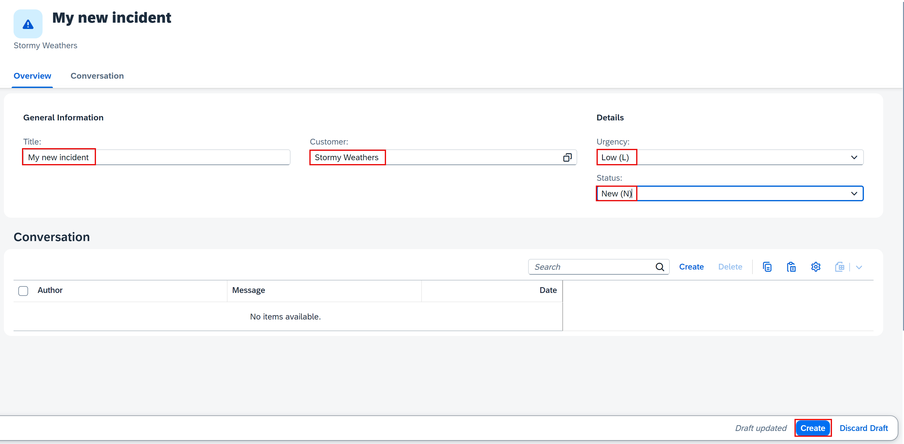
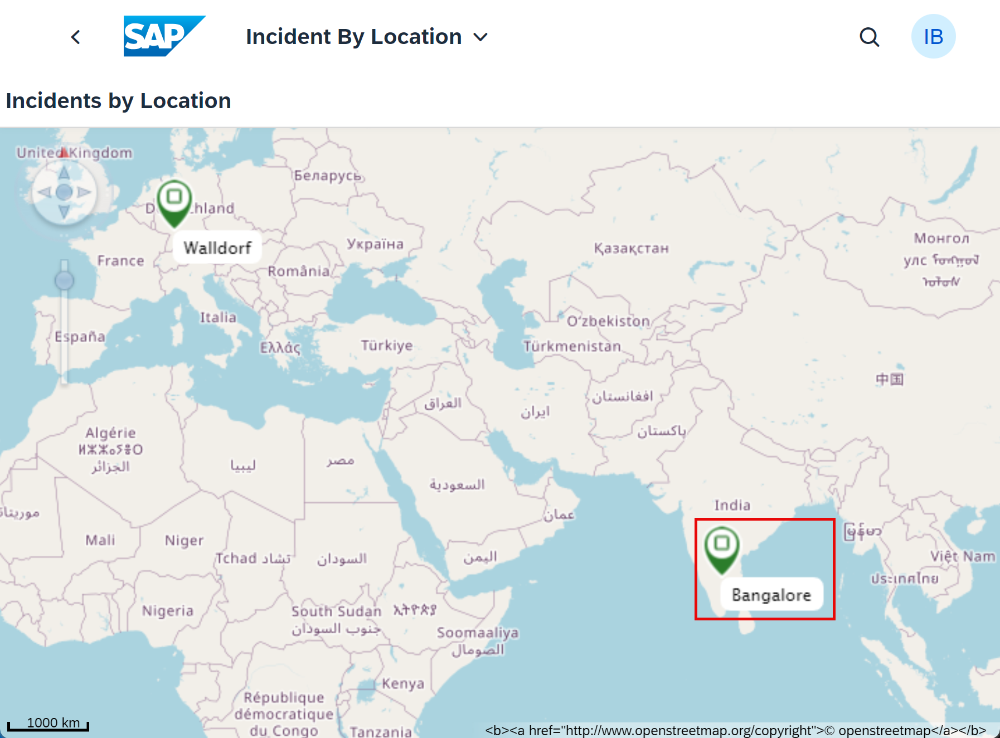
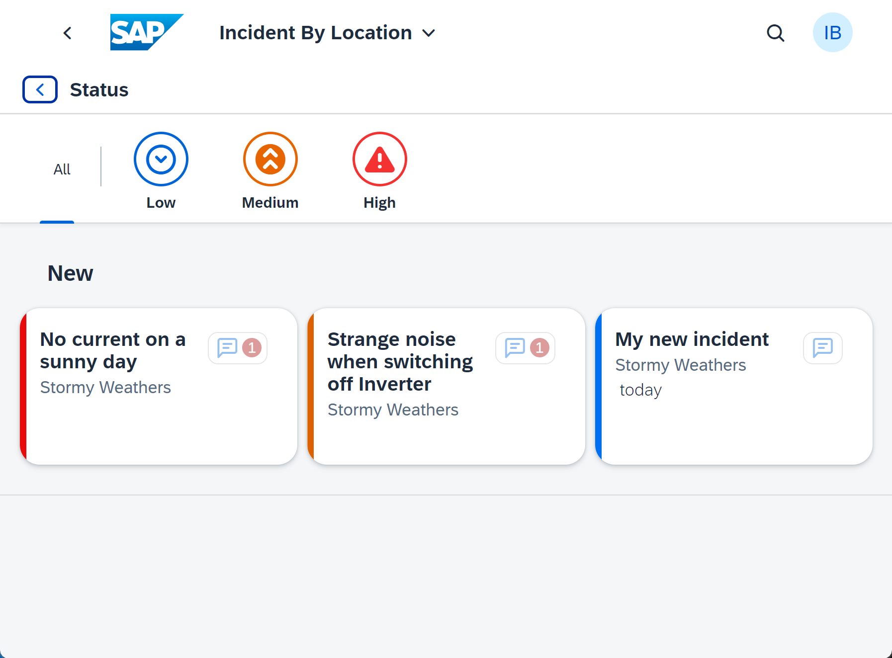

# Run the Manager Dashboard in the Incident Management application

## Prerequisites

- You have sucessfully deployed the application to your SAP BTP Runtime.
- You have assigned application roles before accessing the application. See [User Role Assignment](https://developers.sap.com/tutorials/user-role-assignment.html).
- You have integrated your application with SAP Build Work Zone.

## Run and test the application

1. Access the `Incidents Management` application via launchpad.

2. Create a new incident as follows:

  - Under the input field for the title, type in "My new incident"
  - For the Customer field, choose "Stormy Weathers" using the value help button
  - For the Urgency field choose the option "Low (L)"
  - For the status, choose "New (N)"

  

3. Choose the **Create** button.

4. Go back to the Home page and choose the `Incident By Location` tile in your Workzone application to access it.

5. Click on the `Bangalore` spot marker on the GeoMap where we are supposed to have the **Stormy Weathers** customer.

  

6. You will see your new incident with the creation date and marked as the one with low urgency. You can as well try the filter category buttons above to check how the filtering works.

  

## Summary

Congratulations! You have successfully created, deployed, and tested the freestyle SAPUI5 application.
