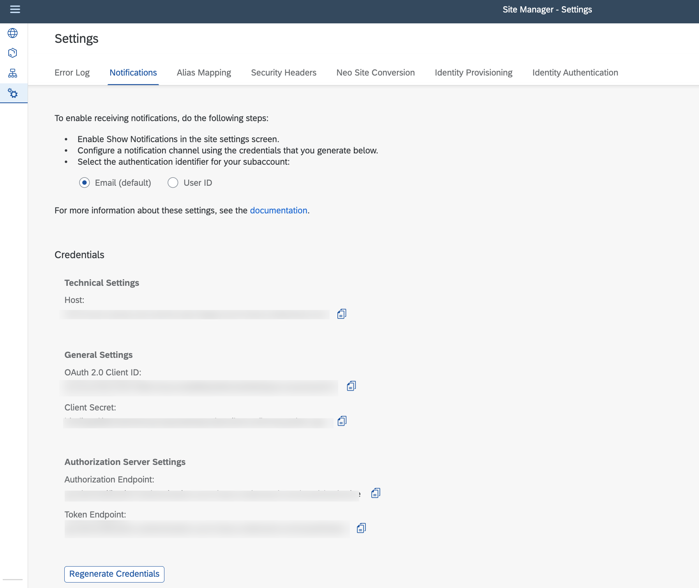

# Configure SAP Build Work Zone, Standard Edition to Receive Notifications

## Prerequisites
 - You have assigned the `Business_Notifications_Admin` role to your user. See [Enabling Notifications From Cloud Solutions](https://help.sap.com/docs/build-work-zone-standard-edition/sap-build-work-zone-standard-edition/enabling-notifications-from-cloud-solutions) for more details.
 - You have assigned the `Launchpad_Admin` role to your user.

## Enable Notifications

1. Open SAP Build Work Zone, standard edition.

2. On the site tile, choose the **Settings** icon to open the **Site Settings** dialog.

3. In the **Site Settings** dialog, choose **Notifications** and enable notifications.

4. Choose **Generate Credentials/Regenerate Credentials**.

    You will be able to see the following configuration:

    

    >You'll need this configuration in the next step while setting up the destination.

## Notification Destination

You need to have a destination configured to publish the notification. 

1. Open your `package.json` file and find the default destination name **SAP_Notifications**.

2. Replace the default destination name **SAP_Notifications** with the destination name that you are configuring.

See [Configure the destination to the notifications service](https://help.sap.com/docs/build-work-zone-standard-edition/sap-build-work-zone-standard-edition/enabling-notifications-for-custom-apps-on-sap-btp-cloud-foundry#configure-the-destination-to-the-notifications-service) for more infor on how to configure the destination.

>Note: You can copy the credentials from **SAP Build Work Zone, standard edition** and configure the destination.

