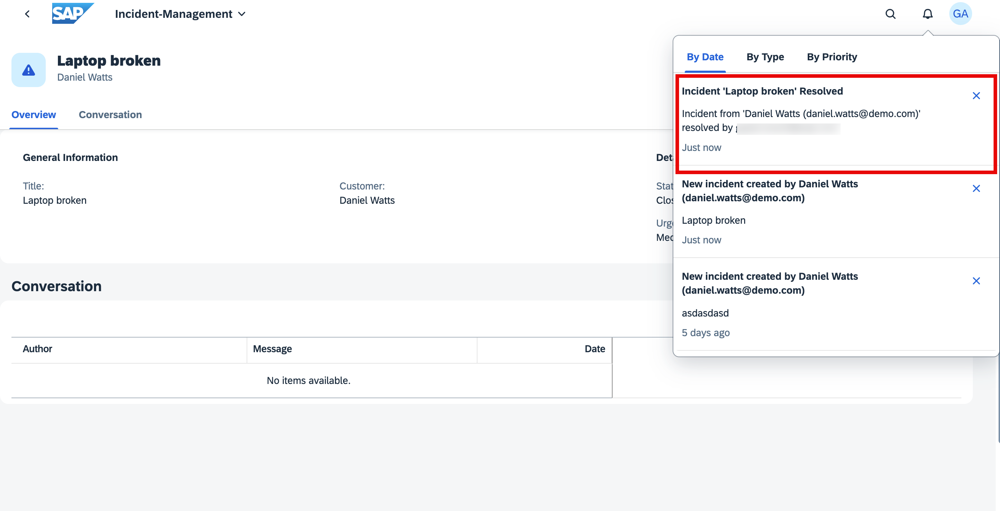

# Receive Notifications in SAP Build Work Zone

To test the notifications, you need to access the application in SAP Build Work Zone, standard edition. 

## Prerequisites
- You have integrated your application with SAP Build Work Zone, standard edition. See [Integrate Your Application with SAP Build Work Zone, Standard Edition](https://developers.sap.com/tutorials/integrate-with-work-zone.html).

## Test the Application
1. Navigate to SAP Build Work Zone, standard edition and open your site.

2. Select the **Incident-Management** tile to launch the application.

3. Create a new incident.

4. Check the bell icon at the top. It will show the notifications that are created. 

   >Note: It might take a few seconds to show the notification
   
   

4. Choose **Edit** and close the incident. You will see another notification.

   