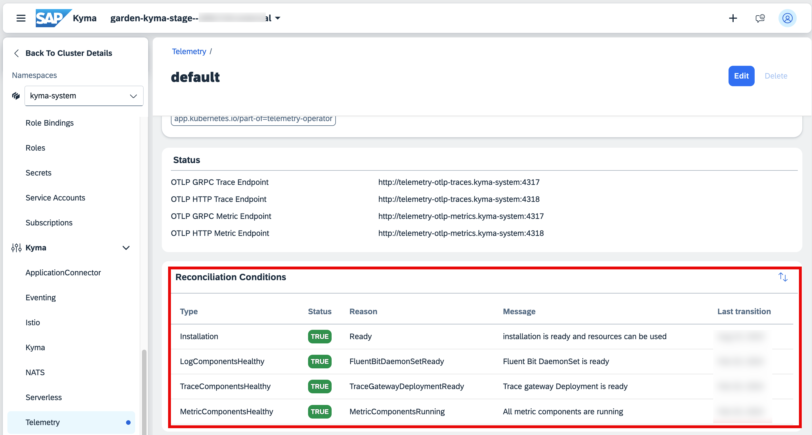

# Enable Observability in the SAP BTP, Kyma Runtime

## Prerequisites

- Add the Kyma [Telemetry module](https://help.sap.com/docs/btp/sap-business-technology-platform/kyma-telemetry-module) by following the steps described in [Add and Delete a Kyma Module Using Kyma Dashboard](https://help.sap.com/docs/btp/sap-business-technology-platform/enable-and-disable-kyma-module).
- Have an entitlement for the service `cloud-logging` assigned to your subaccount.

## Set Up SAP Cloud Logging and integrate it with the SAP BTP, Kyma runtime

To create an SAP Cloud Logging instance and start streaming logs, metrics, and traces from SAP BTP, Kyma runtime to the instance, you need to follow these steps:

1. Log in to the Kyma cluster.

   > [!TIP]
   > To log in to the Kyma cluster, follow [Access a Kyma Instance Using kubectl](https://help.sap.com/docs/btp/sap-business-technology-platform/access-kyma-instance-using-kubectl).

2. Create a namespace with the following command:
   
    ``` 
    kubectl create namespace sap-cloud-logging-integration 
    ```

3. Create a new file called `cloud-logging-instance.yaml` and paste the following code:

    ```
    apiVersion: services.cloud.sap.com/v1
    kind: ServiceInstance
    metadata:
      name: sap-cloud-logging
    spec:
      serviceOfferingName: cloud-logging
      servicePlanName: standard
      externalName: cloud-logging-created-with-sap-btp-service-operators
      parameters:
        ingest_otlp:
          enabled: true
    ```
    The `ingest_otlp` will enable support for OpenTelemetry-based data, which is required for the ingestion of distributed traces and metrics.

4. Apply the configuration with the following command:

    ```
    kubectl apply -n sap-cloud-logging-integration -f cloud-logging-instance.yaml 
    ```
    This will trigger the provisioning of a SAP Cloud Logging instance
   > [!TIP]
   > In this guide, you create an instance of SAP Cloud Logging with the SAP BTP service operator, which is the recommended way. It takes care of creation and periodic rotation of the required secret. See [Create an SAP Cloud Logging Instance through SAP BTP Service Operator](https://help.sap.com/docs/cloud-logging/cloud-logging/create-sap-cloud-logging-instance-through-sap-btp-service-operator).
   However, you can choose any other method of creating the instance and the secret, as long as the parameter for the OTLP ingestion is enabled in the instance. For details, see [Configuration Parameters](https://help.sap.com/docs/cloud-logging/cloud-logging/configuration-parameters).

5. Wait for the instance to be created. You can check its status using the following command:

    ```
    kubectl get serviceinstances.services.cloud.sap.com -o yaml -n sap-cloud-logging-integration
    ```
6. Once the instance is created, create a binding that will provide the required SAP Cloud Logging service secret. Create a file called: `cloud-logging-binding.yaml` and paste the following code: 

    ```
    apiVersion: services.cloud.sap.com/v1
    kind: ServiceBinding
    metadata:
      name: cls-binding
    spec:
      serviceInstanceName: sap-cloud-logging
      externalName: cloud-logging-created-with-sap-btp-service-operators
      secretName: sap-cloud-logging
      credentialsRotationPolicy:
        enabled: true
        rotationFrequency: 1440h

    ```
    To apply the configuration, use the following command:
    ```
    kubectl apply -n sap-cloud-logging-integration -f cloud-logging-binding.yaml
    ```
    
7. Ship the logs to the SAP Cloud Logging service. See [Ship Logs to SAP Cloud Logging](https://help.sap.com/docs/btp/sap-business-technology-platform/integrate-with-sap-cloud-logging?ship-logs-to-sap-cloud-logging).

8. Ship the distributed traces to the SAP Cloud Logging service. See [Ship Distributed Traces to SAP Cloud Logging](https://help.sap.com/docs/btp/sap-business-technology-platform/integrate-with-sap-cloud-logging?ship-distributed-traces-to-sap-cloud-logging).

9. Ship the metrics to the SAP Cloud Logging service. See [Ship Metrics to SAP Cloud Logging](https://help.sap.com/docs/btp/sap-business-technology-platform/integrate-with-sap-cloud-logging?ship-metrics-to-sap-cloud-logging).

    Once the configurations are applied, you can check the status of all telemetry configurations in the Kyma dashboard. They should look like this: 
    

    > [!TIP]
    > Learn how to access [Kyma dashboard](https://learning.sap.com/learning-journeys/deliver-side-by-side-extensibility-based-on-sap-btp-kyma-runtime/using-the-kyma-dashboard_d23b12a1-d17c-491d-a80b-cb78039e317e).

10.  For easier access, adjust the Kyma dashboard navigation. See [Kyma Dashboard Integration](https://help.sap.com/docs/btp/sap-business-technology-platform/integrate-with-sap-cloud-logging?locale=en-US&version=Cloud#set-up-kyma-dashboard-integration).

## Deploy the Incident Management Application in the SAP BTP, Kyma Runtime

Follow the steps in the [Deploy a Full-Stack CAP Application in SAP BTP, Kyma Runtime](https://developers.sap.com/group.deploy-full-stack-cap-kyma-runtime.html) tutorial.

## Visualize Logs, Metrics and Traces

Verify the setup and [access custom logs, metrics, traces](./6-test-the-flow.md) of your deployed application in the newly provisioned SAP Cloud Logging instance.