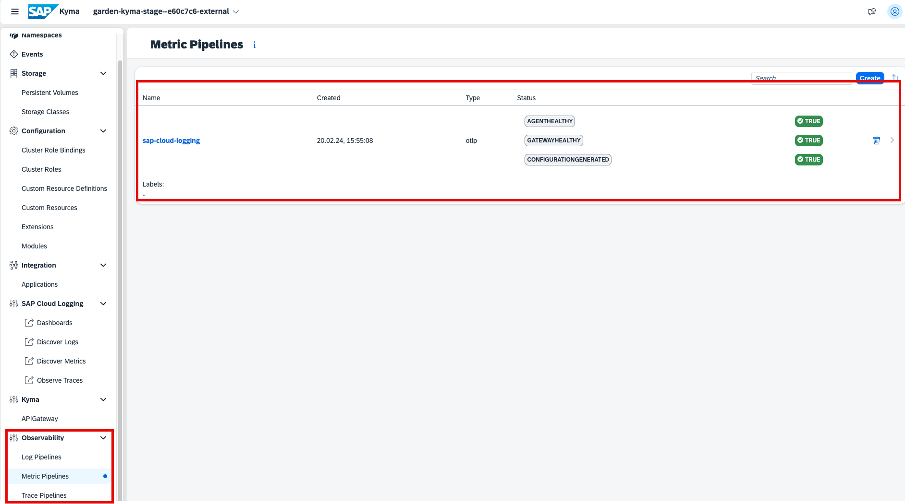

# Observability Enablement in SAP BTP, Kyma Runtime

## Set Up the SAP Cloud Logging Service

To start streaming logs, metrics and traces from SAP BTP, Kyma runtime to the SAP Cloud Logging service, you need to follow these steps:

1. Enable the Kyma [Telemetry module](https://kyma-project.io/#/telemetry-manager/user/README) by following the steps described as [Quick Install of kyma-project.io](https://kyma-project.io/#/02-get-started/01-quick-install).

2. An instance of SAP Cloud Logging with OpenTelemetry is enabled to ingest distributed traces.

> [!TIP]
>We recommend that you create an instance of SAP Cloud Logging with the SAP BTP service operator, because it takes care of creation and rotation of the required secret. See [Create an SAP Cloud Logging Instance through SAP BTP Service Operator](https://help.sap.com/docs/cloud-logging/cloud-logging/create-sap-cloud-logging-instance-through-sap-btp-service-operator)
However, you can choose any other method of creating the instance and the secret, as long as the parameter for the OTLP ingestion is enabled in the instance. For details, see [Configuration Parameters](https://help.sap.com/docs/cloud-logging/cloud-logging/configuration-parameters?locale=en-US&version=Cloud).

To create the SAP Cloud Logging service instance, follow these steps:

1. Log in to the Kyma cluster.

> [!TIP]
> To log in to the Kyma cluster, follow the [Log In to Your Kyma cluster](https://developers.sap.com/tutorials/deploy-to-kyma.html#1206fdc5-e6d4-4238-8cef-638cc7739ca6) tutorial.

1. Create a namespace with the following command:
   
    ``` 
    kubectl create namespace sap-cloud-logging-integration 
    ```

2. Create a new file called `cls.yaml` and paste the following code:

    ```
    apiVersion: services.cloud.sap.com/v1alpha1
    kind: ServiceInstance
    metadata:
      name: created-with-sap-btp-service-operators
    spec:
      serviceOfferingName: cloud-logging
      servicePlanName: standard
      externalName: cloud-logging-created-with-sap-btp-service-operators
      parameters:
        ingest_otlp:
          enabled: true
    ```
3. Apply the configuration with the following command:

    ```
    kubectl apply -n sap-cloud-logging-integration -f cls.yaml 
    ```
       
4. Wait for the instance to be created, you can check its status using the following command:

    ```
    kubectl get serviceinstances.services.cloud.sap.com -o yaml -n sap-cloud-logging-integration
    ```
5. Once the instance is created, create a binding that will provide the required SAP Cloud Logging service secret. Create a file called: `clsbinding.yaml` and paste the following code: 

    ```
    apiVersion: services.cloud.sap.com/v1
    kind: ServiceBinding
    metadata:
      name: cls-binding
    spec:
      serviceInstanceName: created-with-sap-btp-service-operators
      externalName: cloud-logging-created-with-sap-btp-service-operators
      secretName: sap-cloud-logging
      credentialsRotationPolicy:
        enabled: true
        rotationFrequency: 168h

    ```
    To apply the configuration, use the following command:
    ```
    kubectl apply -n sap-cloud-logging-integration -f clsbinding.yaml
    ```
    
7. Ship the logs to the SAP Cloud Logging service. See [Ship Logs to SAP Cloud Logging](https://kyma-project.io/#/telemetry-manager/user/integration/sap-cloud-logging/README?id=ship-logs-to-sap-cloud-logging).

8. Ship the distributed traces to the SAP Cloud Logging service. See [Ship Distributed Traces to SAP Cloud Logging](https://kyma-project.io/#/telemetry-manager/user/integration/sap-cloud-logging/README?id=ship-logs-to-sap-cloud-logging).

9. Ship the metrics to the SAP Cloud Logging service. See [Ship Metrics to SAP Cloud Logging](https://kyma-project.io/#/telemetry-manager/user/integration/sap-cloud-logging/README?id=ship-metrics-to-sap-cloud-logging).

    Once the configurations are applied, you can check the status of all telemetry configurations in the Kyma dashboard. They should look like this: 
    

    > [!TIP]
    > Learn how to access [Kyma dashboard](https://learning.sap.com/learning-journeys/deliver-side-by-side-extensibility-based-on-sap-btp-kyma-runtime/using-the-kyma-dashboard_d23b12a1-d17c-491d-a80b-cb78039e317e).

10.  [Kyma Dashboard Integration](https://kyma-project.io/#/telemetry-manager/user/integration/sap-cloud-logging/README?id=ship-metrics-to-sap-cloud-logging).

# Deploy in SAP BTP, Kyma Runtime

Follow the steps in the [Deploy a Full-Stack CAP Application in SAP BTP, Kyma Runtime](https://developers.sap.com/group.deploy-full-stack-cap-kyma-runtime.html) tutorial.

# Visualize Logs, Metrics and Traces
- [Access custom logs, metrics, traces](./6-test-the-flow.md)
