# Accessing Logs, Metrics and Traces Using SAP Cloud Logging Service

To access logs in the SAP BTP cockpit, navigate to your subaccount and choose **Services** > **Instances and Subscriptions**. 

## Prerequisites

Have Identity Authentication SAML 2.0 integrated with the SAP Cloud Logging. See [Integrate SAP Cloud Identity Services - Identity Authentication SAML 2.0 with SAP Cloud Logging](https://help.sap.com/docs/cloud-logging/sap-cloud-logging/prerequisites#integrate-sap-cloud-identity-services---identity-authentication-saml-2.0-with-sap%0Acloud-logging).

> [!TIP] If you are not having SAP Cloud Identity Services, you can login using the service keys in Cloud foundry runtime. For Kyma, The sap-cloud-logging-integration namespace->secrets will have the dashboard url, username and password to login. 
## Access the SAP Cloud Logging Service

1. In the SAP BTP cockpit, navigate to your subaccount and choose **Services** > **Instances and Subscriptions**. Then, choose the **Instances** tab. 
   
   
2. Choose **incidents-cloud-logging** to open the SAP Cloud Logging Dashboard. Provide the credentials for the SAP Identity and Authentication tenant.

3. Depending in which runtime the application is deployed, choose one of the following:

   * If your application is deployed in the SAP BTP, Cloud Foundry runtime, choose **CF** as highlighted in the following screenshot:

  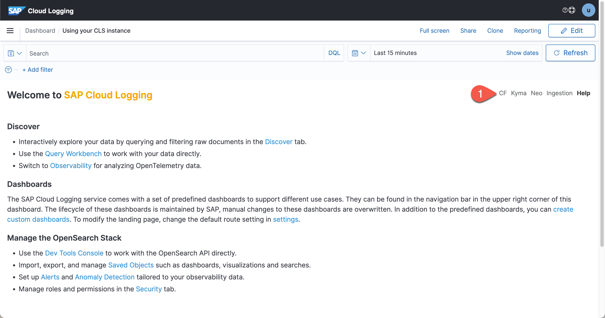
  
   This step will open the Cloud Foundry Overview showcasing many critical application metrics and statistics.
   
   * If your application is deployed in the SAP BTP, Kyma runtime, choose **Kyma**.
   
1. Select the duration for which you want to display the metrics. For example, select **Last 30 minutes** or **Last 24 hours** and choose **Apply**.
   The following metrics will be displayed:
   
   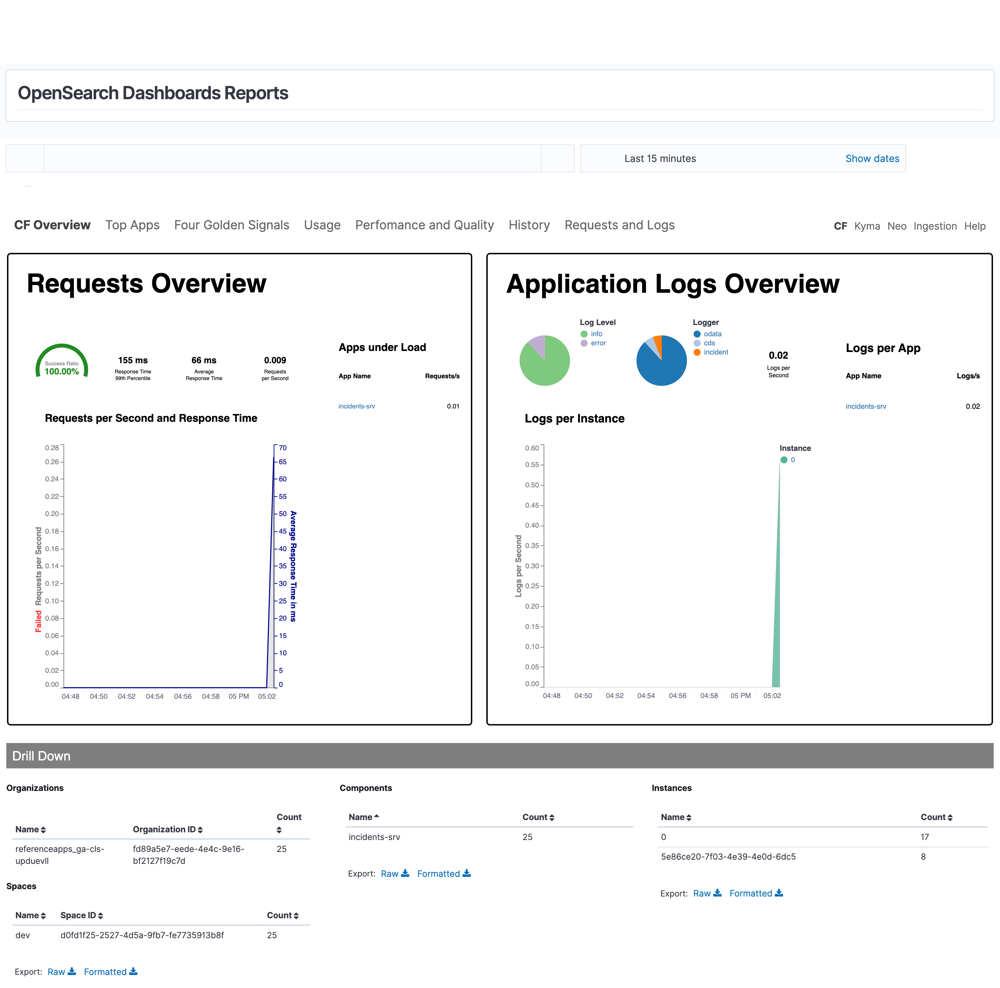
   
2. The CAP framework generates request, error, info logs and the log levels can be changed. See [Configuring Log Levels](https://cap.cloud.sap/docs/node.js/cds-log#configuring-log-levels) in the CAP documentation.

   
   
3. To display the application logs, click the breadcrumb on the left side and choose **Discover**.

   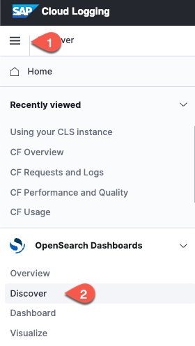

7. Choose the filters by hovering over the labels and choosing '+'. Select `msg,app_name,loggger`.

   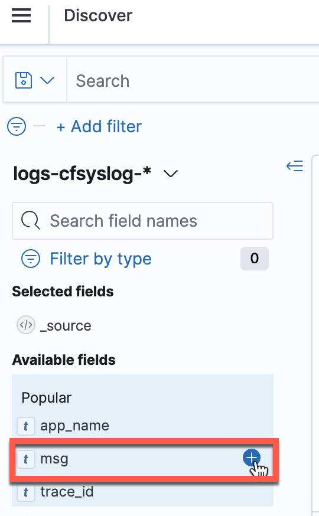

8. The logs can now be visualized as follows:

   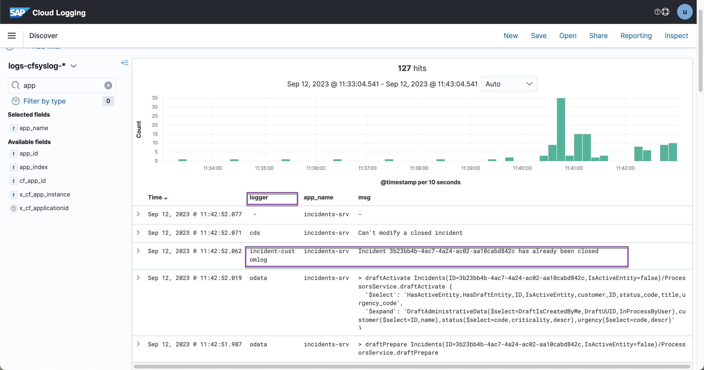
    

> [!NOTE]
> The default logs are generated by the CAP framework. In the `logger`, the framework logs can be identified by the label `cds` or `odata`.
> The custom logs can be identified by the label defined by the user when declaring the cds custom logs. For example, `const LOG = cds.log('incident-customlog')`, logs generated by the custom logger will have the label `incident-customlog` as seen in the screenshot above.

1. If you are using SAP BTP, Kyma runtime, you need to select `logs-json-kyma-*`. 
    The logs will look like this: 
    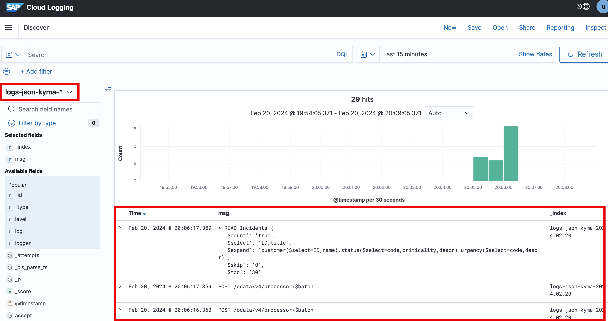 

## Access Application Metrics

1. On the left side of the screen, click the breadcrumb and choose **Discover**.
2. On the **Discover Screen**, `logs-cfsyslog-*` is selected by default. You can see the application logs. 
3. Choose `logs-cfsyslog-*`, and dropdown menu appears. Select `metrics-otel-v1-*`. This will display the metrics from the application. 
4.  Select the fields from the left side of the screen to view specific fields. The output should be displayed like this:
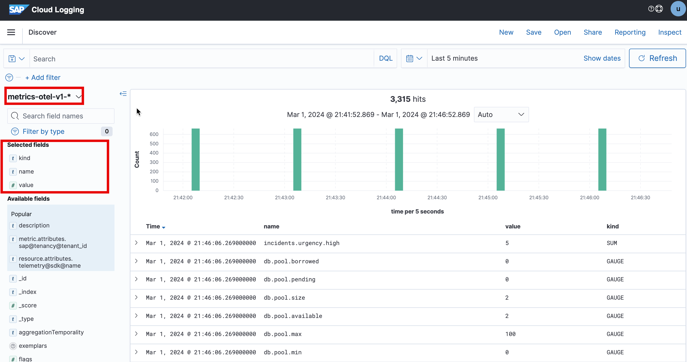

### Create Visualization for Custom Metrics

In the previous chapter, you created a custom metric to count the "**High**" urgency incidents. You can create a custom visualization to show the count. 
1. On the left side breadcrumb, choose **Visualize**. 
2. Choose **Create visualization**.
3. A dialog appears. Choose **Metric**.
   
   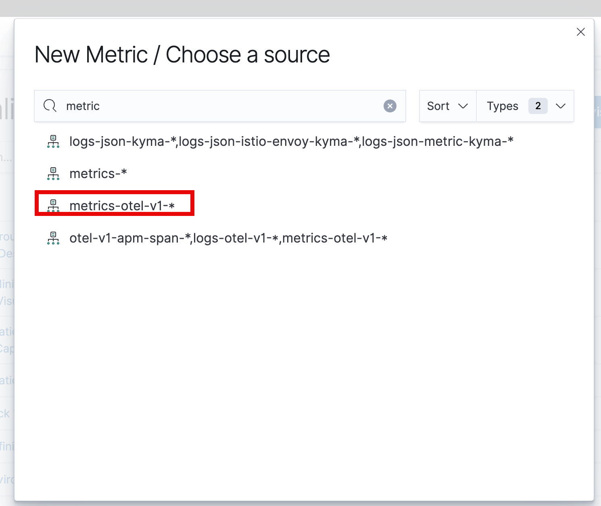

4. On the right side of the screen, choose **Metric**.
5. Choose the dropdown under **Aggregation** and select **Top Hit**.
6. Choose the **Field** dropdown menu and select the **value**.
7. Under the **Custom** label, enter a name such as **High Urgency Incidents**.
8. Choose **Update** at the bottom of the screen.
9. The visualisation will be created.
   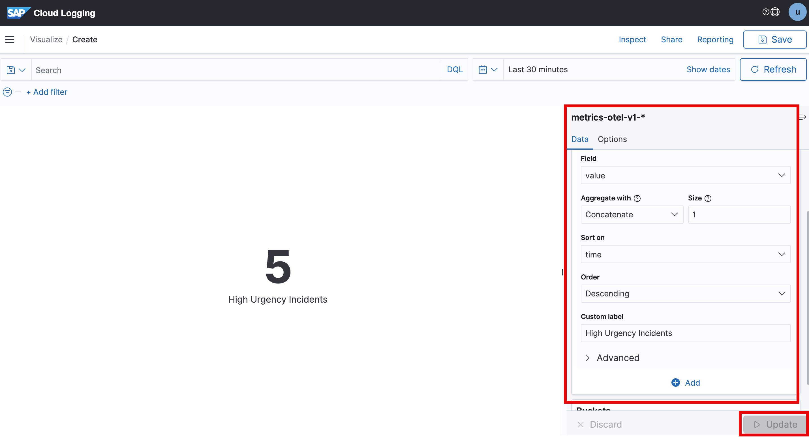
You can save this visualization for quick access.

## Access Traces

1.  To view the traces, from the left side, select `logs-cfsyslog-*` and a dropdown menu appears. Choose `otel-v1-apm-span-*`.
2.  The traces will be visible as follows:
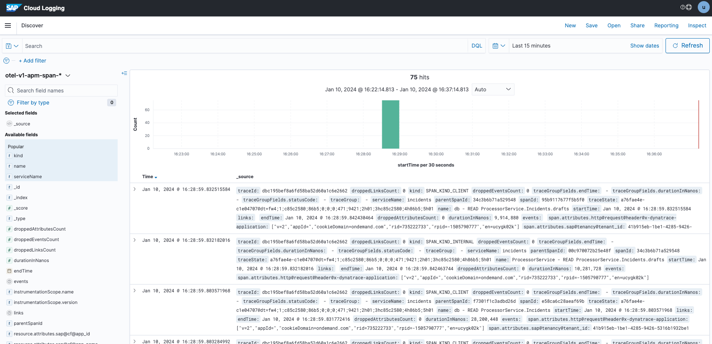

> [!WARNING]
> The traces take up to 3 minutes to appear in the Cloud Logging  Dashboard. If the traces are still not available, try again.
>

## Visualize Traces

You can visualize the traces as a timeline. To do that:

1. In the Cloud Logging Dashboard, choose the left side menu, and choose **Observability**.
2. Choose **Trace Analytics** > **Traces**. If the traces are still not visible, increase the duration to 15 minutes.
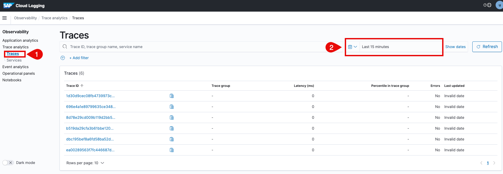

3. Select one of the traces and it will show the timeline of the different traces.
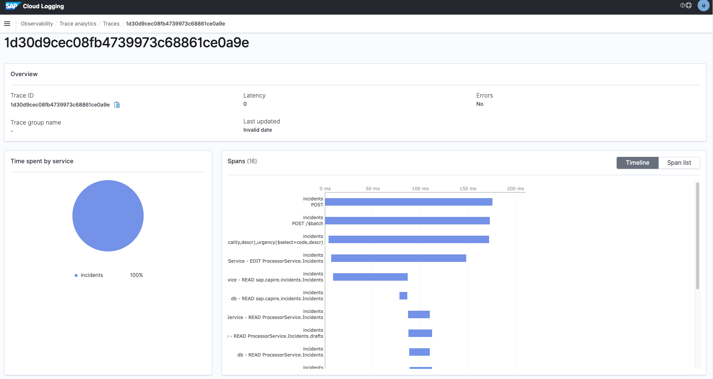
