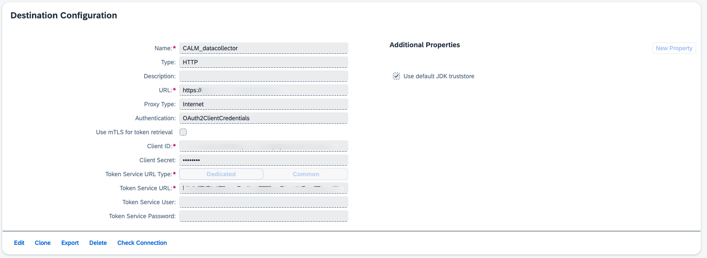
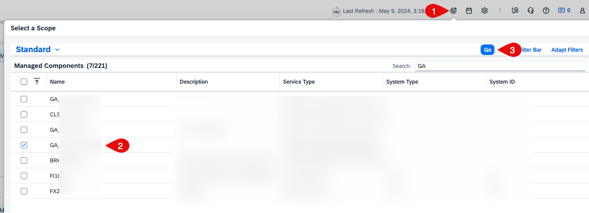
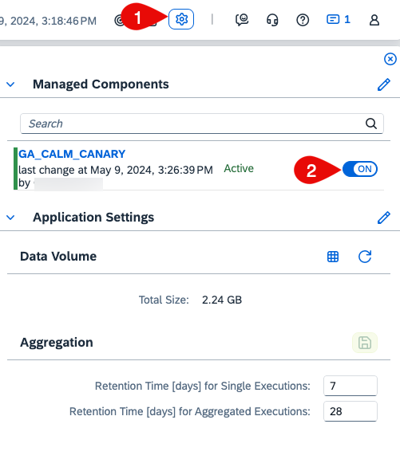
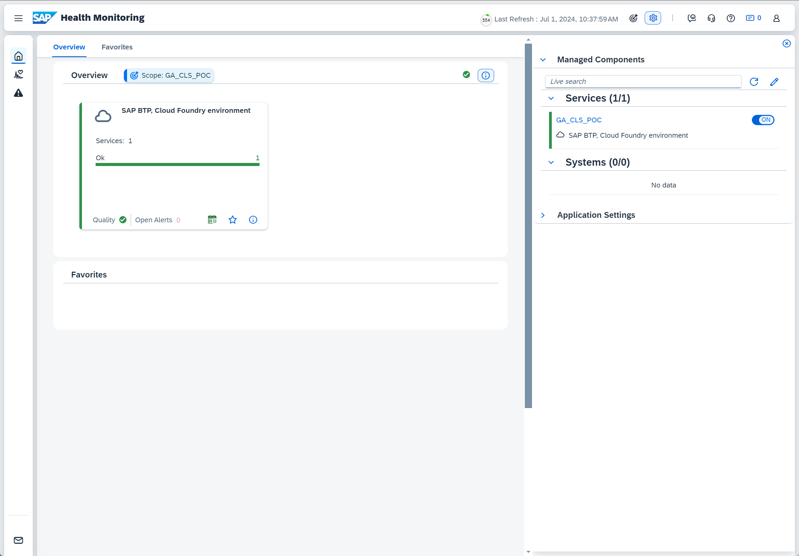
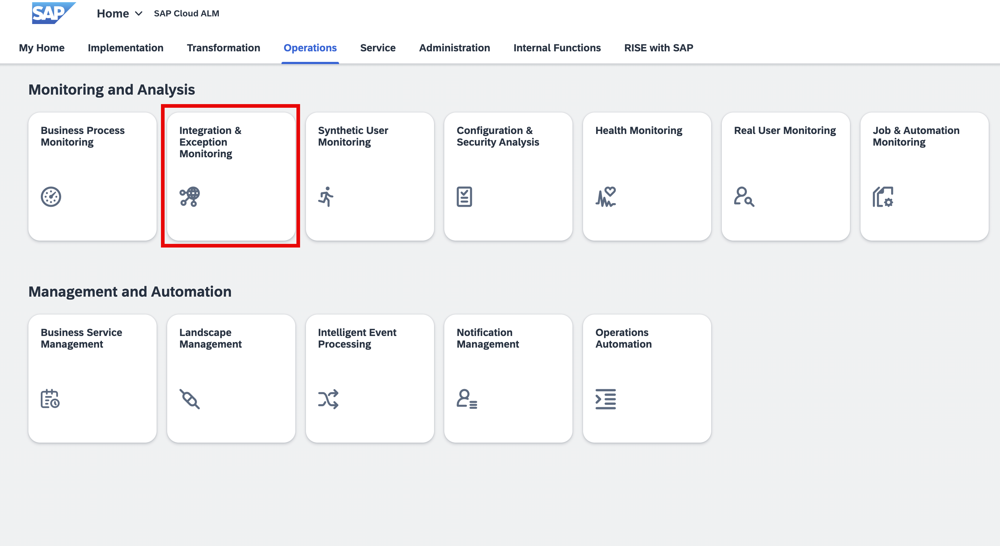
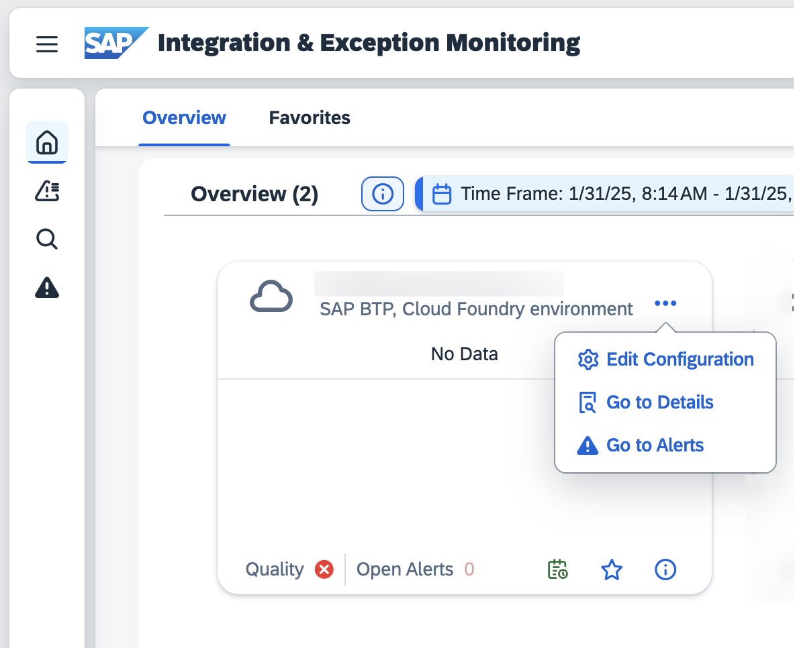
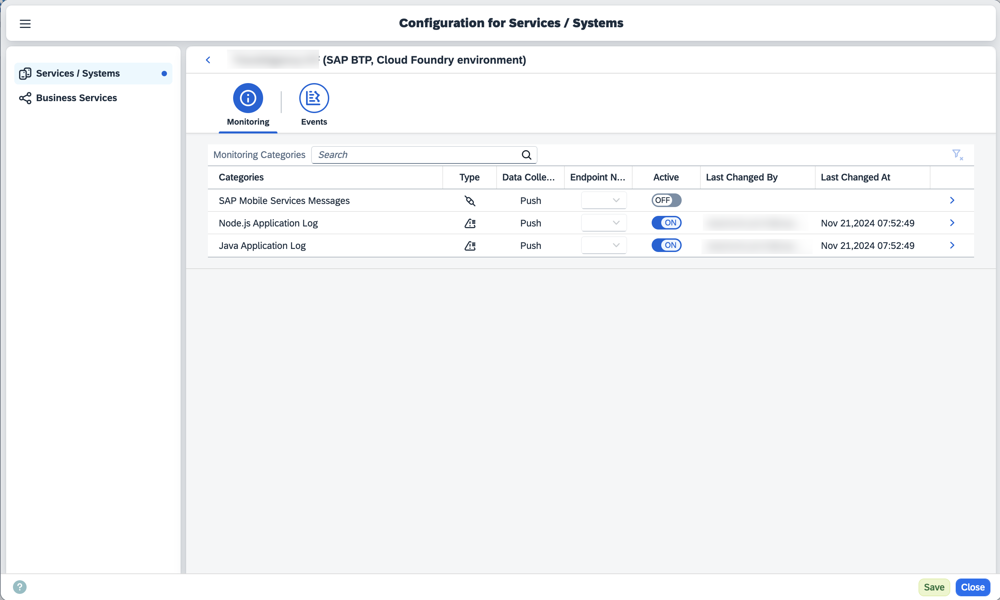
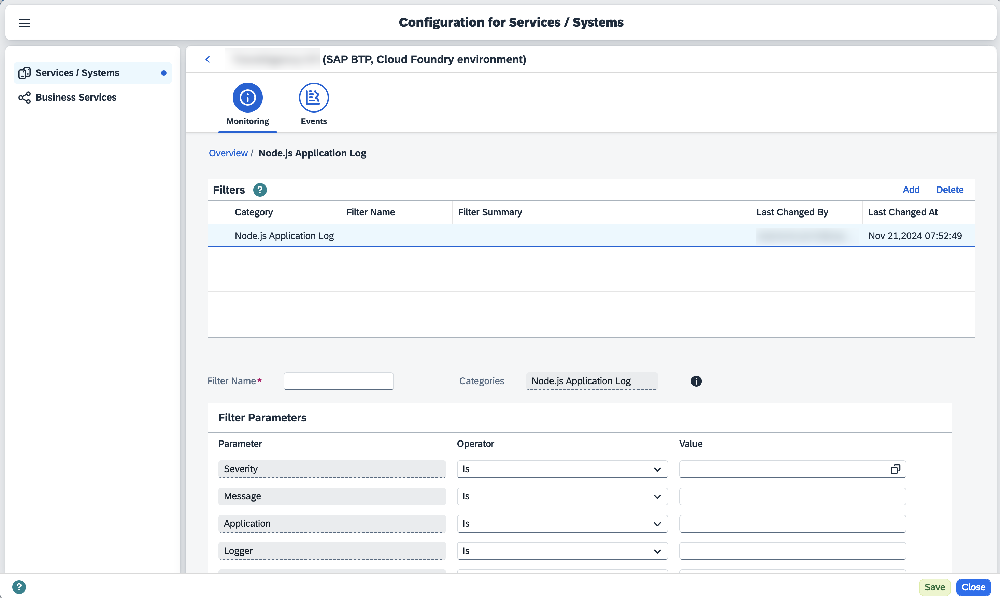

# Setup SAP Cloud ALM
In this section, you will configure your SAP Cloud ALM tenant to start receiving Real User Monitoring and Health Monitoring data from the CAP application.
## Prerequisites
1. [You have enabled data collectors for SAP Cloud ALM in a CAP Application](./configure-sap-cloud-alm.md).

## Set up BTP Destination for SAP Cloud ALM Data Collector
1. Go to the **BTP Subaccount** where you have deployed the application. 
>[!NOTE] 
> Please use one destination per subaccount
2. Under **Connectivity-Destinations**, create a new destination, fill in the required details and save.
     - **Name**: `CALM_datacollector`
     - **Type**: `HTTP`
     - **URL**: `endpoints->Api from SAP Cloud ALM Service Key copied at previous section `
     - **Authentication**: `OAuth2ClientCredentials` Selected from the dropdown
     - **Client ID**: `Client ID from SAP Cloud ALM Service Key`
     - **Client Secret**:`Client Secret from SAP Cloud ALM Service Key` 
     - **Token Service URL**: `url efrom SAP Cloud ALM Service Key`
     
  
     See [Step 3: Authentication](https://support.sap.com/en/alm/sap-cloud-alm/operations/expert-portal/data-collection-infrastructure.html?anchorId=section_1199289189_c) for more details about these configurations.

     The Destination should look like this:
     

## Enable Real User Monitoring
1. Go to the SAP Cloud ALM tenant and choose the **Real User Monitoring** tile under **Operations**. It will open Real User Monitoring (RUM) in a new tab.
2. Choose the **Scope selector**, search for your service and choose **Apply**
   
3. Choose the tile of your service.
4. Choose the settings icon at the top and toggle the button to **On** under your service name.
   
   

   > If it throws a warning, wait for a minute and try again.

## Enable Health Monitoring
1. Go to the SAP Cloud ALM tenant and choose the **Health Monitoring** tile under **Operations**. It will open Health Monitoring in a new tab.
2. Repeat the steps mentioned in the above step to switch on the data collection for Health Monitoring.

   

## Enable Integration & Exception Monitoring
1. Go to the SAP Cloud ALM tenant and choose the **Integration & Exception Monitoring** tile under **Operations**.  
   
   

2. Choose the **Scope selector**, search for your service and choose **Apply**

3. Go to your application tile, choose ***...*** and choose ***Edit Configuration***

   

4. Click on the row, maintain the filters and activate the configurations. 

   

   

5. Save the configuration.
 

## Next Steps
[Analyze CAP Application in SAP Cloud ALM ](./test-the-flow.md)