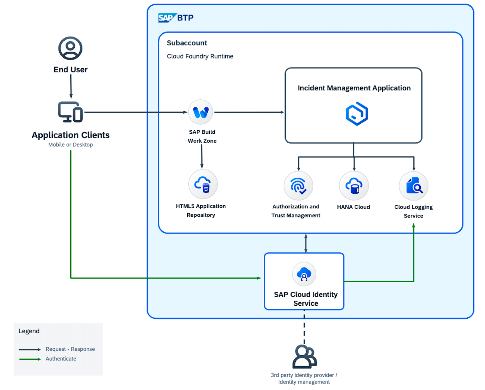

# Introduction
[Observability](https://help.sap.com/docs/btp/btp-developers-guide/dev-guide-operate-cap) helps to take data-driven informed decisions based on runtime Observability telemetry data (logs, metrics, traces, events, ...) and provides insights into SAP & customer services and systems to understand and improve efficiency, scalability, resilience, and availability.

When you seek for fully detailed observability data of your application, you can use [SAP Cloud Logging](https://help.sap.com/docs/cloud-logging/cloud-logging/what-is-sap-cloud-logging?locale=en-US). SAP Cloud Logging allows you to slice and dice logs, metrics, and traces in order to analyze functional and performance behaviour of your BTP workload on Cloud Foundry and Kyma.

## Solution Diagram

### Cloud Foundry Runtime

### Kyma Runtime

# Introduce Custom Metrics, Logs and Trace Spans to Capture Service-Specific Observability Telemetry 

We recommend that you add additional service-specific observability telemetry signals to the build-in general monitoring and observability signals emitted by the SAP Application Programing Model (CAP) framework. Service teams should introduce specific metrics, logs and trace spans. Building up own dashboards, user flow up to defining own alerting patterns on top of these customised signals can improve efficiency in problem and incident situation.

In this tutorial, you will learn how to create service-specific telemetry signals (logs, metrics and trace) for the Incident Management application.

# Implementation

- [Add custom logs, metrics, traces](./2-implement.md)

