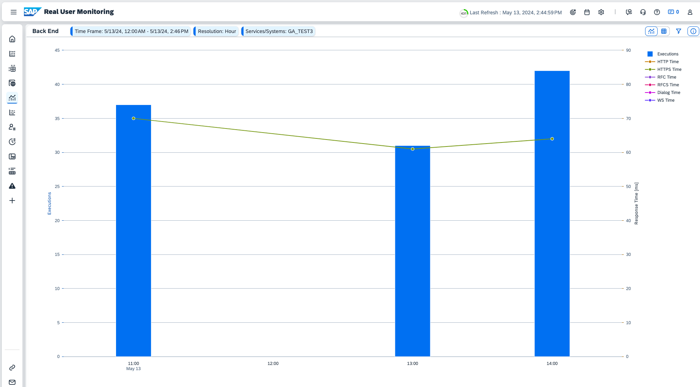

# Access Real User Monitoring, Health Monitoring Data and Integration & Exception Monitoring in SAP Cloud ALM 
Once the application is deployed, SAP Cloud ALM tenant is configured with Real User Monitoring and Health Monitoring, you can start analysing the Incident Management application in SAP Cloud ALM.

## Prerequisites
- [Configure SAP Cloud ALM for Real User Monitoring and Health Monitoring](./configure-sap-cloud-alm.md)

## Testing the Application
Once the application is deployed, launch it and create a couple of incidents. 

### Real User Monitoring Data
1. Launch the **Real User Monitoring Application** from the **Operations** section in SAP Cloud ALM.
2. Open the **Select a Scope** dialog, search for your service, and choose **Apply**.

   

3. A tile with your service is displayed showing HTTP and SAPUI5 request statistics. Choose **SAPUI5**.

   

4. The **Requests** screen is opened showing the request statistics like **Avg. Response Time**, **Users**, **Request Type**, and so on.

      

5. Choose a request from the list to go further into the detailed information about the request. 
   >[!TIP] The chart has been switched from the default ("Orientation: left to right") to "Orientation: Top to Bottom."

   
6. Backend details are shown in the **Back End** tab. The details show the number of requests coming every hour based on the timeframe you have selected.
   

7. In the **Front End** tab, you will see data like **Device Type**, **Operating System**, **Web Browser** used to access the application, and more.
    

You can check further details on the other pages of Real User Monitoring application.

### Health Monitoring Data
1. Launch the **Health Monitoring Application** from the **Operations** section in SAP Cloud ALM.
2. Open the **Select a Scope** dialog, search for your service, and choose **Apply**.
3. Choose the tile that is diplayed. It opens the **Monitoring Screen** showing some basic application metrics.
   
   
4. Choose your service to see further details. It will show detailed metrics for the application. 
   
5. Choose the tile to get metrics like **http.client.duration**. Choose the **Hstory** button on the right to show historical metrics of client duration when there was workload on the application.
   
   
You can explore more options like triggering alerts and drill down further into the application metrics based on your requirements. 

>[!NOTE]
>The Health Metrics data takes time before it can be visualized in the Health Monitoring application. In case you don't see data, wait for sometime.

### Integration & Exception Monitoring

Exception monitoring for Incident Management will follow soon.

----

Read more about the capabilities of the Real User Monitoring, Health Monitoring and Integration & Exception Monitoring
applications in [Real User Monitoring](https://support.sap.com/en/alm/sap-cloud-alm/operations/expert-portal/real-user-monitoring.html),  [Health Monitoring - Setup & Configuration](https://support.sap.com/en/alm/sap-cloud-alm/operations/expert-portal/health-monitoring/health-monitoring-setup-configuration.html) and [Integration & Exception Monitoring](https://support.sap.com/en/alm/sap-cloud-alm/operations/expert-portal/integration-monitoring.html)
