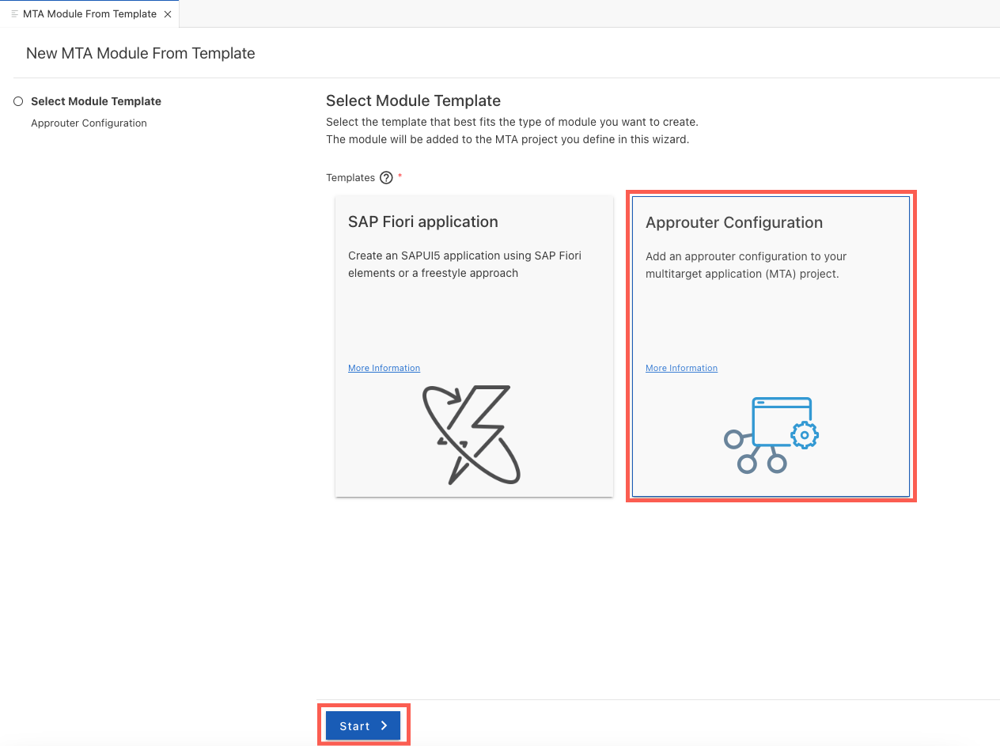
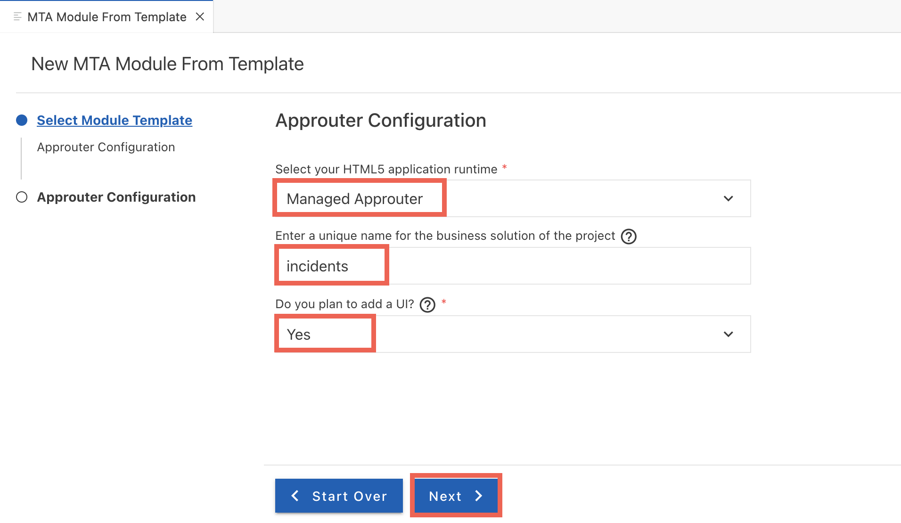
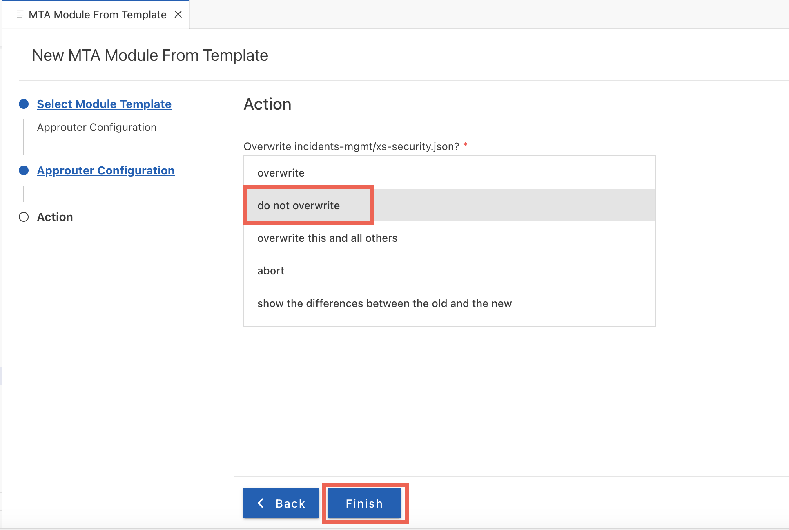
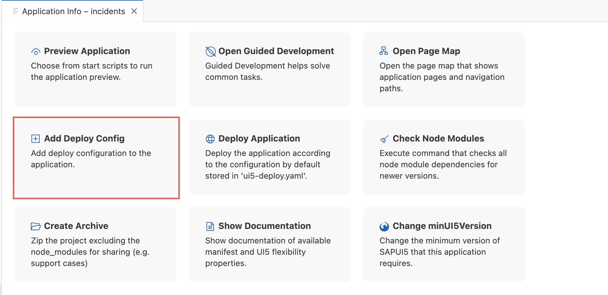
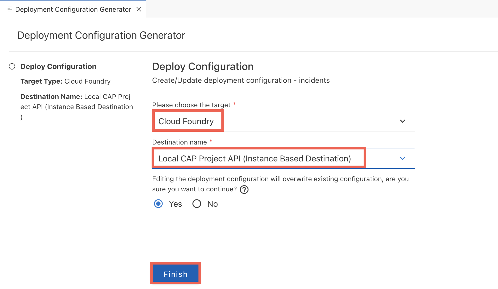
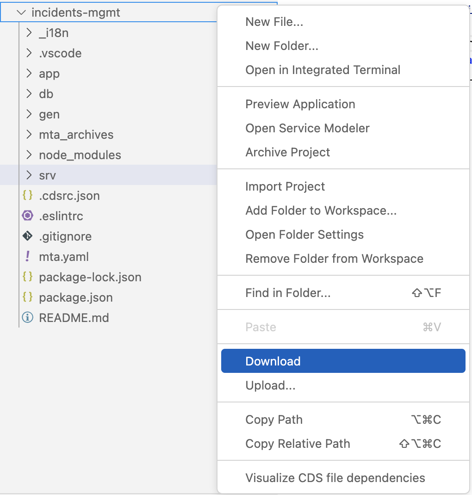
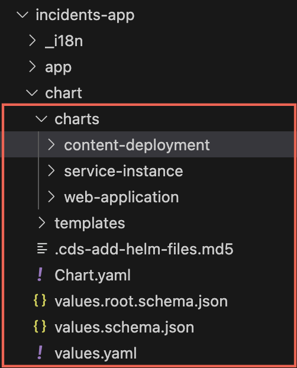

# Setup the Incident Management Application

## Clone the Incident Management Application

1. Run the below command to clone the Incident Management Application

  ```sh
  git clone https://github.com/cap-js/incidents-app.git
  ```

2. Navigate to **package.json** file from the project's root folder and modify the **name** to **incident-management**

Based on the SAP BTP Runtime environment to which you want to deploy your application, you can choose one of the below two options

  - [Prepare application to Deploy to Cloud Foundry](#prepare-application-to-deploy-to-cloud-foundry)
  - [Prepare application to Deploy to Kyma Runtime](#prepare-application-to-deploy-to-kymak8s)

# Prepare application to Deploy to Cloud Foundry

## Preliminary Setup

- [Prepare for SAP BTP Development with Cloud Foundry Runtime](https://developers.sap.com/tutorials/prepare-btp-cf.html)

---
**Info:**
In case you want to use VS Code as your development environment instead of SAP Business Application Studio, you'll need some additional tools installed on your machine. See below:
- Install the Cloud Foundry Command Line Interface (cf CLI). Check out [Installing the cf CLI](https://docs.cloudfoundry.org/cf-cli/install-go-cli.html) for instructions.
- Install the Cloud MTA Build Tool (MBT). You'll need it to build the multi-target application. See [Download](https://sap.github.io/cloud-mta-build-tool/download/) for instructions.
- For Windows, install make tool. You can find detailed instructions at [(For Windows) Install make tool](https://developers.sap.com/tutorials/btp-app-cap-mta-deployment.html#84cb836f-ba56-4984-b188-b527d901d48a).
- Install the [Multiapps CF CLI plugin](https://github.com/cloudfoundry/multiapps-cli-plugin). Open a terminal and run the following commands:

    ```
    cf add-plugin-repo CF-Community https://plugins.cloudfoundry.org
    cf install-plugin multiapps
    ```

---


## Overview
The SAP BTP, Cloud Foundry environment allows you to create polyglot cloud applications in Cloud Foundry. It contains the SAP BTP, Cloud Foundry runtime, which is based on the open-source application platform managed by the Cloud Foundry Foundation.

The SAP BTP for the Cloud Foundry environment enables you to develop new business applications and business services, supporting multiple runtimes, programming languages, libraries, and services. You can leverage a multitude of buildpacks, including community innovations and self-developed buildpacks. It also integrates with SAP HANA extended application services, advanced model.

For more information about the Cloud Foundry environment, refer to [Cloud Foundry Environment](https://help.sap.com/docs/btp/sap-business-technology-platform/cloud-foundry-environment).

## Open Terminal
In SAP Business Application Studio, click the burger menu and choose **Terminal** &rarr; **New Terminal**. 


## Using MTA for Deployment

We’ll be using the [Cloud MTA Build Tool](https://sap.github.io/cloud-mta-build-tool/) to execute the deployment. The modules and services are configured in an `mta.yaml` deployment descriptor file. 

Run the following command to generate your deployment descriptor:

```
cds add mta
```


## Configure Managed Approuter

---
**Tip:**
- Additional documentation [deploying content with Generic Application Content Deployment](https://help.sap.com/viewer/65de2977205c403bbc107264b8eccf4b/Cloud/en-US/d3e23196166b443db17b3545c912dfc0.html)

---

1. In SAP Business Application Studio, invoke the Command Palette ( **View** &rarr; **Command Palette** or <kbd>Shift</kbd> + <kbd>Command</kbd> + <kbd>P</kbd> for macOS / <kbd>Ctrl</kbd> + <kbd>Shift</kbd> + <kbd>P</kbd> for Windows) and choose **Create MTA Module from Template**.

2. Choose Module template **Approuter Configuration** .

3. Choose **Start**.


4. Choose **Managed Approuter** in **Approuter Configuration** .
    
5. Enter `incidents` as the business solution name.

6. Select **yes** for the **Plan to add a UI**.

7. Choose **Next**.


8. Select **do not overwrite** for xs-security.json.

9. Choose **finish**.

 

The above steps will generate the following module and resouces in **mta.yaml**:

```yaml hl_lines="5-9"
_schema-version: '3.1'
...
module:
  ...
- name: incident-management-destination-content
  type: com.sap.application.content
  requires:
  - name: incident-management-destination-service
    parameters:
      content-target: true
  - name: incident-management_html_repo_host
    parameters:
      service-key:
        name: incident-management_html_repo_host-key
  - name: incident-management-auth
    parameters:
      service-key:
        name: incident-management-auth-key
  parameters:
    content:
      instance:
        destinations:
        - Name: incidents_incident_management_html_repo_host
          ServiceInstanceName: incident-management-html5-app-host-service
          ServiceKeyName: incident-management_html_repo_host-key
          sap.cloud.service: incidents
        - Authentication: OAuth2UserTokenExchange
          Name: incidents_incident_management_auth
          ServiceInstanceName: incident-management-auth
          ServiceKeyName: incident-management-auth-key
          sap.cloud.service: incidents
        existing_destinations_policy: ignore
  build-parameters:
    no-source: true
  ...
resources: 
- name: incident-management-destination-service
  type: org.cloudfoundry.managed-service
  parameters:
    config:
      HTML5Runtime_enabled: true
      version: 1.0.0
    service: destination
    service-name: incident-management-destination-service
    service-plan: lite
- name: incident-management_html_repo_host
  type: org.cloudfoundry.managed-service
  parameters:
    service: html5-apps-repo
    service-name: incident-management-html5-app-host-service
    service-plan: app-host
parameters:
  enable-parallel-deployments: true
build-parameters:
  before-all:
  - builder: custom
    commands:
    - npx cds build --production    
```

* This snippet adds `destinations` required by `SAP Build workzone` - HTML5 repo host service and xsuaa service
* The `html5-apps-repo` service with plan `app-host` is required to deploy the HTML5 applications to the HTML5 Application Repository.

10. Add 

## Add UI Application

1. In SAP Business Application Studio, invoke the Command Palette ( **View** &rarr; **Command Palette** or <kbd>Shift</kbd> + <kbd>Command</kbd> + <kbd>P</kbd> for macOS / <kbd>Ctrl</kbd> + <kbd>Shift</kbd> + <kbd>P</kbd> for Windows) and choose **Fiori: Open Application info**.

2. Choose **Add Deploy Config** under the **Application Info - incidents** tab.


3. Select **Cloud Foundry** for **Target** in deployment configuration .

4. Select **Local CAP Project API** in destination name and choose the option yes for Edit the deployment configurations.

5. Choose **Finish**.


The above steps will add SAP Cloud service at the end of `app/incidents/webapp/manifest.json`:

```
 "sap.cloud": {
    "public": true,
    "service": "incidents"
  }
```

6. The above steps will generate the following module and update the resouces in **mta.yaml**:

```yaml hl_lines="5-9"
_schema-version: '3.1'
...
module:
  ...
- name: incident-management-app-content
  type: com.sap.application.content
  path: .
  requires:
  - name: incident-management_html_repo_host
    parameters:
      content-target: true
  build-parameters:
    build-result: resources
    requires:
    - artifacts:
      - nsincidents.zip
      name: nsincidents
      target-path: resources/
- name: nsincidents
  type: html5
  path: app/incidents
  build-parameters:
    build-result: dist
    builder: custom
    commands:
    - npm install
    - npm run build:cf
    supported-platforms: []
  ...
resources: 
- name: incident-management-destination-service
  type: org.cloudfoundry.managed-service
  parameters:
    config:
      HTML5Runtime_enabled: true
      init_data:
        instance:
          destinations:
          - Authentication: NoAuthentication
            Name: ui5
            ProxyType: Internet
            Type: HTTP
            URL: https://ui5.sap.com
          - Authentication: NoAuthentication
            HTML5.DynamicDestination: true
            HTML5.ForwardAuthToken: true
            Name: incident-management-srv-api
            ProxyType: Internet
            Type: HTTP
            URL: ~{srv-api/srv-url}
          existing_destinations_policy: update
      version: 1.0.0
    service: destination
    service-name: incident-management-destination-service
    service-plan: lite
  requires:
  - name: srv-api
  ...  
```

* The snippet added `nsincidents` which is a `html5 app` and it is added as an `artifact` in app content.

# Prepare application to Deploy to Kyma/K8s

## Preliminary Setup
- [Download your project from SAP Business Application Studio](#download-and-setup-the-project-locally), unzip and import it into Visual Studio Code.
- [Prepare for SAP BTP Development with Kyma Runtime]()
- [SAP BTP Operator Module is enabled](https://help.sap.com/docs/btp/sap-business-technology-platform/enable-and-disable-kyma-module#loio1b548e9ad4744b978b8b595288b0cb5c)
- Download and install the following command line tools:
  - [kubectl command line client for Kubernetes](https://kubernetes.io/docs/tasks/tools/)
  - [Docker Desktop](https://docs.docker.com/get-docker/) is a paid subscription and it costs approx 12.45 EUR/Month
  - [pack command line tool](https://buildpacks.io/docs/tools/pack/)
  - [helm command line tool](https://helm.sh/docs/intro/install/)
- [Access Kyma instance using kubectl](https://help.sap.com/docs/btp/sap-business-technology-platform/access-kyma-instance-using-kubectl?locale=244dbc262b5c4d37a42cfd7405e4719e.html)
- Use the image artifactory recommended by your organization. Incase if you dont have an artifactory you can use [dockerhub](https://docs.docker.com/docker-hub/quickstart/) for a non-productive usage.

## Overview
SAP BTP, Kyma runtime is a cloud-native application runtime that combines the power of Kubernetes with a set of best-in-class tools and open-source components that empower you to develop, run, and operate secure and scalable cloud-native applications. Detailed information is available at [Kyma Environment](https://help.sap.com/docs/btp/sap-business-technology-platform/kyma-environment).
The Kyma runtime for SAP BTP's files are provided as a container image. In addition, since the containers run on Kubernetes, their configuration is described by Kubernetes resources.

Hence, two kinds of artifacts are needed to run applications on Kubernetes:

1. Container images
2. Kubernetes resources

You start by building your project as container images and push those images to a container registry of your choice. Then, you add a [CAP Helm chart](https://cap.cloud.sap/docs/guides/deployment/deploy-to-kyma#about-cap-helm) to your project. As a last step, you deploy the Helm chart to your Kyma resources, where service instances of SAP BTP services are created and pods pull the previously created container images from the container registry.

## Get Access to a Container Registry
SAP BTP doesn't provide a container registry.

You can choose from offerings of hosted open source and private container image registries, as well as solutions that can be run on premise or in your own cloud infrastructure. However, you need to consider that the Kubernetes cluster needs to access the container registry from its network.

The use of a public container registry gives everyone access to your container images.
In a private container registry, your container images are protected. You will need to configure a pull secret to allow your cluster to access it.

### Setup Your Cluster for a Public Container Registry
Make sure that the container registry is accessible from your Kubernetes cluster. No further setup is required.

### Setup Your Cluster for a Private Container Registry
To use a container image from a private repository, you need to create an image pull secret and configure this secret for your containers.

---
**Warning:**
It is recommended to use a technical user for this secret that has only read permission, because users with access to the Kubernetes cluster can reveal the password from the secret easily.

---

## Download and Setup the Project Locally
1. In SAP Business Application Studio, right click on the project folder (`Incidents-app``) and choose **Download**.


2. Extract the downloaded file `incidents-app.tar`.

3. Open a command line window.

4. Open the project in VS code:
  ```bash
  code incidents-app
  ```

## Add Configurations for UI

The `cds add helm` command supports deployment to the HTML5 application repository which can be used with both standalone app router and managed app router. See [UI Deployment](https://cap.cloud.sap/docs/guides/deployment/deploy-to-kyma#ui-deployment).

[HTML5 application deployer](https://www.npmjs.com/package/@sap/html5-app-deployer/v/5.0.0) handles the upload of the HTML5 applications content to the HTML5 application repository.
Below the root folder, the HTML5 applications deployer looks for the `resources` folder which has the static files of the HTML5 application.

1. Create a new folder called `resources` under `app/incidents` and move `webapp` folder to `resources`.

2. Open `app/incidents/package.json` and add the following code snippet:

        ```json
        {
            "name": "incidents",
            "version": "0.0.1",
            "description": "A Fiori application.",
            "keywords": [
                "ui5",
                "openui5",
                "sapui5"
            ],
            "main": "webapp/index.html",
            "scripts": {
                "start": "node node_modules/@sap/html5-app-deployer/index.js",
                "deploy-config": "npx -p @sap/ux-ui5-tooling fiori add deploy-config cf"
            },
            "dependencies": {  
                "@sap/html5-app-deployer": "5.0.0"
              },
            "devDependencies": { }
        }
        ```
3. Move `xs-app.json` from `app/incidents` to `app/incidents/resources/webapp`
4. Open `app/incidents/resources/webapp/xs-app.json` and add the following code snippet:

        ```json
        {
            "source": "^/odata/v4/processors/(.*)$",
            "destination": "srv-api",
            "authenticationType": "xsuaa"
        },
        ```
5. Open `app/incidents/resources/webapp/manifest.json` and remove the leading `/` from the `uri`

```json
  {
      "mainService": {
          "uri": "odata/v4/processors/",
          "type": "OData",
          "settings": {
              "annotations": [],
              "localUri": "localService/metadata.xml",
              "odataVersion": "4.0"
          }
      }
  }

```

This is needed as the dataSource URIs must be relative to the base URL, which means there is no need for a slash as the first character.

For more information refer the [document](https://help.sap.com/docs/btp/sap-business-technology-platform/accessing-business-service-ui?locale=39723061bc4b4b679726b120cbefdf5a.html&q=base%20URL)

6. Add the below code snippet to the end of `manifest.json` file

  ```json
  "sap.cloud": {
        "public": true,
        "service": "incidents"
  }
  ```

7. Delete `node-modules` and `package-lock.json` if there are any inside `app/incidents` folder.

8. Run `npm i`

## Add Helm Chart

CAP provides a configurable Helm chart for Node.js and Java applications.

1. Run the below command to add helm charts:

    ```sh
    cds add helm
    ```

This command adds the Helm chart to the chart folder of your project.
The generated chart will look something like this:



The files in the charts folder support the deployment of your CAP service, database and UI content, and the creation of instances for SAP BTP services.

2. Run the below command to automate the setup for HTML5 application deployment:

    ```sh
    cds add html5-repo
    ```

# Undeploy the Application

Based on the SAP BTP Runtime environment to which you had deployed your application, you can choose one of the below two options:
  
## Undeploy application from Cloud Foundry

Run the below command to undeploy your application from SAP BTP Cloud Foundry Runtime

  ```sh
  cf undeploy <YOUR_MTA_ID> --delete-services
  ```

**info**
Replace `YOUR_MTA_ID` in the above command with the `ID` from mta.yaml file.

## Undeploy application from Kyma Runtime

Run the below command to undeploy your application from SAP BTP Kyma Runtime

  ```sh
  helm uninstall <RELEASE_NAME> -n <YOUR_NAMESPACE>
  ```


