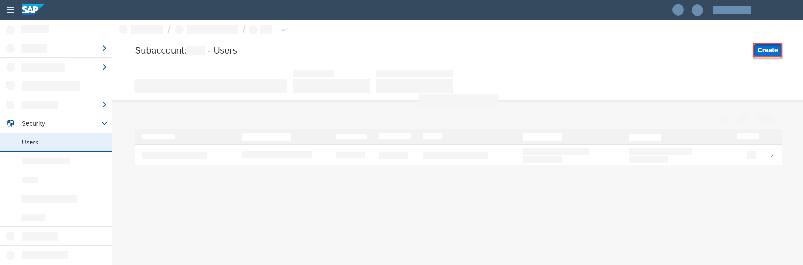
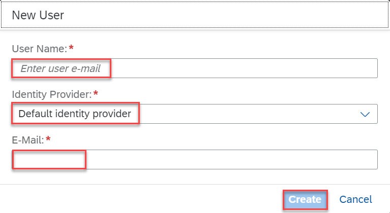
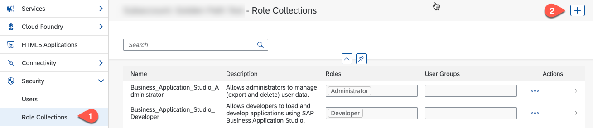
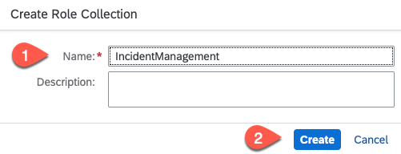
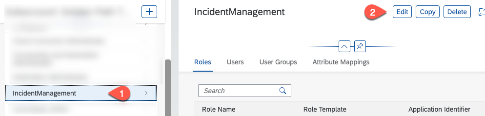
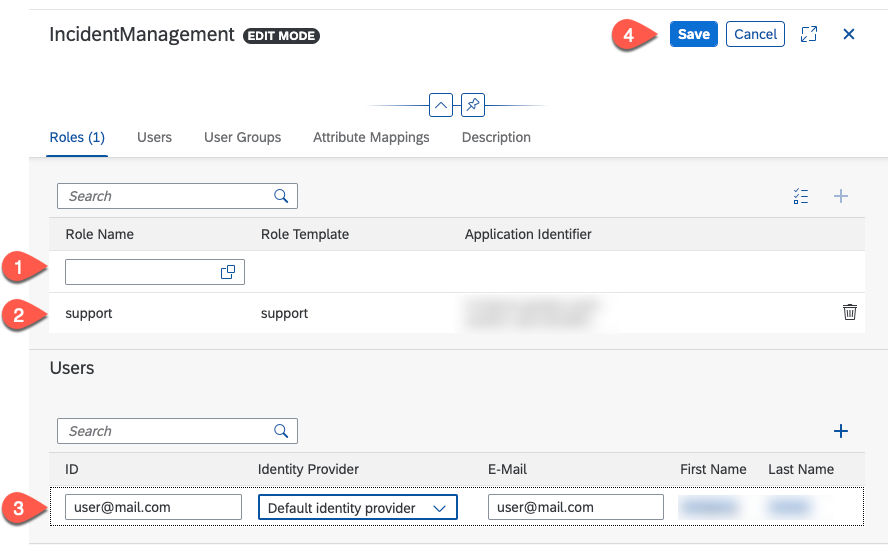

# User Role Assignment

Follow the below steps to add users to the SAP BTP subaccount and assign roles.

## Create a User

1. Open the SAP BTP cockpit and navigate to your subaccount.

1. Choose **Security** &rarr; **Users**, and then choose **Create**.

   

2. In the **New User** dialog, enter the user e-mail address in the **User Name** field and the **E-Mail** field, select an identity provider in the **Identity Provider** dropdown, and choose **Create**.

   

## Create a Role Collection

1. At the **SAP BTP Cockpit** choose **Security**  &rarr; **Role Collections** Press "+" and create a new Role Collection called **IncidentManagement**

    

    

2. Select the IncidentManagement role collection and choose **Edit**

   

3. In the **Roles** section add the support role. In the **Users** section add all users that need access to the Incident Management application. Select the same Identity Provider as in the user setup and press **Save**

   
  
