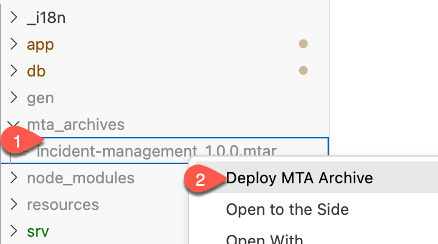

# Deploy and Run the Application on Cloud Foundry with the Installed Mock Server

## Usage scenario

Deploy the project to Cloud Foundry using the MTA build file

## Prerequisites

* You have prepared the project for productive usage

### Deploy the Application

1. Navigate to the root folder of incident management application and change credentials in package.json file to 

    ```json
        "credentials": {
            "destination": "<destination_name>",
            "path": "/v2/odata/v4/api-business-partner"
        }
    ```

**Note** - As **destination_name** you must enter the name of the destination created while installing mock server to SAP BTP Cloud Foundry Runtime.

1. In the incidents-srv module requires section add **- name: incident-management-destination-service**
   
    ```yaml
    - name: incident-management-srv
      type: nodejs
      path: gen/srv
      requires:
      - name: incident-management-auth
      - name: incident-management-db
      - name: incident-management-destination-service
    ....
    ```

2. Right-click the mta.yaml file and choose **Build MTA Project**
   
   

3. If the build was successful, you find the generated file in the mta_archives folder. Right-click on incidents_1.0.0.mtar and select **Deploy MTA Archive**  
   
   

4. Login to your SAP BTP subaccount and space to start the deployment.
   
   

   
