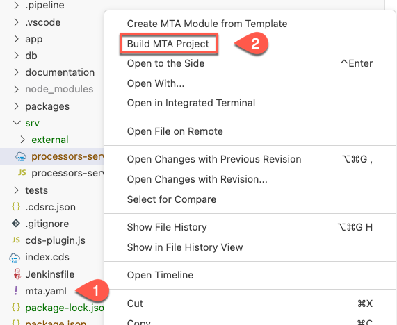
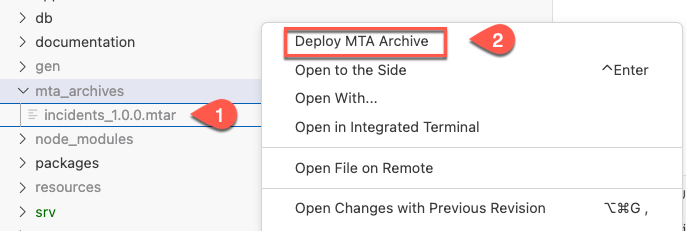
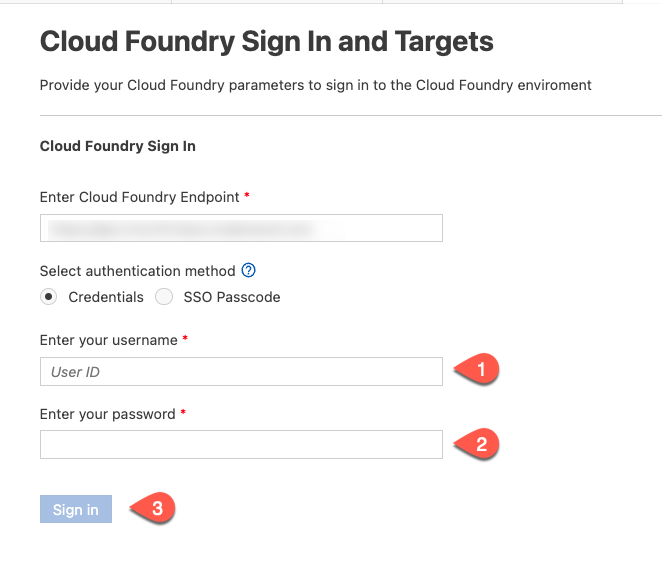
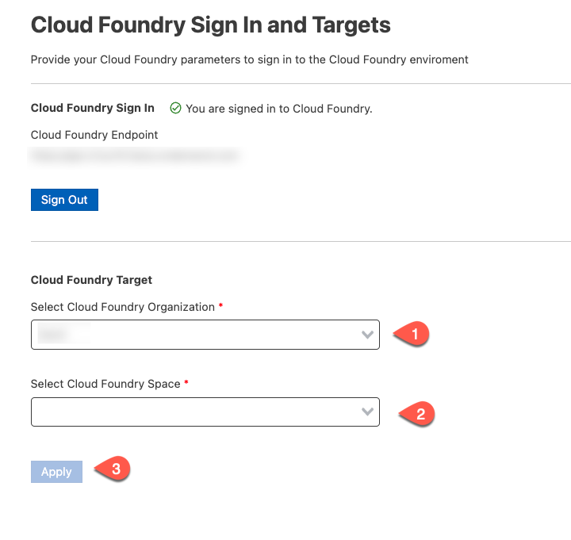

# Deploy and Run the Application on Cloud Foundry with SAP S/4HANA Cloud Backend

## Usage Scenario

Deploy the project to Cloud Foundry using the MTA build file.

## Prerequisites

* You have prepared the project for productive usage.

## Content
Extend the existing MTA build file with the settings for SAP S/4HANA Cloud extension service.


### Deploy the Application

1. Add SAP S/4HANA Cloud API access service. Right-click on the *mta.yaml* file and choose **Open with ... - Text Editor**.
2. Add the following code snippet to the *resource* section

    ```yaml
    - name: incidents-api-access
        type: org.cloudfoundry.managed-service  
        parameters:
          path: ./bupa.json
          service: s4-hana-cloud
          service-plan: api-access
          system-name: <system-name>
    ```

**Note** - For **system-name**, enter the name of your registered SAP S/4HANA Cloud system.

4. In the *incident-management-srv* module, in the *requires* section, add **- name: incident-management-destination-service**
   
    ```yaml
    - name: incident-management-srv
      type: nodejs
      path: gen/srv
      requires:
      - name: incident-management-auth
      - name: incident-management-db
      - name: incident-management-destination-service
    ....
    ```

5. Right-click on the *mta.yaml* file and choose **Build MTA Project**
   
   

5. If the build was successful, you find the generated file in the *mta_archives* folder. Right-click on *incident-management_1.0.0.mtar* and choose **Deploy MTA Archive**.
   
   

6. Login to your SAP BTP subaccount and space to start the deployment.
   
   

   


Before you can access the application, you need to [Assign Application Roles](https://developers.sap.com/tutorials/user-role-assignment.html).

As a next step, proceed to [Integrate with SAP Build Workzone](https://developers.sap.com/tutorials/integrate-with-work-zone.html) to access the application in launchpad.
