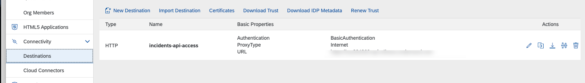
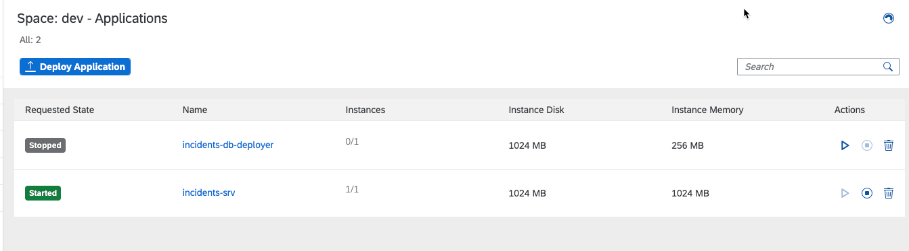
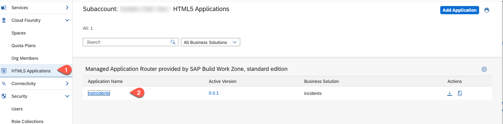

# Run and Test the Incident Management Application

## Prerequisites
You have sucessfully deployed the application to your Cloud Foundry environment.

## Check the deployment

1. If you are using SAP S/4 HANA Cloud, then:
In the SAP BTP cockpit select **Destinations** . You should see the **incidents-api-access** destination:
   
   

2. In the SAP BTP Cockpit select **Cloud Foundry** &rarr; **Spaces**. Choose your space and you should see the incidents-srv with a **Started** state.
   
    

## Run and Test the applicaion

1. In your SAP BTP Cockpit of your subaccount choose **HTML5 Applications** - You get a list of the deployed HTML5 applications. Select the Incident Management Application

   

2. The application starts and you should be able to create a new incident.
   
   

## Summary

Congratulation! You have successfully developed, configured and deployed the Incidenent Management Application using an external service.

