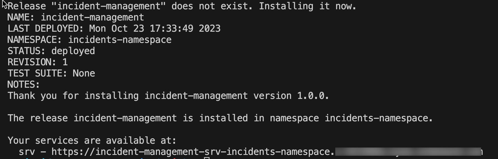

# Deploy and Run the Application on Kyma with SAP S/4HANA Cloud Backend

## Usage Scenario

Deploy the project to Kyma using Helm configurations. See [Helm](https://helm.sh/).

## Configure the Build

To transform source code into container images, CAP uses [Cloud Native Buildpacks](https://buildpacks.io/) configured via a `containerize.yaml` file.

For more information, see [About Cloud Native Buildpacks](https://cap.cloud.sap/docs/guides/deployment/deploy-to-kyma?impl-variant=node#about-cloud-native-buildpacks).

Log in to your container registry:

```sh
docker login docker.io -u <your-user>
```

**Before You Begin**

If you're using any device with a non-x86 processor (e.g. MacBook M1/M2), you need to instruct Docker to use x86 images by setting the **DOCKER_DEFAULT_PLATFORM** environment variable: *export DOCKER_DEFAULT_PLATFORM=linux/amd64*.
See [Environment variables](https://docs.docker.com/engine/reference/commandline/cli/#environment-variables).

1. Do the productive build for your application, which writes into the `gen/srv` folder:

    ```sh
    cds build --production
    ```

2. Configure `containerize.yaml` at the root of your project:

    > **Note:** Set `BP_NODE_VERSION: "20"` to pin Node.js to version 20 LTS. Without it, the Paketo buildpack selects Node.js 26, which requires `libatomic.so.1` — a library not present in the `paketobuildpacks/run-jammy-base` runtime image, causing the container to crash on startup.

    ```yaml
    _schema-version: '1.0'
    repository: <your-dockerhub-username>
    tag: <image-version>
    modules:
      - name: incident-management-srv
        build-parameters:
          buildpack:
            type: nodejs
            builder: builder-jammy-base
            path: gen/srv
            env:
              BP_NODE_VERSION: "20"
      - name: incident-management-hana-deployer
        build-parameters:
          buildpack:
            type: nodejs
            builder: builder-jammy-base
            path: gen/db
            env:
              BP_NODE_VERSION: "20"
      - name: incident-management-html5-deployer
        build-parameters:
          buildpack:
            type: nodejs
            builder: builder-jammy-base
            path: ui-resources
    ```

**Info**
The `cds up` command builds images using the [Paketo Jammy Base Builder](https://github.com/paketo-buildpacks/builder-jammy-base), which contains the build result from the configured `path` and the required npm packages.

## Remote Service Configuration

1. Add the following code snippet to `chart/Chart.yaml`:

  ```yaml
  - name: service-instance
    alias: s4-hana-cloud
    version: ">0.0.0"
  ```

2. Add the following configurations for `s4-hana-cloud` service instance creation in `values.yaml`:

  ```yaml
  s4-hana-cloud:
    serviceOfferingName: s4-hana-cloud
    servicePlanName: api-access
  ```

For more information about Helm and CAP, see [About CAP Helm chart](https://cap.cloud.sap/docs/guides/deployment/deploy-to-kyma?impl-variant=node#about-cap-helm).

## Deploy Helm Chart

Once all configurations are done, configure access to your container images and deploy.

### Configure Access to Your Container Images

Add your container image settings to your `chart/values.yaml`:

> **Note:** The `global.image.registry` field must be a valid registry domain (e.g. `docker.io`). A bare Docker Hub username is not valid and will cause `cds up` to fail with a registry validation error.

```yaml
global:
  domain: <your-kyma-cluster-domain>
  imagePullSecret:
    name: <image-pull-secret-name>
  imagePullPolicy: Always
  image:
    registry: docker.io
    tag: <image-version>
srv:
  image:
    repository: <your-dockerhub-username>/incident-management-srv
hana-deployer:
  image:
    repository: <your-dockerhub-username>/incident-management-hana-deployer
html5-apps-deployer:
  image:
    repository: <your-dockerhub-username>/incident-management-html5-deployer
```

## Deploy CAP Helm Chart

1. Log in to your Kyma cluster.

2. Execute one of the commands below based on your integration scenario:

  a. For deploying together with SAP S/4HANA Cloud:

    ```sh
    cds up --to k8s --namespace incident-management
    ```

    > After deploying, bind the S/4HANA Cloud service instance with the parameters file:
    >
    > ```sh
    > helm upgrade incident-management --namespace incident-management ./gen/chart \
    >   --set-file xsuaa.jsonParameters=xs-security.json --set-file s4-hana-cloud.jsonParameters=bupa.json
    > ```

  b. For deploying together with Mock Server:

    ```sh
    cds up --to k8s --namespace incidents-namespace
    ```

This installs the Helm chart from the chart folder with the release name ***incident-management*** in the specified namespace. The namespace is created automatically if it does not exist.

> **Tip:** With `cds up --to k8s`, you can deploy a new application as well as update an existing deployment.

The outcome of installation looks similar to this:



To be able to access the application via the URL, you have to [Assign Application Roles](https://developers.sap.com/tutorials/user-role-assignment.html).

As a next step, to access the application in launchpad, proceed to [Integrate with SAP Build Workzone](https://developers.sap.com/tutorials/integrate-with-work-zone.html).
