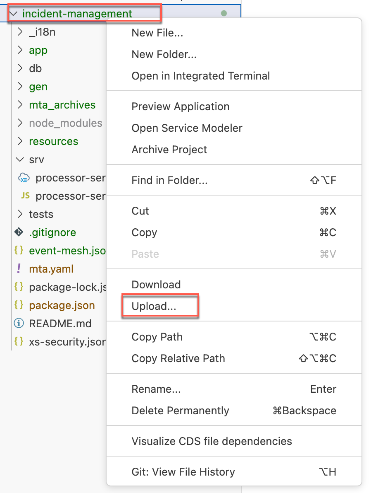

# Extend the Incident Management Application

## Prerequisites

* You have ensured that the [prerequisites are fullfilled and all the required systems are in place](../mission-prerequisites/README.md)
* You have downloaded the [Business Partner API](../explore-apis-and-events/README.md)

## Content

1. Navigate to the project's root folder of the Incident Management application. 
   
2.  In the *package.json*, change the name to `incident-management`.
    
    ```js
    {
      "name": "incident-management",
      "version": "1.0.0",
      "dependencies": {
        ....
    ```
3. Add some additional libraries to the *package.json* for the communication with external systems. In the terminal, go to the project's root folder of the Incident Management application and run the following command:  
   
   ```bash
   npm add @sap-cloud-sdk/http-client@3.x @sap-cloud-sdk/util@3.x @sap-cloud-sdk/connectivity@3.x @sap-cloud-sdk/resilience@3.x
   ```

4. Import the Business Partner API to your project.
   * In the project explorer, right-click on the project's root folder and select **Upload...**

     

   * Select the *API_BUSINESS_PARTNER.edmx* file and upload it to your project folder.
   * In the terminal, run the following command
  
      ```bash
      cds import API_BUSINESS_PARTNER.edmx --as cds
      ```
   * You can find the generated files in the **srv/external** folder.

5. Change the conditions for the relationships between some entities. Open **srv/external/API_BUSINESS_PARTNER.cds**. Search for **entity API_BUSINESS_PARTNER.A_BusinessPartner**. Scroll down to the **to_BusinessPartnerAddress** section and replace it with the following:

    ```js
    to_BusinessPartnerAddress : Composition of many API_BUSINESS_PARTNER.A_BusinessPartnerAddress on to_BusinessPartnerAddress.BusinessPartner = BusinessPartner;
    ```

9. Search for **entity API_BUSINESS_PARTNER.A_BusinessPartnerAddress**. Replace the associations for email address and phone number.

    ```js
    to_EmailAddress : Composition of many API_BUSINESS_PARTNER.A_AddressEmailAddress on to_EmailAddress.AddressID = AddressID;

    to_PhoneNumber : Composition of many API_BUSINESS_PARTNER.A_AddressPhoneNumber on to_PhoneNumber.AddressID = AddressID;
    ```

6. Create a new file *remote.cds* in the *srv* folder.

7. Copy the snippet to the newly created *remote.cds* file

    ```js
    using { API_BUSINESS_PARTNER as S4 } from './external/API_BUSINESS_PARTNER';

    service RemoteService {
      entity BusinessPartner as projection on S4.A_BusinessPartner {
        key BusinessPartner as ID,
        FirstName as firstName,
        LastName as lastName,
        BusinessPartnerName as name,
        to_BusinessPartnerAddress as addresses
      }
      entity BusinessPartnerAddress as projection on S4.A_BusinessPartnerAddress {
                BusinessPartner as ID,
                AddressID as addressId,
                to_EmailAddress as email,
                to_PhoneNumber as phoneNumber
      }
      entity EmailAddress as projection on S4.A_AddressEmailAddress {
          key AddressID as addressId,
          EmailAddress as email
      }

      entity PhoneNumber as projection on S4.A_AddressPhoneNumber {
          key AddressID as addressId,
          PhoneNumber as phone
      }
    }
    ```

10. Now add some buisness logic for reading and saving a business partner. 
   * Open the *srv/processor-service.js* file. 
   * Set the `init` method to `async` 
  
      ```js
      async init() {
        this.before("UPDATE", "Incidents", (req) => this.onUpdate(req));
        this.after("READ", "Incidents", (data) => this.changeUrgencyDueToSubject(data));

        return super.init();
      }
      ```
   * Add a custom handler for READ of customers in the init() method 
      
      ```js
      this.on('READ', 'Customers', (req) => this.onCustomerRead(req));
      ```

  * Add the custom handler implementation after the init method
      ```js
        async onCustomerRead(req) {
          console.log('>> delegating to S4 service...', req.query);
          const top = parseInt(req._queryOptions?.$top) || 100;
          const skip = parseInt(req._queryOptions?.$skip) || 0;
        
          const { BusinessPartner } = this.remoteService.entities;

          // Expands are required as the runtime does not support path expressions for remote services
          let result = await this.S4bupa.run(SELECT.from(BusinessPartner, bp => {
            bp('*'),
              bp.addresses(address => {
                address('email'),
                  address.email(emails => {
                    emails('email');
                  });
              })
          }).limit(top, skip));
        
          result = result.map((bp) => ({
            ID: bp.ID,
            name: bp.name,
            email: bp.addresses[0]?.email[0]?.email
          }));

          // Explicitly set $count so the values show up in the value help in the UI
          result.$count = 1000;
          console.log("after result", result);
          return result;
        }   
    ```

*  Add a custom handler for CREATE, UPDATE, DELETE of incidents. Add this code snippet to the *init* method

    ```js
    this.on(['CREATE','UPDATE'], 'Incidents', (req, next) => this.onCustomerCache(req, next));
    this.S4bupa = await cds.connect.to('API_BUSINESS_PARTNER');
    this.remoteService = await cds.connect.to('RemoteService');
    ```
* Add the custom handler after the *init* method

  ```js
    async onCustomerCache(req, next) {
      const { Customers } = this.entities;
      const newCustomerId = req.data.customer_ID;
      const result = await next();
      const { BusinessPartner } = this.remoteService.entities;
      if (newCustomerId && (newCustomerId !== "") && ((req.event == "CREATE") || (req.event == "UPDATE"))) {
        console.log('>> CREATE or UPDATE customer!');

        // Expands are required as the runtime does not support path expressions for remote services
        const customer = await this.S4bupa.run(SELECT.one(BusinessPartner, bp => {
          bp('*'),
            bp.addresses(address => {
              address('email', 'phoneNumber'),
                address.email(emails => {
                  emails('email')
                }),
                address.phoneNumber(phoneNumber => {
                  phoneNumber('phone')
                })
            })
        }).where({ ID: newCustomerId }));
                                                                                      
        if(customer) {
          customer.email = customer.addresses[0]?.email[0]?.email;
          customer.phone = customer.addresses[0]?.phoneNumber[0]?.phone;
          delete customer.addresses;
          delete customer.name;
          await UPSERT.into(Customers).entries(customer);
        }
      }
      return result;
      }
    ```

11. To run tests, navigate to `tests/test.js` and replace line no.3 with the code snippet below

    ```js
    const { GET, POST, DELETE, PATCH, expect } = cds.test(__dirname + '../../', '--with-mocks');
    ```

    Now you can run tests by

    ```sh
    npm run test
    ```

 ## Result
 You have integrated the Business Partner API into your project and business logic to read the data from the backend system. New or changed customer data would be stored in your application database.


   
