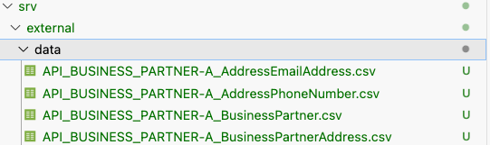
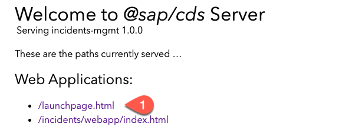
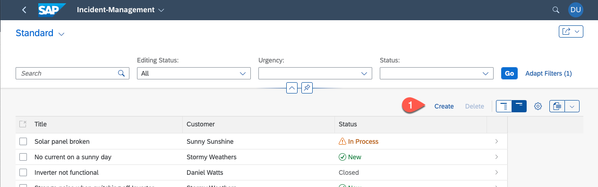
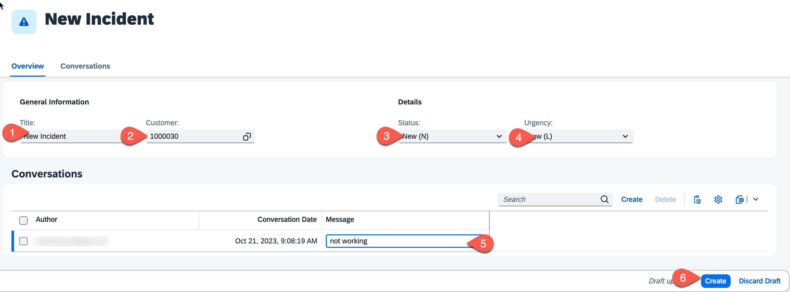

# Test the Incident Management Application

## Usage scenario

To increase your development speed, it is helpful to run and test your implementation in a local environment. In this section you will learn how to set up and use a mock server for running your development tests.  

## Content

### Create Mock Data for the New Entities.

1. Create a new folder **data** in the `srv/external` folder.

2. Create a new file **API_BUSINESS_PARTNER-A_BusinessPartner.csv** and add the following data to it
   
   ```csv
   BusinessPartner;FirstName;LastName;BusinessPartnerName;BusinessPartnerIsBlocked;
   1004155;Daniel;Watts;Daniel Watts;false
   1004161;Stormy;Weathers;Stormy Weathers;false
   1004100;Sunny;Sunshine;Sunny Sunshine;true
   ```

3. Create a new file **API_BUSINESS_PARTNER-A_BusinessPartnerAddress.csv** and add the following data to it

   ```csv
   BusinessPartner;AddressID;
   1004155;123
   1004161;345
   1004100;456
   ```

4. Create a new file **API_BUSINESS_PARTNER-A_AddressEmailAddress.csv** and add the following data to it

   ```csv
   AddressID;EmailAddress;Person;OrdinalNumber
   123;test@demo.com;Williams;123
   345;testjohn@demo.com;Smith;222
   456;testhencry@demo.com;johnson;333
   ```
5. Create a new file **API_BUSINESS_PARTNER-A_AddressPhoneNumber.csv** and add the following data to it

   ```csv
   AddressID;PhoneNumber;Person;OrdinalNumber
   123;+44-555-123;Daniel;123
   345;+01-555-688;Stormy;222
   456;+01-555-789;Sunny;333
   ```
   
    

### Run the Incident Management Application

1. Build your application.

   ```sh
   npm i
   ```

2. Run the mock server locally .

   ```sh
   cds mock API_BUSINESS_PARTNER
   ```

3. In the terminal, you should see the following output
   ```cds
   [cds] - connect using bindings from: { registry: '~/.cds-services.json' }
   [cds] - connect to db > sqlite { url: ':memory:' }
      > init from db/data/sap.capire.incidents-Urgency.csv 
      > init from db/data/sap.capire.incidents-Status.csv 
      > init from db/data/sap.capire.incidents-Incidents.csv 
      > init from db/data/sap.capire.incidents-Customers.csv 
      > init from db/data/sap.capire.incidents-Conversations.csv 
      > init from srv/external/data/API_BUSINESS_PARTNER-A_BusinessPartnerAddress.csv 
      > init from srv/external/data/API_BUSINESS_PARTNER-A_BusinessPartner.csv 
      > init from srv/external/data/API_BUSINESS_PARTNER-A_AddressPhoneNumber.csv 
      > init from srv/external/data/API_BUSINESS_PARTNER-A_AddressEmailAddress.csv  
   ```
   > If the API_BUSINESS_PARTNER doesn't show up, remove the `.cds-services.json` file - you find it in the user root folder (e.g.: /home/user/.cds-services.json) 

4.  Open a new terminal and run `cds watch`. This will start the application connected to the running mock service.
   >In case you had previously deployed the application to Kyma Runtime -  Navigate to `app/incidents/resources/webapp` folder and move the `webapp` folder to `app/incidents`. Also, delete the `resources` folder.
5. In a browser, open the server URL: `http://localhost:4004`.
6. There are two URLs under web applications:
 
    - */launchpage.html* uses a [local launchpage](!https://pages.github.tools.sap/cap/golden-path/develop/Launchpage/Launchpage)
    - */incidents/webapp/index.html* uses the *index.html* from [ui5 app](!https://pages.github.tools.sap/cap/golden-path/develop/btp-app-create-ui-fiori-elements/btp-app-create-ui-fiori-elements)
  
    - Choose the *launchpad.html*.
    
   


7.  When you are prompted to authenticate, use the following credentials:
 
    - Username: `incident.support@tester.sap.com`
    - Password: `initial`   
    
    > You find the user settings in the `.cdsrc.json file`.

8. Testing the scenario - while creating a new incident, the value help for customers loads data from the mock service.
   * Open the Incident Management application.
  
      
  
   *  Choose **Create**.
  
      
   
   * Set **Title**, **Customer**, **Status** and **Urgency**. 
   * The value help for **Customer** fetches data from the mock server.
   * Create a conversation.
   * Choose **Create** to save the settings.
     
      
   

## Summary
By using a mock server you can easily test your implementation in a local environment. You find more details in the documentation for [Local Mocking](https://cap.cloud.sap/docs/guides/using-services#local-mocking)
