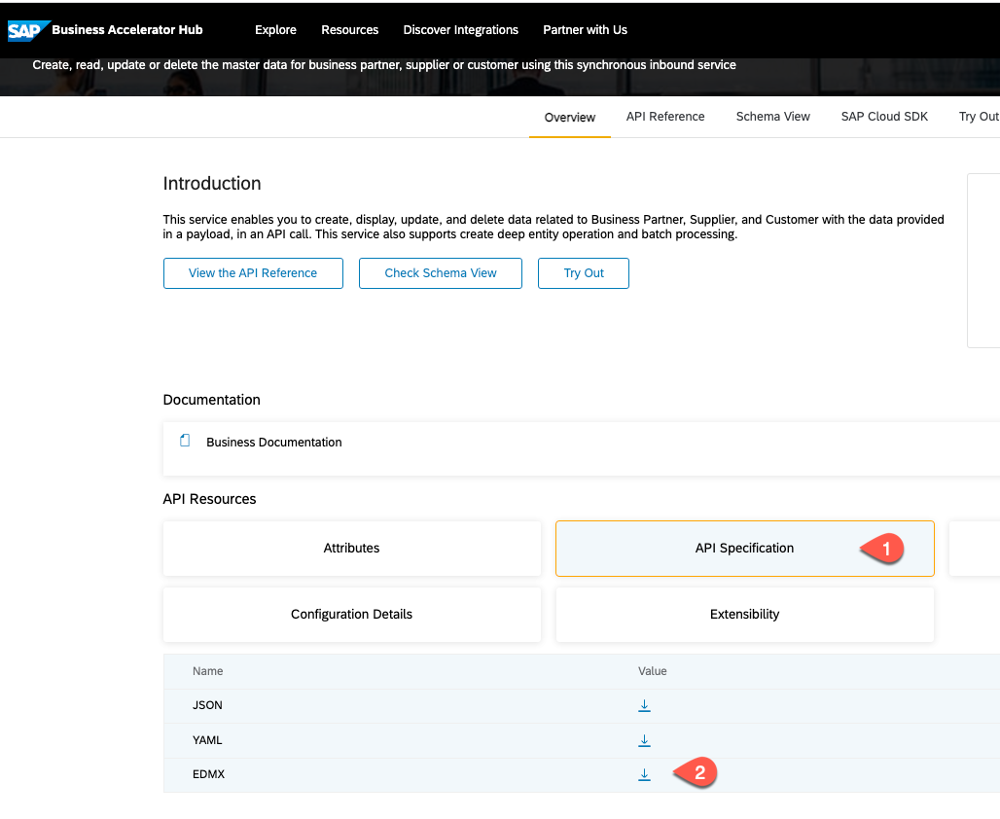

# Get the Business Partner API

SAP Business Accelerator Hub is a web application hosted by SAP where you can discover, explore, and test SAP and partner APIs (Application Programming Interfaces) that are required to build extensions or process integrations.

In the [SAP Business Accelerator Hub](https://api.sap.com/), you can find the APIs that you need to complete your extension scenario. 

For our scenario, we use the Business Partner API from SAP S/4HANA Cloud.

### Download the Business Partner API

1. In the SAP Business Accelerator Hub, go to [Business Partner API (A2X)](https://api.sap.com/api/API_BUSINESS_PARTNER/overview). 
2. In _API Resources_, select _API Specification_.
3. From the list of files, download the _EDMX_ file. You will need this file in a later section.
   
   

