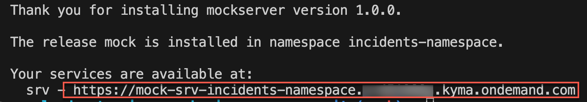

# Option 2 - Install Mock Server in SAP BTP Kyma Runtime

## Usage Scenario

If you don't have access to an SAP backend system (SAP ECC, SAP S/4HANA or SAP on-premise system) but still need OData services with some data, you can use this [mock server application](https://github.com/SAP-samples/cloud-extension-ecc-business-process/blob/mock/README.md). It contains some entities of SAP OData services with sample data.

In essence, these are the steps you need to follow:
1. Install the mock server. 

2. Create a destination to the mock server in your subaccount.

> This installation of the mock server is only needed if you want to test an application deployed for Kyma Runtime. For local development testing, you can use the local mock server. 

## Install the Mock Server

### Prerequisites

1. [Access Kyma instance using kubectl](https://help.sap.com/docs/btp/sap-business-technology-platform/access-kyma-instance-using-kubectl?locale=244dbc262b5c4d37a42cfd7405e4719e.html).

2. Verify login to Kyma instance.

    ```bash
    kubectl get pods
    ```

3. Make sure you deploy the Incident Management application and the mock server to the same Kyma namespace.

### Build and Deploy the Mock Server Application

1. Clone the mock server GitHub repository.

   ```bash
      git clone -b mock https://github.com/SAP-samples/cloud-extension-ecc-business-process.git
   ```

2. Build the application.

    ```bash
    cds build --production
    ```

3. Build an image and publish the image.

    ```bash
    pack build <your-container-registry>/mockserver-srv:latest \
    --path gen/srv \
    --builder paketobuildpacks/builder-jammy-base \
    --publish
    ```

4. CAP provides a configurable Helm chart for Node.js applications. Add Helm charts.

    ```bash
    cds add helm
    ```

5. The above command also adds configurations for enterprise-messaging service instance. You will be needing this while enhancing the application with Eventing. For now, remove the references of enterprise-messaging from the charts folder.

   In `Values.yaml` file:
   
   - From `srv/bindings`, remove
   
        ```yaml
        messaging:
            serviceInstanceName: event-mesh
        ```

   - Remove event-mesh service instance creation

        ```yaml
        event-mesh:
            serviceOfferingName: enterprise-messaging
            servicePlanName: default
        ```

    From `Chart.yaml` file, remove
        
      ```yaml
      - name: service-instance
          alias: event-mesh
          version: ">0.0.0"
      ```

6. Configure the created Helm charts.

    - Specify the domain of your cluster in the `chart/values.yaml` file so that the URL of your CAP service can be generated.

    ```yaml
    ...
    domain: <cluster domain>
    ```

    Get the domain name for your Kyma cluster. 

    ```yaml
    kubectl get gateway -n kyma-system kyma-gateway \
        -o jsonpath='{.spec.servers[0].hosts[0]}'
    ```

    - Add your container image settings `<your-container-registry>` and `tag` to your `chart/values.yaml`.

7. Create a namespace if it is not done already.

   ```sh
   kubectl create namespace incidents-namespace
   kubectl label namespace incidents-namespace istio-injection=enabled
   ```

8. Do the productive build for your application from the project's root directory, which writes into the `gen` folder using the below command:

    ```sh
    cds build --production
    ```
    
9. Deploy the mock server.

    ```yaml
    helm upgrade --install mock ./gen/chart -n <namespace>
    ```   

8. Copy the service URL for the installed mock server from the terminal.

    

## Create Destination to Mock Server

3. Go to your SAP BTP cockpit and navigate to the subaccount overview. Choose **Connectivity** &rarr; **Destination**. Then, choose **New Destination**. 
  1. Enter the following values:

      * **Name** = *[Some destination name depending on your mission]*
      * **Type** = HTTP
      * **URL** = *[service url for the installed mock server]* e.g. https://\<The application route of the mock server\>
      * **Proxy Type** = Internet
      * **Authentication** = NoAuthentication

  2. Select the **Use default JDK truststore** checkbox.

  3. Save your settings.

4. Choose **Check Connection**. You should get a `200 OK` message.

## Test the Mock Server

1. Call the **Application Route**.

2. There will be a couple of API endpoints to display the data.
