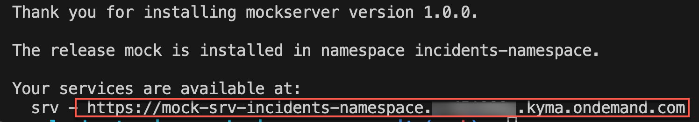

# Option 2 - Install Mock Server in SAP BTP Kyma Runtime

## Usage Scenario

If you don't have access to an SAP backend system (SAP ECC, SAP S/4HANA or SAP on-premise system) but still need OData services with some data, you can use this [mock server application](https://github.com/SAP-samples/cloud-extension-ecc-business-process/blob/mock/README.md). It contains some entities of SAP OData services with sample data.

In essence, these are the steps you need to follow:
1. Install the mock server. 

2. Create a destination to the mock server in your subaccount.

> This installation of the mock server is only needed if you want to test an application deployed for Kyma Runtime. For local development testing, you can use the local mock server. 

## Install the Mock Server

### Prerequisites

1. [Access Kyma instance using kubectl](https://help.sap.com/docs/btp/sap-business-technology-platform/access-kyma-instance-using-kubectl?locale=244dbc262b5c4d37a42cfd7405e4719e.html).

2. Verify login to Kyma instance.

    ```bash
    kubectl get pods
    ```

3. Make sure you deploy the Incident Management application and the mock server to the same Kyma namespace.

### Build and Deploy the Mock Server Application

1. Clone the mock server GitHub repository.

   ```bash
      git clone -b mock https://github.com/SAP-samples/cloud-extension-ecc-business-process.git
   ```

2. Build the application.

    ```bash
    cds build --production
    ```

3. Configure `containerize.yaml` at the root of the cloned project:

    > **Note:** Set `BP_NODE_VERSION: "20"` to pin Node.js to version 20 LTS. Without it, the Paketo buildpack selects Node.js 26, which requires `libatomic.so.1` — a library not present in the `paketobuildpacks/run-jammy-base` runtime image, causing the container to crash on startup.

    ```yaml
    _schema-version: '1.0'
    repository: <your-dockerhub-username>
    tag: latest
    modules:
      - name: mockserver-srv
        build-parameters:
          buildpack:
            type: nodejs
            builder: builder-jammy-base
            path: gen/srv
            env:
              BP_NODE_VERSION: "20"
    ```

4. CAP provides a configurable Helm chart for Node.js applications. Add Helm charts.

    ```bash
    cds add helm
    ```

5. The above command also adds configurations for enterprise-messaging service instance. You will be needing this while enhancing the application with Eventing. For now, remove the references of enterprise-messaging from the charts folder.

   In `Values.yaml` file:
   
   - From `srv/bindings`, remove
   
        ```yaml
        messaging:
            serviceInstanceName: event-mesh
        ```

   - Remove event-mesh service instance creation

        ```yaml
        event-mesh:
            serviceOfferingName: enterprise-messaging
            servicePlanName: default
        ```

    From `Chart.yaml` file, remove
        
      ```yaml
      - name: service-instance
          alias: event-mesh
          version: ">0.0.0"
      ```

6. Configure the created Helm charts.

    - Specify the domain of your cluster in `chart/values.yaml` so that the URL of your CAP service can be generated:

    ```yaml
    ...
    domain: <cluster domain>
    ```

    Get the domain name for your Kyma cluster: 

    ```bash
    kubectl get gateway -n kyma-system kyma-gateway \
        -o jsonpath='{.spec.servers[0].hosts[0]}'
    ```

    - Add your container image settings to `chart/values.yaml`:

    > **Note:** The `global.image.registry` field must be a valid registry domain (e.g. `docker.io`). A bare Docker Hub username is not valid and will cause `cds up` to fail with a registry validation error.

    ```yaml
    global:
      domain: <your-kyma-cluster-domain>
      imagePullSecret:
        name: <image-pull-secret-name>
      imagePullPolicy: Always
      image:
        registry: docker.io
        tag: latest
    srv:
      image:
        repository: <your-dockerhub-username>/mockserver-srv
    ```

7. Create a namespace if it is not done already.

   ```sh
   kubectl create namespace incidents-namespace
   kubectl label namespace incidents-namespace istio-injection=enabled
   ```

8. Deploy the mock server using `cds up`:

    ```sh
    cds up --to k8s --namespace incidents-namespace
    ```

    This single command builds the container image, pushes it to your registry, and deploys the Helm chart to your Kyma cluster.

9. Copy the service URL for the installed mock server from the terminal.

    

## Create Destination to Mock Server

1. Go to your SAP BTP cockpit and navigate to the subaccount overview. Choose **Connectivity** &rarr; **Destination**. Then, choose **New Destination**. 
  1. Enter the following values:

      * **Name** = *[Some destination name depending on your mission]*
      * **Type** = HTTP
      * **URL** = *[service url for the installed mock server]* e.g. https://\<The application route of the mock server\>
      * **Proxy Type** = Internet
      * **Authentication** = NoAuthentication

  2. Select the **Use default JDK truststore** checkbox.

  3. Save your settings.

2. Choose **Check Connection**. You should get a `200 OK` message.

## Test the Mock Server

1. Call the **Application Route**.

2. There will be a couple of API endpoints to display the data.
