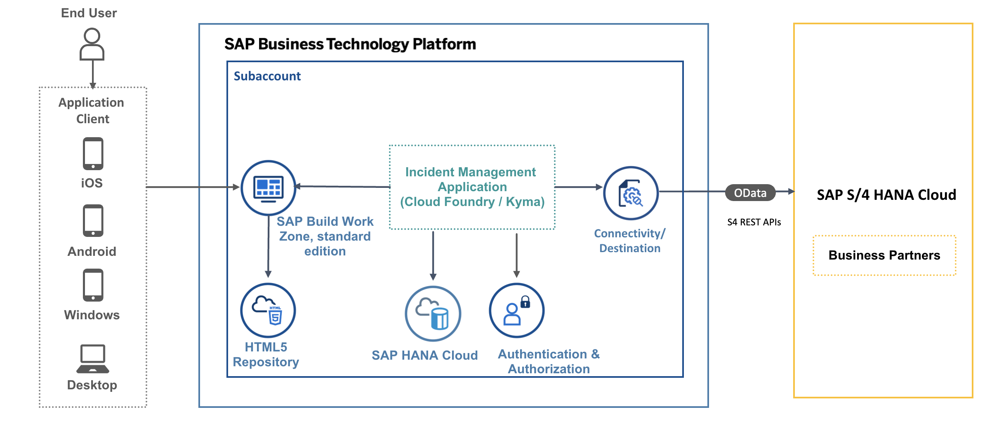

# Introduction
SAP BTP Applications need to connect to SAP systems to fetch and process data. 

You can find the APIs exposed by an SAP system that you need to complete your extension scenario in [SAP Business Accelerator Hub](https://api.sap.com/).  
SAP BTP Connectivity allows SAP BTP applications to securely access APIs that run on the Internet or on-premise. 
To allow applications running on SAP BTP to consume SAP S/4HANA Cloud APIs, you need to create a service instance of the [SAP S/4HANA Cloud Extensibility service](https://help.sap.com/docs/btp/sap-business-technology-platform/create-service-instance-to-consume-sap-s-4hana-cloud-apis?locale=en-USstate%3DPRODUCTION).

# Business Scenario

In this tutorial, we will integrate SAP S/4 HANA Cloud Business Partner API to the Incident Management application.

The Incident Management application helps call center support representatives process and manage customer incidents. A support representative (processor) receives a phone call from an existing customer and creates a new incident on behalf of the customer.

When a new incident is created by the processor, they have to assign the incident to the respective customer. The option to choose a customer will be given as a value help and the list of customers in the value help will be fetched from the SAP S/4HANA Cloud system. 
For this purpose, we will be using the [SAP S/4HANA Business Partner API](https://api.sap.com/api/API_BUSINESS_PARTNER/overview).

# Solution Diagram

  

# Options

If you don't have access to an SAP S/4HANA system, you can use a mock server.
Based on your SAP BTP runtime, choose between Cloud Foundry runtime and Kyma runtime.

|                      | SAP BTP, Cloud Foundry Runtime                  | SAP BTP, Kyma Runtime                           |
|----------------------|-------------------------------------------------|-------------------------------------------------|
| Mock Server       |  [Connect to a Remote Service Using the SAP Destination Service (SAP BTP, Cloud Foundry Runtime and Mock Server)](remote-service-mock-cf.md)              | [Connect to a Remote Service Using the SAP Destination Service (SAP BTP, Kyma Runtime and Mock Server)](remote-service-mock-kyma.md)             |
| SAP S/4HANA Cloud      |  [Connect to a Remote Service Using the SAP Destination Service (SAP BTP, Cloud Foundry Runtime and SAP S/4HANA Cloud)](remote-service-s4h-cf.md)             | [Connect to a Remote Service Using the SAP Destination Service (SAP BTP, Kyma Runtime and SAP S/4HANA Cloud)](remote-service-s4h-kyma.md)             |

