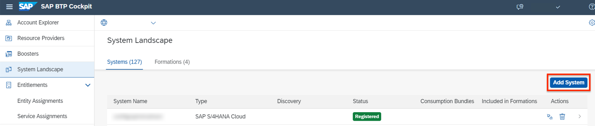
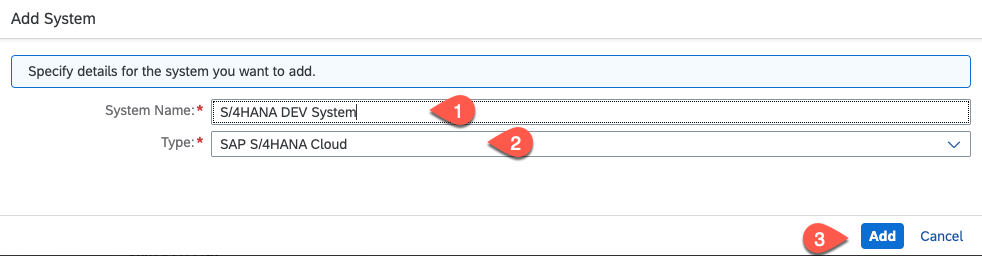
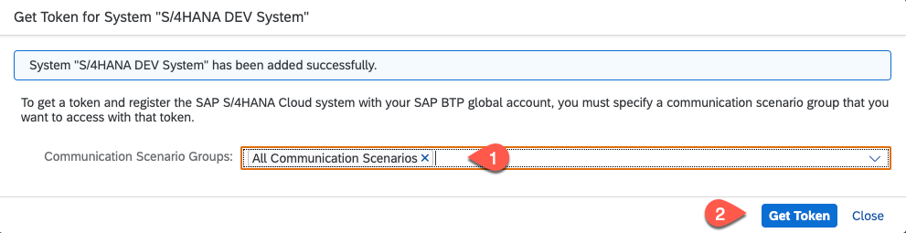
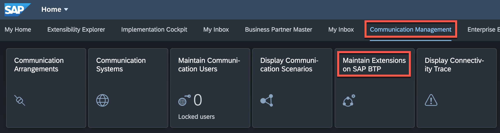
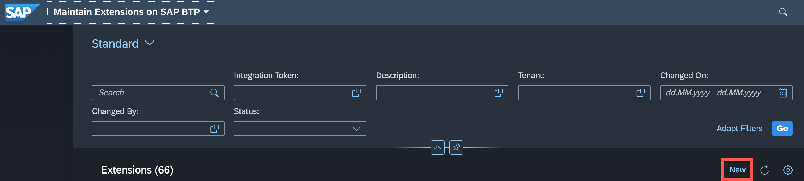
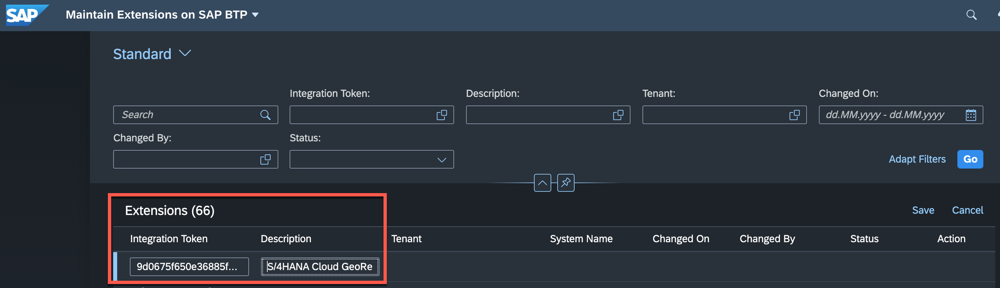

# Configure the Connectivity Between SAP S/4HANA Cloud and SAP BTP

## Usage Scenario

To connect to an SAP S/4HANA Cloud system using service binding, you have to register the system in your SAP SAP Business Technology Platform (BTP) account.

## Prerequisites
You need a user with administrator access for the SAP BTP global account and the SAP S/4HANA Cloud system.

## Note

> You can skip this procedure if you want to test this scenario with a mock server only.

### SAP Business Technology Platform

1. In **SAP BTP cockpit**, open your global account and choose
**System Landscape**.

2. In the **System Landscape** screen, choose **Systems** and then **Add System**.

   

3. In the **Register System** dialog box, enter a name for the SAP S/4HANA Cloud system you want to connect.

- Recommendation: use a name that uniquely identifies this system, for example, system ID.
- Example: **S/4HANA Cloud DEV System**

4. In the **Type** dropdown list, choose **SAP S/4HANA Cloud**.

5. Choose **Add**.

   

6. Configure the communication flow. In the **Communication Scenario Groups** dropdown menu, select **All Communication Scenarios**.

7. Choose **Get Token**.
   SAP BTP generates an integration token so the SAP S/4HANA Cloud system administrator can configure integration with SAP BTP from your SAP S/4HANA Cloud system. 

   

9. Copy the generated token and close the dialog box.
    You will need the token in the following procedure.

  

### SAP S/4HANA Cloud

1. Log on to your SAP S/4HANA Cloud tenant.

2. Navigate to **Home -> Communication Management** tab and choose the tile **Maintain Extensions on SAP BTP**.

   

3. On the **Maintain Extensions on SAP BTP** screen in the **Integration section**, choose **New**.

   

4. In the **Integration Token** field, paste the integration token previously generated and copied in the SAP BTP Cockpit.

      

5. Enter a description for your system integration token.

- Recommendation: use the same name you entered in SAP BTP cockpit when you generated the token.
- Example: >S/4HANA Cloud system name<

6. Choose **Save**.

- A new entry is displayed for your system in the table with status **Enabling**.
- Wait for a few seconds.
- After the automated integration, the status of your system integration changes to **Enabled**.
- The same takes place on the SAP BTP side. You will see the system as **Registered** – potentially after a refresh.

   

See also: [Register an SAP S/4HANA Cloud System in a Global Account in SAP BTP](https://help.sap.com/viewer/65de2977205c403bbc107264b8eccf4b/Cloud/en-US/28171b629f3549af8c1d66d7c8de5e18.html).
