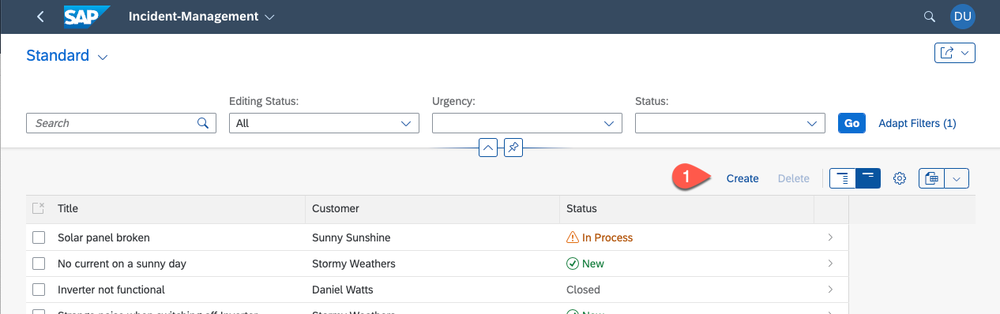
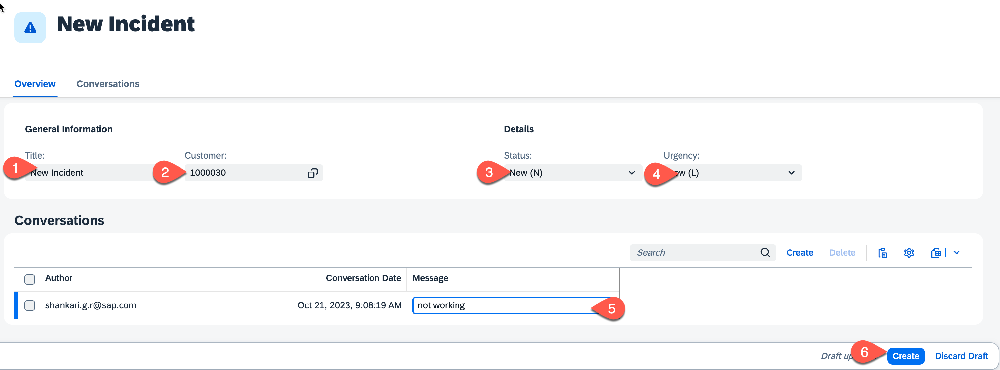

# Run the Incident Management Application with SAP S/4HANA Backend

## Prerequisites

- You have sucessfully deployed the application to your SAP BTP Runtime.
- You have assigned application roles before accessing the application. See [User Role Assignment](https://developers.sap.com/tutorials/user-role-assignment.html).
- You have integrated your application with SAP Build Work Zone and accessed it via launchpad. See [Integrate Your Application with SAP Build Workzone](https://developers.sap.com/tutorials/integrate-with-work-zone.html).

## Run and Test the Applicaion

1. Access your application via launchpad.
   
   

2. While creating a new incident, the value help for customers loads data from the integrated remote service.
  
   *  Choose **Create**
  
      
   
   * Set **Title**, **Customer**, **Status** and **Urgency**. 
   * The value help for **Customer** fetches data from the remote server.
   * Create a conversation.
   * Choose **Create** to save the settings.
     
      

## Summary

Congratulations! You have successfully developed, configured and deployed the Incidenent Management application using an external service.
