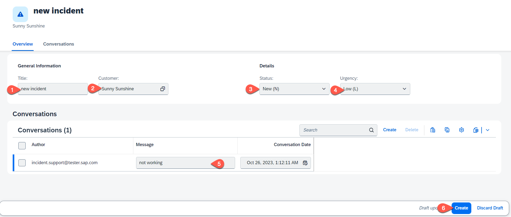

# Run the Incident Management Application with SAP S/4HANA Backend

## Prerequisites

- You have sucessfully deployed the application to your SAP BTP Runtime.
- [Assigned Application Roles]() before accessing the application.
- [Integrated your application with SAP Build Workzone]() and accessed the application via launchpad

## Run and Test the applicaion

1. Access your application via launchpad.
   
   

2. while creating a new incident, the value help for customers loads data from the integrated remote service.
  
   *  Choose **Create**
  
      
   
   * Set Title, Customer, Status and Urgency. 
   * The value help for Customer fetches data from the remote server.
   * Create a conversation.
   * Choose Create to save the settings.
     
      

## Summary

Congratulation! You have successfully developed, configured and deployed the Incidenent Management Application using an external service.