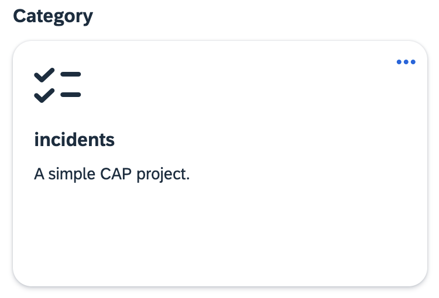
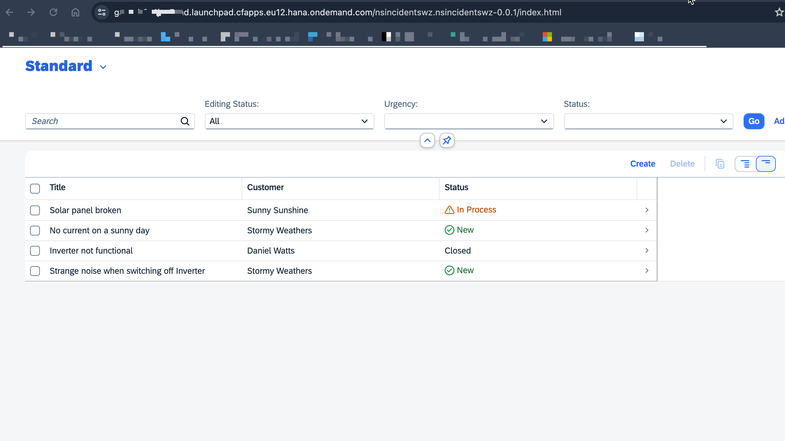
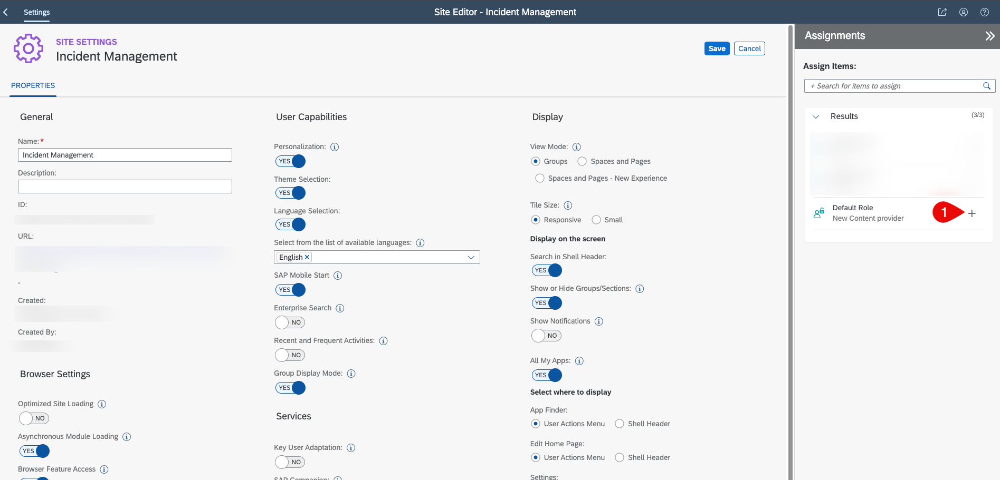
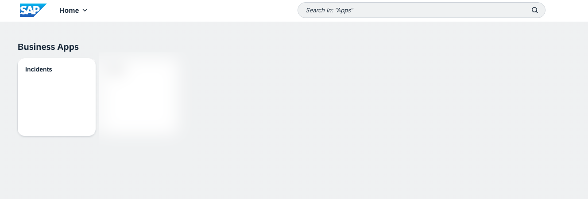
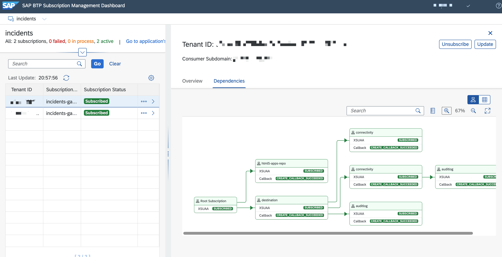

# Subscribe to the Application

You will learn about the lifecycle management of a multitenant application.

> **TIP**
> The subscription can be done from the same region where the multitenant application is deployed. For example, if the application is deployed in `eu12`, it can be subscribed from only subaccounts that are part of `eu12` region.

## Subscribe to SAP Build Work Zone, Standard Edition

1. Follow the steps described in [Step 1 of the Integrate Your Application with SAP Build Work Zone, Standard Edition tutorial](https://developers.sap.com/tutorials/integrate-with-work-zone.html#7fcf8831-58a9-429c-a18e-629800d23ded).
2. Follow the steps described in [Step 2 of the Integrate Your Application with SAP Build Work Zone, Standard Edition tutorial](https://developers.sap.com/tutorials/integrate-with-work-zone.html#a5f75fc6-0e74-4b64-bf09-a39277f47c7e). 

## Subscribe to the Application

1. In the SAP BTP cockpit, navigate to your subaccount and choose **Service Marketplace**.
2. Find the `Incidents` application.

>[!TIP] The application name can vary based on the name passed in the SaaS provisioning service configurations.

1. Choose the **Incidents** tile and then choose **Create** on the right side of the screen.
2. The subscription process will start. Wait for it to finish, and then move to the next step.

## Assigning Roles to User

Before accessing the application, you must assign the `Support` role to the user. 

1. In the SAP BTP cockpit, navigate to the subscriber subaccount. 
2. Choose **Security** > **Role Collections**.
3. Create a new role collection and assign the `support` scope to it. Then, asign the role collection to the user. To do this, follow the steps described in the [Assign the User Roles](https://developers.sap.com/tutorials/user-role-assignment.html) tutorial.

## Launch the Application

1. In the SAP BTP cockpit, navigate to your subaccount and choose the HTML5 tab of the subaccount. 
2. You will see `nsincidentswz` or other name based on the namespace given to your UI application.
3. Click it and launch it. 
4. The final application will look like this:

## Configure Design and Runtime Destinations 

Once the application is successfully deployed, there is a need to configure design and runtime destination. This enables the SAP Build Work Zone service to configure sites with the application configurations like groups, roles, categories and so on.

### Create Runtime Time Destination 

1. In the SAP BTP cockpit, navigate to the subscriber subaccount. 
2. Choose **Connectivity** > **Destination** and then choose **Create Destination**.
4. Fill in the following configuration:
 
   **Name**: `incident-management-rt`

   **Type**: `HTTP`

   **URL**: `https://<subscriber-subdomain>.launchpad.cfapps.sap.hana.ondemand.com`

   **Proxy Type**: `Internet`

   **Authentication**: `NoAuthentication`

   **CEP.HTML5contentprovider**: `true`

>**CEP.HTML5contentprovider**: `true` is a mandatory parameter. It should be added to the additional properties of destination configuration.
   
5. Select the **Use default JDK truststore** checkbox and choose **Save**.

### Create Design Time Destination

#### Create Design Time Secret in Kyma Runtime (If application is deployed to the Kyma Runtime)

1. Open the Kyma cluster where the application is deployed and navigate to the **Namespace**.
3. Under **Service Management** > **Service Bindings**, choose **Create**.
4. Enter the `incidents-runtime` name.
5. In the **Service Instance Name** dropdown menu, select `incident-management-html5-apps-repo-runtime`.
6. Choose **Create**.
7. Wait for it to be in a **Provisioned** state.
8. Choose **Secret Name** under Binding Data.
9. It will open the secret. Choose **Decode**
10. Copy the details, you will need them in the next step.

> If the application is deployed to the **Cloud Foundry** runtime, view the service keys if **HTML5 Runtime** service instance and fill the below configurations.

### Configure the Design Time Destination

1. In the SAP BTP cockpit, navigate to the provider subaccount. 
2. Choose **Connectivity** > **Destination** and then choose **Create Destination**.
4. Fill in the following configuration:
   
   **Name**: `incident-management_cdm`

   **Type**: `HTTP`

   **URL**: `https://html5-apps-repo-rt.cfapps.eu12.hana.ondemand.com/applications/cdm/<sap-app-id>`

   **Proxy Type**: `Internet`

   **Authentication**: `OAuth2ClientCredentials`

   **Client ID**: `<Client ID from the HTML5 repo runtime secret created in the pervious step>`

   **Client Secret**: `<Client Secret from the HTML5 repo runtime secret created in the pervious step>`

   **Token Service URL**: `<token url from secret create at previous step>/oauth/token`

    #### Choose a  **New Property** and Create the Following Properties:

    **grant_type**: `client_credentials`

    **saasregistryenabled**: `true`

    **sap.cloud.service**: `html5-apps-repo-rt`

    **ServiceKeyName**: `<service key name given in kyma`

    **uri**: `uri from the HTML5 repo runtime secret`

    **xsappname**: `xsappname from the HTML5 repo runtime secret`

5. Select the **Use default JDK truststore** checkbox and choose **Save**.

## Integrate with SAP Build Work Zone

To integrate the application with SAP Build Work Zone, you need to create a new channel as a content provider. Once the channel is created, you can access the CDM configurations to streamline the group, category creation. 

1. Open SAP Build Work Zone.
2. Open **Channel Manager** from the left side of the screen. 
3. Choose **New** and then choose **New Content Provider**.
4. Fill in the details, choose **cdm** and **runtime destinations** that configured during deployment and choose **Save**.
5. The content channel will be now added.

   
   
6. Choose **Site Manager** and create a new site. 
8. Choose **Edit** on the new site. 
9. Under **Assignments**, choose the search field. 
10. Choose the **+** icon to add the application role to the site and choose **Save**.

    
    
### Assign Roles and Access the Application

Now that the site has been created. To access the site, you have to assign a site role to your user. To do so, follow these steps:
1. In the SAP BTP cockpit, navigate to the subscriber subaccount. 
2. Choose **Security** > **Role Collections**.
3. Find **~new_content_provider_defaultRole** or any other name that you had given to your site when creating the site. 
4. Assign the **Support** role to the role collection and add your user.
5. Choose **Save**.
6. Now, launch the site and open your application. 
    

## Managing Subscriptions

The subscriptions can be viewed, updated or unsubscribed in the Subscription Manager Dashboard. This dashboard enables you to manage the lifecycle of a tenant in one central place. See [Using the Subscription Management Dashboard](https://help.sap.com/docs/btp/sap-business-technology-platform/using-subscription-management-dashboard?locale=en-US).

1. In the SAP BTP cockpit, navigate to the provider subaccount. 
2. Assign the `Subscription Management Dashboard Administrator` role to your user.
3. Choose **Instance and Subscriptions**.
4. Choose the **SaaS Provisioning service** name or **incidents-registry**.
5. It will open the **SAP BTP Subscription Management Dashboard**.
6. You can see the list of subscribed tenants there. Choosing it will open more details to the right side.
7. Choose the **Dependencies** tab on the right. This will show the list of dependent/reuse service that is part of this application.

   
## Explore More 
- [SAP SaaS Provisioning Service](https://help.sap.com/docs/btp/sap-business-technology-platform/developing-multitenant-applications-in-cloud-foundry-environment?locale=en-US)
- [CAP Multitenancy](https://cap.cloud.sap/docs/guides/multitenancy/)
- [Develop a Multitenant Extension Application in SAP BTP, Kyma Runtime](https://discovery-center.cloud.sap/missiondetail/3683/3726/)
- [Nodejs Multitenant Easy franchise](https://github.com/SAP-samples/btp-cf-multitenant-extension)
- [Develop a multitenant Software as a Service application in SAP BTP using CAP (Cloud Foundry)](https://github.com/SAP-samples/btp-cf-cap-multitenant-susaas)

   
