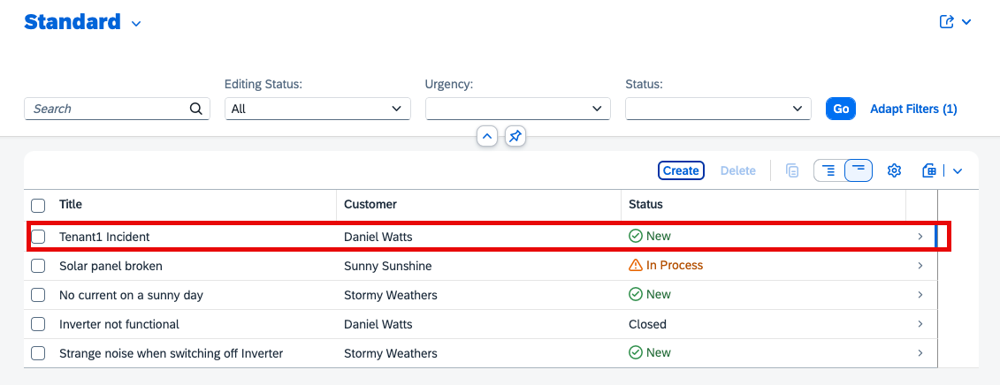
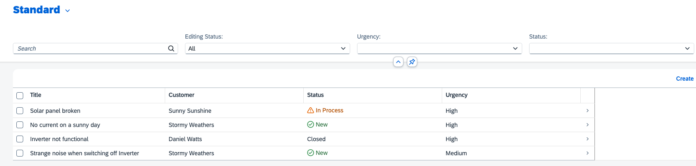

# Test With Different Users/Tenants

## Launch the Application Server

In a new terminal at the root of your project run the server with the following command:

  ```shell
  cds watch --profile local-multitenancy
  ```

## Test With Different Users/Tenants

Open the Incident Management application at `http://localhost:4004/incidents/webapp/index.html` and log in with the users `alice` and `erin`, respectively. Leave the password field empty. To see the requests served in tenant isolation, that is, from different databases, change the data in one of the tenants and check that it's not visible in the other one.

### Test Tenants

1. Open the application in new tab, log in to t1 with the user `alice`, and create a new incident.



2. Stop the server and start again or use it in incognito mode with user `erin`. Here you cannot see the incident created with the user `alice` as part of the tenant `t1`.



This shows that the tenant isolation is working properly. 

