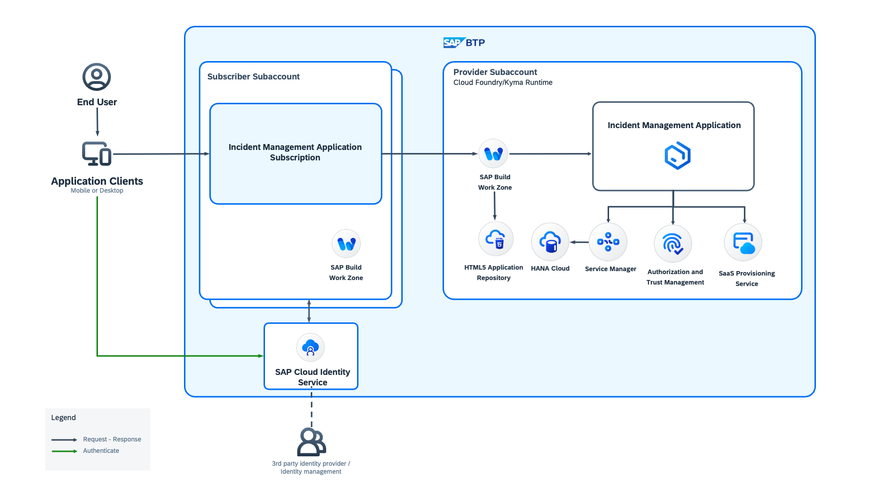
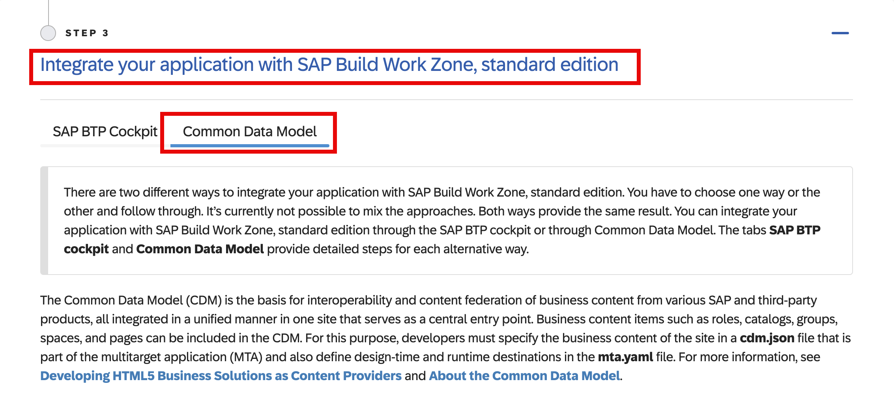

## SAP Build WorkZone Central Entry Point Based Multitenancy
The SAP Build Work Zone Central Entry point approach will look like the following:

## Additional Entitlements Required 

| Service                                    | Plan       | Number of Instances |
|--------------------------------------------|------------|:-------------------:|
| Service Manager                            | container       |          1          |
| SAP Software-as-a-Service Provisioning service | application |          1          |

## Prerequisites

1. Have the Incident Management application deployed in one of the following SAP BTP runtimes:
> Please follow the steps of **Integrate your application with SAP Build Work Zone, standard edition using Common Data Model**

   - Option 1: SAP BTP, Cloud Foundry runtime: [Deploy a Full-Stack CAP Application in SAP BTP, Cloud Foundry Runtime](https://developers.sap.com/group.deploy-full-stack-cap-application.html).
    
   - Option 2: SAP BTP, Kyma runtime:  [Deploy a Full-Stack CAP Application in SAP BTP, Kyma Runtime](https://developers.sap.com/group.deploy-full-stack-cap-kyma-runtime.html).

   The following steps needs to be implemented from the above tutorials.
   

2. To clean up some of the settings and continue with this scenario, undeploy the Incident Management application by running one of the following command depending on the runtime you use:
   
   - For SAP BTP, Cloud Foundry runtime: `cf undeploy <YOUR_MTA_ID> --delete-services`
   - For SAP BTP, Kyma runtime: `helm uninstall <RELEASE_NAME> -n <YOUR_NAMESPACE>`

