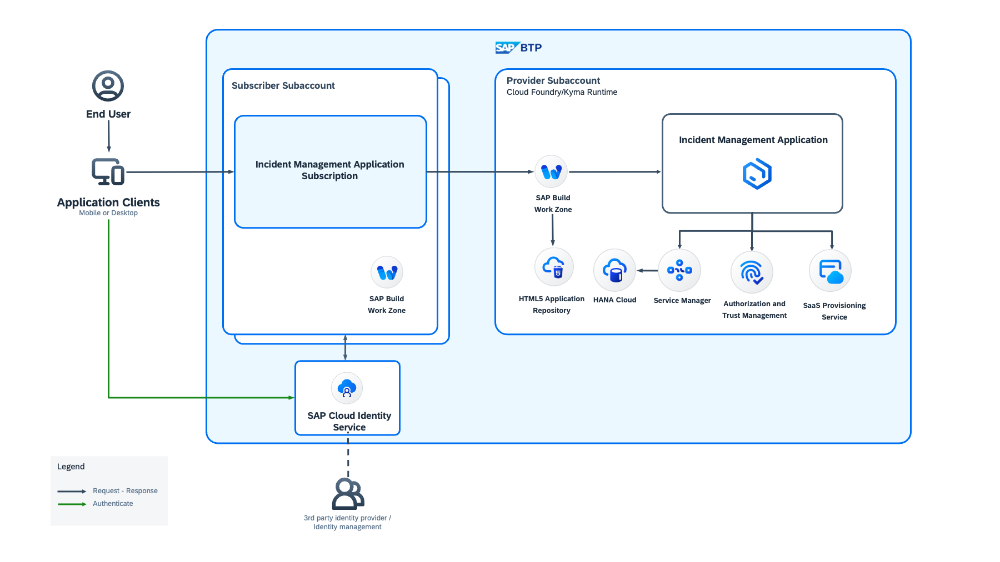

## SAP Build Work Zone Central Entry Point Based Multitenancy
The SAP Build Work Zone Central Entry Point approach will look like the following:

## Additional Entitlements Required 

| Service                                    | Plan       | Number of Instances |
|--------------------------------------------|------------|:-------------------:|
| Service Manager                            | container       |          1          |
| SAP Software-as-a-Service Provisioning service | application |          1          |

## Prerequisites

1. Have the Incident Management application deployed in one of the following SAP BTP runtimes:
> Please follow the steps of **Integrate your application with SAP Build Work Zone, standard edition using Common Data Model**

   - Option 1: SAP BTP, Cloud Foundry runtime: [Deploy a Full-Stack CAP Application in SAP BTP, Cloud Foundry Runtime](https://developers.sap.com/group.deploy-full-stack-cap-application.html).
    
   - Option 2: SAP BTP, Kyma runtime:  [Deploy a Full-Stack CAP Application in SAP BTP, Kyma Runtime](https://developers.sap.com/group.deploy-full-stack-cap-kyma-runtime.html).

   > **Note:** The prerequisite deployment must include the following components, as they are required by the MTA configuration in this scenario:
   > - **XSUAA** (`incident-management-auth`) — added via `cds add xsuaa`
   > - **SAP HANA Cloud** (`incident-management-db`) — added via `cds add hana`

2. **Enable Multitenancy** by following the steps in:
   [Enable Multitenancy for the CAP Application](../enable-mtx/1-enable-mtx.md)

> **Note:** To clean up settings before continuing with this scenario, you can undeploy the Incident Management application:
> - For SAP BTP, Cloud Foundry runtime: `cf undeploy <YOUR_MTA_ID> --delete-services`
> - For SAP BTP, Kyma runtime: `helm uninstall <RELEASE_NAME> -n <YOUR_NAMESPACE>`

## Next Step

[Add Dependent Services and Prepare for Production](./2-add-dependent-services.md)

