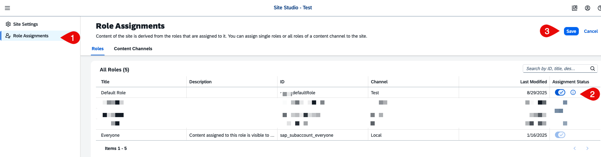

# Subscribe to the Application

You will learn about the lifecycle management of a multitenant application.

> [!Tip]
>The subscription can be done from the same region where the multitenant application is deployed. For example, if the application is deployed in `eu12`, it can be subscribed from only subaccounts that are part of `eu12` region.
## Subscribe to SAP Build Work Zone, Standard Edition

Create a subscriber subaccount in the same region where the multitenant application is deployed. And then follow the below steps in the subscriber subaccount: 

1. Follow the steps described in [Step 1,2 - Subscribe to SAP Build Work Zone, standard edition](https://developers.sap.com/tutorials/integrate-with-work-zone.html#ce55604a-ed61-423c-8b9b-62193f78af40).  
   See the below screenshot for more information:
   

## Subscribe to the Application

1. In the SAP BTP cockpit, navigate to your subaccount and choose **Service Marketplace**.
2. Find the `Incident Management` application.

   

> [!Tip] 
> The application name can vary based on the name passed in the SaaS provisioning service configurations.
3. Choose the **Incident Management** tile and then choose **Create** on the right side of the screen.
4. The subscription process will start. Wait for it to finish, and then move to the next step.

## Assigning Roles to User

Before accessing the application, you must assign the `Support` role collection to the user. 

1. In the SAP BTP cockpit, navigate to the subscriber subaccount. 
2. Choose **Security** > **Role Collections**.
3. Select **support (incident-management xxxxxxx)** role collection. You can check the **Role Collection** information in the `mta.yaml` file.
4. Choose **Edit**.
5. Under **Users** fill your user details and select **Save**.

To make the application tile visible in the SAP Build Work Zone, you need to assign the site role to your user. This will be done in the next section.
1. In the SAP BTP cockpit, navigate to the subscriber subaccount. 
2. Choose **Security** > **Role Collections**.
3. Select **default xxxxxxx)** role collection. You can check the **Role Collection** information in the `mta.yaml` file.
4. Choose **Edit**.
5. Under **Users** fill your user details and select **Save**.

## Launch the Application

1. In the SAP BTP cockpit, navigate to your subaccount and choose the HTML5 tab of the subaccount. 
2. You will see `nsincidents` or other name based on the namespace given to your UI application.
3. Click it and launch it. 
4. The final application will look like this:

## Configure Design and Runtime Destinations 

Once the application is successfully deployed, there is a need to configure design and runtime destination. This enables the SAP Build Work Zone service to configure sites with the application configurations like groups, roles, categories and so on.

### Create Runtime Time Destination 

1. In the SAP BTP cockpit, navigate to the subscriber subaccount. 
2. Choose **Connectivity** > **Destination** and then choose **Create Destination**.
3. Fill in the following configuration:

   | Property | Value |
   |----------|-------|
   | **Name** | `incident-management-rt` |
   | **Type** | `HTTP` |
   | **URL** | `https://<subscriber-subdomain>.launchpad.cfapps.<region>.hana.ondemand.com` |
   | **Proxy Type** | `Internet` |
   | **Authentication** | `NoAuthentication` |
   | **CEP.HTML5contentprovider** | `true` |
>[!NOTE]
>**CEP.HTML5contentprovider**: `true` is a mandatory parameter. It should be added to the additional properties of destination configuration.
>
> Replace the values for `<subscriber-subdomain>` and `<region>`.

4. Select the **Use default JDK truststore** checkbox and choose **Save**.

### Create Design Time Destination

#### Create Design Time Secret in **Kyma Runtime** (If application is deployed to the Kyma Runtime)

1. Open the Kyma cluster where the application is deployed and navigate to the **Namespace**.
2. Under **Service Management** > **Service Bindings**, choose **Create**.
3. Enter the `incidents-runtime` name.
4. In the **Service Instance Name** dropdown menu, select `incident-management-html5-apps-repo-runtime`.
5. Choose **Create**.
6. Wait for it to be in a **Provisioned** state.
7. Choose **Secret Name** under Binding Data.
8. It will open the secret. Choose **Decode**
9. Copy the details, you will need them in the next step.

#### For **Cloud Foundry Runtime**
If the application is deployed to the **Cloud Foundry** runtime, view the service keys of **HTML5 Runtime** service instance and fill the below configurations.

### Configure the Design Time Destination

1. In the SAP BTP cockpit, navigate to the provider subaccount. 
2. Choose **Connectivity** > **Destination** and then choose **Create Destination**.
3. Fill in the following configuration:

   | Property | Value |
   |----------|-------|
   | **Name** | `incident-management_cdm` |
   | **Type** | `HTTP` |
   | **URL** | `https://html5-apps-repo-rt.cfapps.<region>.hana.ondemand.com/applications/cdm/<sap.cloud.service>` |
   | **Proxy Type** | `Internet` |
   | **Authentication** | `OAuth2ClientCredentials` |
   | **Client ID** | `<Client ID from the HTML5 repo runtime>` |
   | **Client Secret** | `<Client Secret from the HTML5 repo runtime>` |
   | **Token Service URL** | `<token url from secret create at previous step>/oauth/token` |
   
   #### Additional Properties:
   
   | Property | Value |
   |----------|-------|
   | **grant_type** | `client_credentials` |
   | **saasregistryenabled** | `true` |
   | **sap.cloud.service** | `html5-apps-repo-rt` |
   | **ServiceKeyName** | `html5-apps-repo-runtime` |
   | **uri** | `uri from the HTML5 repo runtime` |
   | **xsappname** | `xsappname from the HTML5 repo runtime` |

4. Select the **Use default JDK truststore** checkbox and choose **Save**.

## Integrate with SAP Build Work Zone

To integrate the application with SAP Build Work Zone, you need to create a new channel as a content provider. Once the channel is created, you can access the CDM configurations to streamline the group, category creation. 

1. Open SAP Build Work Zone.
2. Open **Channel Manager** from the left side of the screen. 
3. Choose **New** and then choose **New Content Provider**.
4. Fill in the details, choose **cdm** and **runtime destinations** that configured during deployment and choose **Save**.
5. The content channel will be now added.

   

6. Choose **Site Manager** and create a new site. 
7. Under Left Side of screen choose **Role Assignments**.
8. Choose **Edit**.
9. Switch the **`<ChannelName>`-DefaultRole>** icon to add selected mode for application role assign it to the site and choose **Save**.
    

### Assign Roles and Access the Application

Now that the site has been created. To access the site, you have to assign a site role to your user. To do so, follow these steps:
1. In the SAP BTP cockpit, navigate to the subscriber subaccount. 
2. Choose **Security** > **Role Collections**.
3. Find **~`<ChannelName>`_defaultRole** or any other name that you had given to your site when creating the site. 
4. Assign the **Support** role to the role collection and add your user.
5. Choose **Save**.
6. Now, launch the site and open your application. 
    

## Managing Subscriptions

The subscriptions can be viewed, updated or unsubscribed in the Subscription Manager Dashboard. This dashboard enables you to manage the lifecycle of a tenant in one central place. See [Using the Subscription Management Dashboard](https://help.sap.com/docs/btp/sap-business-technology-platform/using-subscription-management-dashboard?locale=en-US).

1. In the SAP BTP cockpit, navigate to the provider subaccount. 
2. Assign the `Subscription Management Dashboard Administrator` role to your user.
3. Choose **Instance and Subscriptions**.
4. Choose the **SaaS Provisioning service** name or **incidents-registry**.
5. It will open the **SAP BTP Subscription Management Dashboard**.
6. You can see the list of subscribed tenants there. Choosing it will open more details to the right side.
7. Choose the **Dependencies** tab on the right. This will show the list of dependent/reuse service that is part of this application.

   

## Explore More 
- [SAP SaaS Provisioning Service](https://help.sap.com/docs/btp/sap-business-technology-platform/developing-multitenant-applications-in-cloud-foundry-environment?locale=en-US)
- [CAP Multitenancy](https://cap.cloud.sap/docs/guides/multitenancy/)
- [Develop a Multitenant Extension Application in SAP BTP, Kyma Runtime](https://discovery-center.cloud.sap/missiondetail/3683/3726/)
- [Nodejs Multitenant Easy franchise](https://github.com/SAP-samples/btp-cf-multitenant-extension)
- [Develop a multitenant Software as a Service application in SAP BTP using CAP (Cloud Foundry)](https://github.com/SAP-samples/btp-cf-cap-multitenant-susaas)