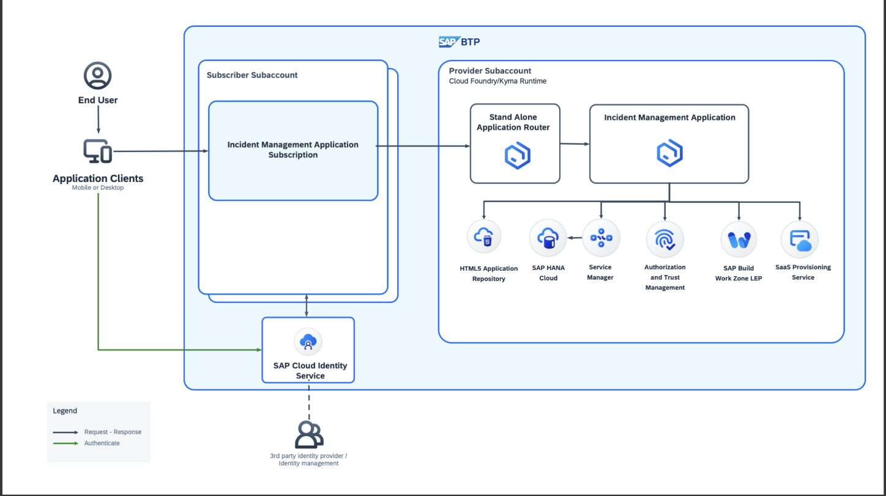

## SAP Build Work Zone Local Entry Point-Based Multitenancy
The SAP Build Work Zone Local Entry point approach will look like the following:

## Additional Entitlements Required 

| Service                                    | Plan       | Number of Instances |
|--------------------------------------------|------------|:-------------------:|
| Service Manager                            | container       |          1          |
| SAP Build Work Zone | local-entry-point |          1          |

## Prerequisites

## Prepare for Production

1. Add an SAP HANA Cloud client to your application and run the following command in the terminal.

```sh
cds add hana,xsuaa --for production
```
> [!Note]
> The `cds add hana` command adds the @sap/cds-hana module that allows SAP HANA Cloud to access the package.json file and the database configuration "db": "hana" that uses SAP HANA Cloud when the application is started on production.
>
> The `cds add hana` command adds to the package.json file the "@cap-js/hana": "^x" dependency, the cds.requires [production] profile "db": "hana", and the SQL configuration "native_hana_associations": false.
>
> Running `cds add xsuaa` command does two things:
>
> Adds the SAP Authorization and Trust Management service (including the "@sap/xssec": "^x" dependency and the cds.requires [production] profile "auth": "xsuaa") to the package.json file of the INCIDENT-MANAGEMENT project.
>
> Creates the SAP Authorization and Trust Management service security configuration (that is, the xs-security.json file) for the INCIDENT-MANAGEMENT project.


## Prepare the HTML5 Applications with Deploy Configurations

Run the following command in the terminal:

```sh
cds add html5-repo
```

## Prepare the Application Router

Run the following command in the terminal:

```sh
cds add approuter
```

## Set Up the Cloud Service

Open `app/incidents/webapp/manifest.json`, and add the following code in the root level if it's not present.

```json
"sap.cloud": {
   "public": true,
   "service": "incidents.service"
}
```

## Set Up the MTA for Deployment

Run the following command to generate the mta.yaml deployment descriptor:

```sh
cds add mta
```
