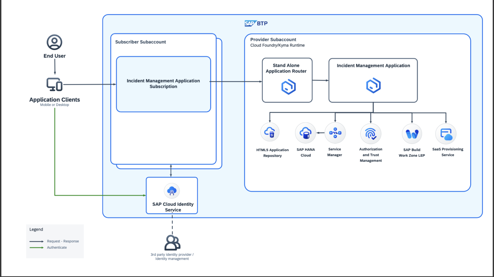

## SAP Build Work Zone Local Entry Point-Based Multitenancy
The SAP Build Work Zone Local Entry Point approach is as follows:


## Additional Entitlements Required 

| Service                                    | Plan       | Number of Instances |
|--------------------------------------------|------------|:-------------------:|
| Service Manager                            | container       |          1          |
| SAP Build Work Zone | local-entry-point |          1          |

## Prerequisites

**If you have developed the application using [Develop a Full-Stack CAP Application](https://developers.sap.com/group.cap-application-full-stack.html), update it by following the below steps and proceed to the next page.**

## Update the Incident Management Application

The following changes are required for integrating with SAP Build Work Zone Local Entry Point, as you will be developing the application using a standalone approuter.

1. Open `package.json`, and set the following properties to `false`.

   ```json
   "destinations": false,
   "workzone": false
   ```

 **Destinations** and **workzone** are not required for the standalone approuter.

2. Delete `mta.yaml`, and run the following command to generate the updated `mta.yaml` file.

   ```sh
   cds add mta
   ```

**If you are setting up the Incident Management Application for the first time, set it up by following the below steps.** 

## Set Up the Incident Management Application 

### Prepare for Production

Add an SAP HANA Cloud client to your application and run the following command in the terminal.

```sh
cds add hana,xsuaa --for production
```

> The `cds add hana` command adds the @sap/cds-hana module that allows SAP HANA Cloud to access the package.json file and the database configuration "db": "hana" that uses SAP HANA Cloud when the application is started on production.
>
> The `cds add hana` command adds to the package.json file the "@cap-js/hana": "^x" dependency, the cds.requires [production] profile "db": "hana", and the SQL configuration "native_hana_associations": false.
>
> Running `cds add xsuaa` command does two things:
>
> Adds the SAP Authorization and Trust Management service (including the "@sap/xssec": "^x" dependency and the cds.requires [production] profile "auth": "xsuaa") to the package.json file of the INCIDENT-MANAGEMENT project.
>
> Creates the SAP Authorization and Trust Management service security configuration (that is, the xs-security.json file) for the INCIDENT-MANAGEMENT project.


### Prepare the HTML5 Applications With Deploy Configurations

Run the following command in the terminal:

```sh
cds add html5-repo
```
### Prepare the Application Router

Run the following command in the terminal:

```sh
cds add approuter
```
### Enable Multitenancy

To enable multitenancy for the application, follow the steps in:

[Enable multitenancy for the CAP application](https://discovery-center.cloud.sap/protected/index.html#/mymissiondetail/210866/cardName/Enable%20multitenancy%20for%20the%20CAP%20application/?tab=projectboard)

> This step is required to support multi-tenant scenarios when integrating with SAP Build Work Zone Local Entry Point (LEP).

### Set Up the Cloud Service

Update `app/incidents/webapp/manifest.json`, and add the following code at the root level if it's not present.

```json
"sap.cloud": {
   "public": true,
   "service": "incidents.service"
}
```

### Set Up the MTA for Deployment

Run the following command to generate the `mta.yaml` deployment descriptor:

```sh
cds add mta
```
