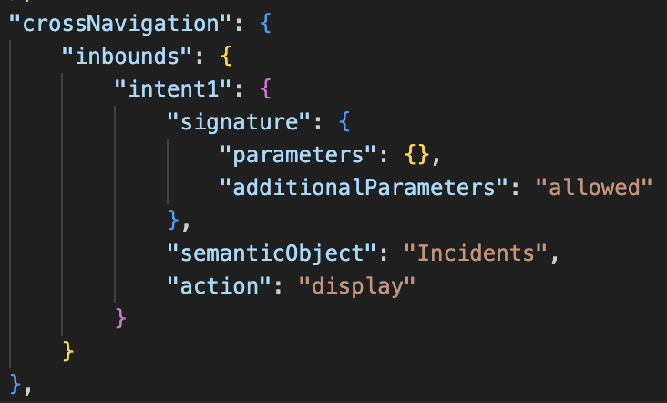

# Prepare for Deployment in the SAP BTP, Cloud Foundry Runtime

In this section, you will be preparing the Incident Management application to work with the SAP Build Work Zone local entry point approach.

## Create the CDM configuration

1. Create a **workzone** folder on the root of the project. Then, create a file named **cdm.json** and paste the following:

> [!Tip] 
> Ensure that the `appId` is matching with `app/incidents/manifest.json`->`sap.app.id` . Update the `appId` below with the value of the `sap.app.id` of your application.
>  Ensure that the `vizId` is matching with `app/incidents/manifest.json -> sap.app.crossNavigation` the name of the inbounds.
> For example, if your crossNavigation looks like the one below, the `vizId` becomes `intent1`.
    


  ```json
    [
      {
        "_version": "3.0",
        "identification": {
          "id": "Incidents_LEP",
          "title": "{{title}}",
          "entityType": "role"
        },
        "payload": {
          "catalogs": [
            {
              "id": "lepCatalog"
            }
          ],
          "spaces": [
            {
              "id": "lepSpace"
            }
          ],
          "apps": [
            {
              "id": "ns.incidents"
            }
          ]
        },
        "texts": [
          {
            "locale": "en",
            "textDictionary": {
              "title": "LEP Role"
            }
          },
          {
            "locale": "",
            "textDictionary": {
              "title": "LEP Role"
            }
          }
        ]
      },
      {
        "_version": "3.0",
        "identification": {
          "id": "lepCatalog",
          "title": "{{title}}",
          "entityType": "catalog"
        },
        "payload": {
          "viz": [
            {
              "appId": "ns.incidents",
              "vizId": "intent1"
            }
          ]
        },
        "texts": [
          {
            "locale": "en",
            "textDictionary": {
              "title": "LEP Catalog"
            }
          },
          {
            "locale": "",
            "textDictionary": {
              "title": "LEP Catalog"
            }
          }
        ]
      },
      {
        "_version": "3.1.0",
        "identification": {
          "id": "lepSpace",
          "title": "{{title}}",
          "description": "{{description}}",
          "entityType": "space"
        },
        "payload": {
          "contentNodes": [
            {
              "type": "workpage",
              "id": "lepWorkpage"
            }
          ]
        },
        "texts": [
          {
            "locale": "en",
            "textDictionary": {
              "title": "LEP Space",
              "description": "LEP Space"
            }
          },
          {
            "locale": "",
            "textDictionary": {
              "title": "LEP Space",
              "description": "LEP Space"
            }
          }
        ]
      },
      {
        "_version": "3.2.0",
        "identification": {
          "id": "lepWorkpage",
          "entityType": "workpage",
          "title": "{{title}}",
          "description": "{{description}}"
        },
        "payload": {
          "workpageConfig": {
            "title": "{{title}}"
          },
          "rows": [
            {
              "id": "row-1",
              "rowConfig": {},
              "columns": [
                {
                  "id": "col-11",
                  "columnConfig": {
                    "columnWidth": 8
                  },
                  "cells": [
                    {
                      "id": "cell-111",
                      "cellConfig": {},
                      "widgets": [
                        {
                          "id": "widg-1111",
                          "viz": {
                            "appId": "ns.incidents",
                            "vizId": "intent1"
                          }
                        }
                      ]
                    }
                  ]
                }
              ]
            }
          ]
        },
        "texts": [
          {
            "locale": "en",
            "textDictionary": {
              "title": "LEP Workpage (New Experience)",
              "description": "LEP Workpage (New Experience)"
            }
          },
          {
            "locale": "",
            "textDictionary": {
              "title": "LEP Workpage (New Experience)",
              "description": "LEP Workpage (New Experience)"
            }
          }
        ]
      },
      {
        "_version": "3.1.0",
        "identification": {
          "id": "lepPage",
          "entityType": "page",
          "title": "{{title}}",
          "description": "{{description}}"
        },
        "payload": {
          "sections": [
            {
              "id": "section1",
              "title": "{{sections.section1.title}}",
              "viz": [
                {
                  "appId": "ns.incidents",
                  "displayFormatHint": "default",
                  "vizId": "intent1"
                }
              ]
            }
          ]
        },
        "texts": [
          {
            "locale": "",
            "textDictionary": {
              "description": "LEP Workpage (Old Experience)",
              "sections.section1.title": "LEP Workpage (Old Experience) Section",
              "title": "LEP Workpage (Old Experience)"
            }
          },
          {
            "locale": "en",
            "textDictionary": {
              "description": "LEP Workpage (Old Experience)",
              "sections.section1.title": "LEP Workpage (Old Experience) Section",
              "title": "LEP Workpage (Old Experience)"
            }
          }
        ]
      },
      {
        "_version": "3.2.0",
        "identification": {
          "id": "lepSite",
          "entityType": "site"
        },
        "payload": {
          "siteConfig": {
            "title": "SAP Fiori launchpad site on Cloud Foundry",
            "alias": "lepSite",
            "displaySettings": {
              "launchpadViewMode": "SpacesAndWorkPages"
            },
            "userCapabilities": {
              "supportedLanguages": [
                "en"
              ]
            },
            "browserSettings": {
              "asynchronousModuleLoading": true
            }
          }
        }
      }
    ]
  ```


## Update the MTA File with Multitenancy Configuration 

To deploy a multitenant application and access it in the subscriber subaccount through SAP Build Work Zone, you have to update the MTA configuration for design time and runtime. 
In the `mta.yaml` file, update the following configurations:

1. Add dependencies to `incident-management-mtx`. To get the reuse dependent services, add the following services to the `requires` section:
  
    ```yaml
      - name: incidents-mtx
          ...
          requires:
            - name: incidents-registry
            - name: app-api
              properties:
                SUBSCRIPTION_URL: ~{app-protocol}://\${tenant_subdomain}-~{app-uri}
            - name: incidents-db
            - name: incidents-html5-runtime
            - name: incidents-auth
            - name: incidents-html5-repo-host # Add
            - name: incidents-build-workzone-service # Add
    ```

2. Add `incidents-build-workzone-service` under `resources`:

    ```yaml
      resources:
      ...
      - name: incidents-build-workzone-service
        parameters:
          config:
            providerId: ${lepProviderId}-${org}-${space}
            exposureId: incidents.service 
          service-plan: local-entry-point
          service: build-workzone-standard
        type: org.cloudfoundry.managed-service
    ```
> [!Note]
> **exposureId** should be the `sap.cloud service` specified in `app/incidents/webapp/manifest.json`.
   
3. Add the workzone service under the `requires` section of `incidents` approuter module:
   
    ```yaml
      - name: incidents
        ...
        properties:
          TENANT_HOST_PATTERN: "^(.*)-${default-uri}"
          OWN_SAP_CLOUD_SERVICE: "["incidentsservice"]" # Add
        requires:
          - name: incidents-build-workzone-service # Add
    ```
> [!Note]
> **OWN_SAP_CLOUD_SERVICE** is the value taken from `app/incidents/webapp/manifest.json -> sap.cloud.service`. If *sap.cloud.service* is `incidents.service`, the value of **OWN_SAP_CLOUD_SERVICE** property becomes `"["incidentsservice"]"`
  
4. Update the `incidents-app-deployer` module:

    1. In the `requires` section, add the following dependencies:
        
      ```yaml
        requires:
        ...
          - name: incidents-build-workzone-service
      ```

    2. Change the `path` from `gen` to `app`.

    3. Change the `build-result` and `target-path` from `app/` to `resources`.

         The application deployer will look like this: 

          ```yaml
          - name: incidents-app-deployer
            type: com.sap.application.content
            path: app
            requires:
              - name: incidents-build-workzone-service
              - name: incidents-html5-repo-host
                parameters:
                  content-target: true
            build-parameters:
              build-result: resources
              requires:
                - name: incidentsincidents
                  artifacts:
                    - incidents.zip
                  target-path: resources

          ```
        > **The names may differ based on your project configurations.**

5. Update the `build-parameters`: 
      
      ```yaml
      build-parameters:
        before-all:
          - builder: custom
            commands:
              - npm ci
              - mkdir -p app/resources
              - cp workzone/cdm.json app/resources/cdm.json
              - npx cds build --production
      ```

6. Update the `xs-security.json` with the role template and role collection:

    ```json

    "scopes": [
      ...
        {
          "name": "uaa.user",
          "description": "UAA"
        },
      "role-templates": [
        ...
        {
          "name": "MultitenancyCallbackRoleTemplate",
          "description": "Call callback-services of applications",
          "scope-references": [
            "$XSAPPNAME.mtcallback"
          ]
        },
        {
          "name": "Token_Exchange",
          "description": "UAA",
          "scope-references": [
            "uaa.user"
          ]
        },
      ],
      "role-collections": [
        {
          "name": "Incidents_LEP",  
          "description": "Grant Administrative access to LEP",
          "role-template-references": [
            "$XSAPPNAME.Token_Exchange",
            "$XSAPPNAME.MultitenancyCallbackRoleTemplate",
            "$XSAPPNAME.support",
            "$XSAPPNAME.admin"
          ]
        }
      ]
      
    ```

> [!Note]
> The name of the **Role collection** and **CDM identification id** should be the same as it has a **1:1 role collection relationship to CDM roles**. This is needed so that the application tiles described in `cdm.json` are visible in the subscriber subaccount.

## Next Step

[Deploy the Incident Management Application in the SAP BTP, Cloud Foundry Runtime](./4-deploy-to-cf.md)
