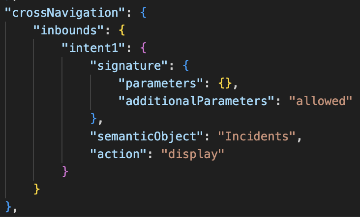

# Prepare for Deployment in the SAP BTP, Cloud Foundry Runtime

In this section, you will be preparing the Incident Management application to work with the SAP Build Work Zone local entry point approach.

## Create the CDM configuration

1. Create a **workzone** folder on the root of the project. Then, create a file named **cdm.json** and paste the following:
 
    > Ensure that the `appId` matches `app/incidents/manifest.json` → `sap.app.id`. Update the `appId` below with the value from your application.
    >
    > Ensure that the `vizId` matches the inbound name under `sap.app.crossNavigation.inbounds` in `app/incidents/manifest.json`. For example:
    > ```json
    > "crossNavigation": {
    >   "inbounds": {
    >     "intent1": {
    >       "semanticObject": "incidents",
    >       "action": "display"
    >     }
    >   }
    > }
    > ```
    > In this example, `vizId` is `intent1`.

      


```json
  [
    {
      "_version": "3.0",
      "identification": {
        "id": "Incidents_LEP",
        "title": "{{title}}",
        "entityType": "role"
      },
      "payload": {
        "catalogs": [
          {
            "id": "lepCatalog"
          }
        ],
        "spaces": [
          {
            "id": "lepSpace"
          }
        ],
        "apps": [
          {
            "id": "ns.incidents"
          }
        ]
      },
      "texts": [
        {
          "locale": "en",
          "textDictionary": {
            "title": "LEP Role"
          }
        },
        {
          "locale": "",
          "textDictionary": {
            "title": "LEP Role"
          }
        }
      ]
    },
    {
      "_version": "3.0",
      "identification": {
        "id": "lepCatalog",
        "title": "{{title}}",
        "entityType": "catalog"
      },
      "payload": {
        "viz": [
          {
            "appId": "ns.incidents",
            "vizId": "intent1"
          }
        ]
      },
      "texts": [
        {
          "locale": "en",
          "textDictionary": {
            "title": "LEP Catalog"
          }
        },
        {
          "locale": "",
          "textDictionary": {
            "title": "LEP Catalog"
          }
        }
      ]
    },
    {
      "_version": "3.1.0",
      "identification": {
        "id": "lepSpace",
        "title": "{{title}}",
        "description": "{{description}}",
        "entityType": "space"
      },
      "payload": {
        "contentNodes": [
          {
            "type": "workpage",
            "id": "lepWorkpage"
          }
        ]
      },
      "texts": [
        {
          "locale": "en",
          "textDictionary": {
            "title": "LEP Space",
            "description": "LEP Space"
          }
        },
        {
          "locale": "",
          "textDictionary": {
            "title": "LEP Space",
            "description": "LEP Space"
          }
        }
      ]
    },
    {
      "_version": "3.2.0",
      "identification": {
        "id": "lepWorkpage",
        "entityType": "workpage",
        "title": "{{title}}",
        "description": "{{description}}"
      },
      "payload": {
        "workpageConfig": {
          "title": "{{title}}"
        },
        "rows": [
          {
            "id": "row-1",
            "rowConfig": {},
            "columns": [
              {
                "id": "col-11",
                "columnConfig": {
                  "columnWidth": 8
                },
                "cells": [
                  {
                    "id": "cell-111",
                    "cellConfig": {},
                    "widgets": [
                      {
                        "id": "widg-1111",
                        "viz": {
                          "appId": "ns.incidents",
                          "vizId": "intent1"
                        }
                      }
                    ]
                  }
                ]
              }
            ]
          }
        ]
      },
      "texts": [
        {
          "locale": "en",
          "textDictionary": {
            "title": "LEP Workpage (New Experience)",
            "description": "LEP Workpage (New Experience)"
          }
        },
        {
          "locale": "",
          "textDictionary": {
            "title": "LEP Workpage (New Experience)",
            "description": "LEP Workpage (New Experience)"
          }
        }
      ]
    },
    {
      "_version": "3.2.0",
      "identification": {
        "id": "lepSite",
        "entityType": "site"
      },
      "payload": {
        "siteConfig": {
          "title": "SAP Fiori launchpad site on Cloud Foundry",
          "alias": "lepSite",
          "displaySettings": {
            "launchpadViewMode": "SpacesAndWorkPages"
          },
          "userCapabilities": {
            "supportedLanguages": [
              "en"
            ]
          },
          "browserSettings": {
            "asynchronousModuleLoading": true
          }
        }
      }
    }
  ]
```


## Update the MTA File With Multitenancy Configuration 

To deploy a multitenant application and access it in the subscriber subaccount through SAP Build Work Zone, you have to update the MTA configuration for design time and runtime. 
In the `mta.yaml` file, update the following configurations:

1. Add dependencies to the MTX sidecar module. To get the reuse dependent services, add the following services to the `requires` section:
  
    ```yaml
    - name: incident-management-mtx
        ...
        requires:
          - name: incidents-registry
          - name: app-api
            properties:
              SUBSCRIPTION_URL: ~{app-protocol}://\${tenant_subdomain}-~{app-uri}
          - name: incidents-db
          - name: incidents-html5-runtime
          - name: incidents-auth
          - name: <repo-host-name> # Add
          - name: incidents-build-workzone-service # Add
    ```

- Replace `<repo-host-name>` with the `html5-repo-host` resource name in your `mta.yaml`. Check under **resources** — for example:

    ```yaml
    - name: incident-management-html5-repo-host
        type: org.cloudfoundry.managed-service
        parameters:
          service: html5-apps-repo
          service-plan: app-host
    ```

2. Add `incidents-build-workzone-service` under `resources`:

    ```yaml
    resources:
    ...
    - name: incidents-build-workzone-service
      parameters:
        config:
          providerId: ${org}-${space}
          exposureId: <exposureId>
        service-plan: local-entry-point
        service: build-workzone-standard
      type: org.cloudfoundry.managed-service
    ```

- Replace `<exposureId>` with the `sap.cloud.service` value from `app/incidents/webapp/manifest.json` (for example, `incidents.service`).
   
3. Under `incidents` approuter module, add **OWN_SAP_CLOUD_SERVICE**, **COOKIE_BACKWARD_COMPATIBILITY** under `properties` section and the workzone service under the `requires` section.
   
    ```yaml
    - name: incidents
      ...
      properties:
        TENANT_HOST_PATTERN: "^(.*)-${default-uri}"
        OWN_SAP_CLOUD_SERVICE: ["incidentsservice"] # Add
        COOKIE_BACKWARD_COMPATIBILITY: true # Add
      requires:
        - name: incidents-build-workzone-service # Add
    ```

    -  **OWN_SAP_CLOUD_SERVICE** is derived from `app/incidents/webapp/manifest.json → sap.cloud.service` with all dots removed. For example, `incidents.service` becomes `incidentsservice`.
  
4. Update the `incidents-app-deployer` module:

    1. In the `requires` section, add the following dependencies:
        
        ```yaml
        requires:
        ...
          - name: incidents-build-workzone-service
        ```

    2. Change the `path` from `gen` to `app`.

    3. Change the `build-result` and `target-path` from `app/` to `resources`.

         The application deployer will look like this: 

          ```yaml
          - name: incidents-app-deployer
            type: com.sap.application.content
            path: app
            requires:
              - name: incidents-build-workzone-service
              - name: incidents-html5-repo-host
                parameters:
                  content-target: true
            build-parameters:
              build-result: resources
              requires:
                - name: incidentsincidents
                  artifacts:
                    - incidents.zip
                  target-path: resources

          ```
        - **The names may differ based on your project configuration. Verify the artifact name against the generated `mta.yaml`.**

5. Update the `build-parameters`:

      ```yaml
      build-parameters:
        before-all:
          - builder: custom
            commands:
              - npm ci
              - mkdir -p app/resources
              - cp workzone/cdm.json app/resources/cdm.json
              - npx cds build --production
      ```

6. Open `package.json` and remove the workspace entry if it exists:
    ```json
    "workspaces": [ "app/*" ]
    ```
   > Workspaces cause `mbt build` to fail for LEP because the app directory is handled separately via the build commands above.
7. Update the `mta.yaml` by removing the auto-generated role collections:
    ```yaml
    ...
    role-collections:
      - name: 'support (incident-management ${org}-${space})'
        description: 'generated'
        role-template-references:
          - '$XSAPPNAME.support'
      - name: 'admin (incident-management ${org}-${space})'
        description: 'generated'
        role-template-references:
          - '$XSAPPNAME.admin'
    ...
   ```

> **Note:** The name of the **Role collection** and **CDM identification id** must be the same — this 1:1 relationship ensures that the application tiles described in `cdm.json` are visible in the subscriber subaccount.

8. Under the `incidents` approuter module, add:
  ```yaml
    parameters:
      host: incidents-router
  ```
  > This shortens the approuter URL to `incidents-router.cfapps.<region>.hana.ondemand.com`. It is required because the full auto-generated URL often exceeds 63 characters.

## Next Step

[Deploy in the SAP BTP, Cloud Foundry Runtime](./4-deploy-to-cf.md)