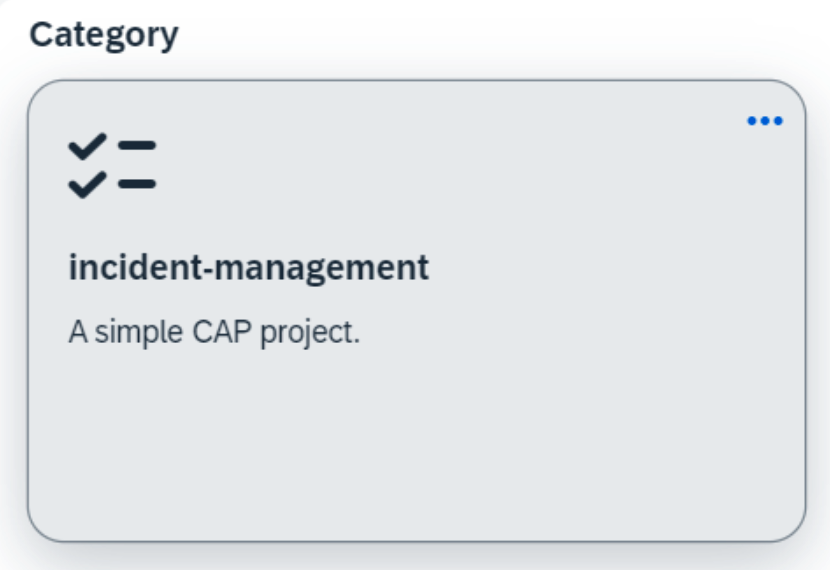
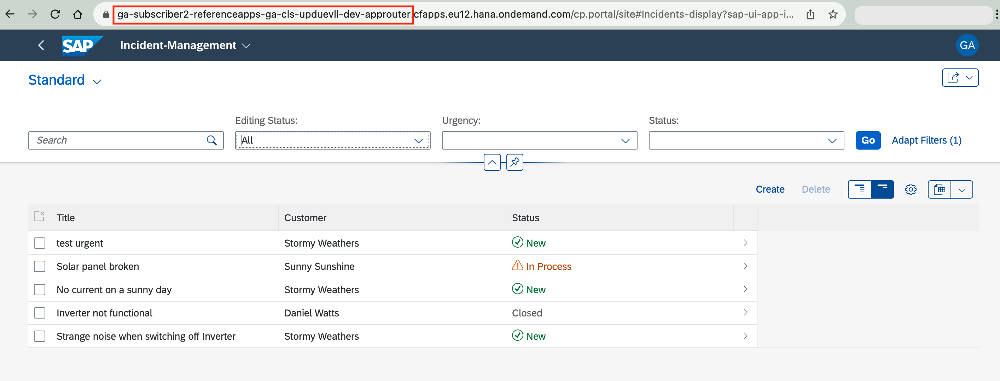
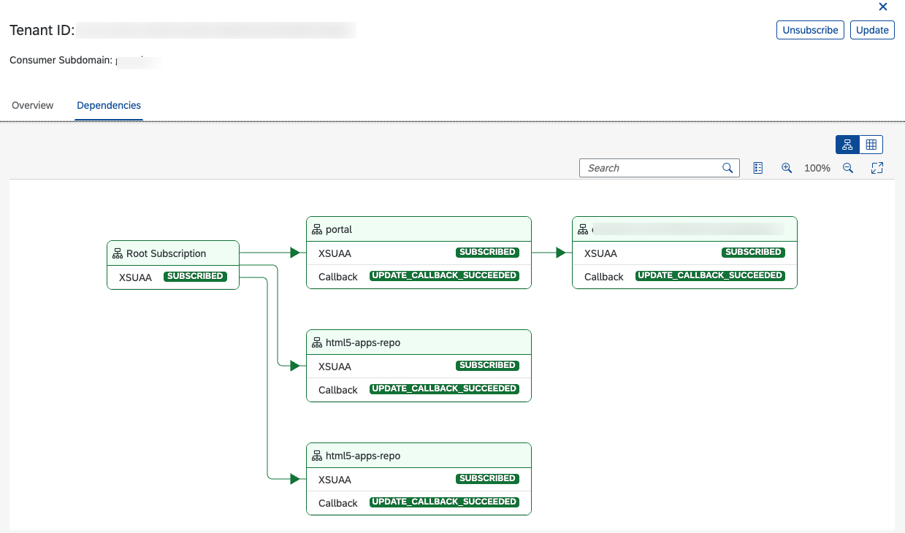

# Subscribe to the Multitenant Application

This guide will walk you through the lifecycle management of a multitenant application.

- The subscription must be done the same region where the multitenant application is deployed. 
  Example: If the application is deployed in `eu12`, it can be subscribed only from subaccounts that are part of the `eu12` region.

## Subscribe to the Application
1. Create a subaccount in the same region where the multitenant application is deployed.
2. Go to **Service Marketplace** inside the subaccount.
3. Find the `Incident Management` application.

   

4. Choose the **Incident Management** tile and then choose **Create** on the right side of the screen. The subscription process starts. 
6. Once the subscription process has been finished, choose **Go to Application**.

> This step will give an error message:  `404 Not Found: Requested route ('*-approuter.cfapps.eu12.hana.ondemand.com') does not exist.`.
This happens as there is no application deployed with the above route. You need to map the route to the `approuter` in the provider subaccount where the application is deployed. 
>
> To create tenant-specific routes, see [Create Tenant-Specific Route in Cloud Foundry](./operate/cf-route.md).

## Assigning Roles to User

Before accessing the application, you must assign the `Incidents_LEP` role to the user:

1. Open the subscriber subaccout. 
2. Choose **Security** > **Role Collections**.
3. Assign the `Incidents_LEP` Role Collection to the user.
Now, you can open the application URL and access the application. 

## Managing Subscriptions

The subscriptions can be viewed, updated or unsubscribed in the Subscription Manager Dashboard. This dashboard enables you to manage the lifecycle of a tenant in one central place. For more details, see [Using the Subscription Management Dashboard ](https://help.sap.com/docs/btp/sap-business-technology-platform/using-subscription-management-dashboard?locale=en-US).

1. Open the provider subaccount where the application is deployed.
2. Assign the `Subscription Management Dashboard Administrator` role to your user.
3. Open **Instance and Subscriptions**.
4. Choose the **SaaS Provisioning service** name or **incidents-registry**. It will open the **SAP BTP Subscription Management Dashboard**.
6. You can see the list of subscribed tenants. Choosing it will open more details to the right side.
7. Choose the **Dependencies** tab on the right. This will show the list of dependent/reuse service that is part of this application.

   

  
