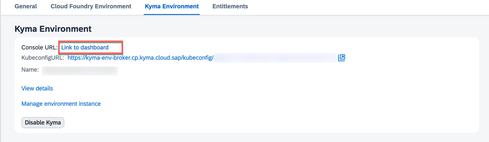
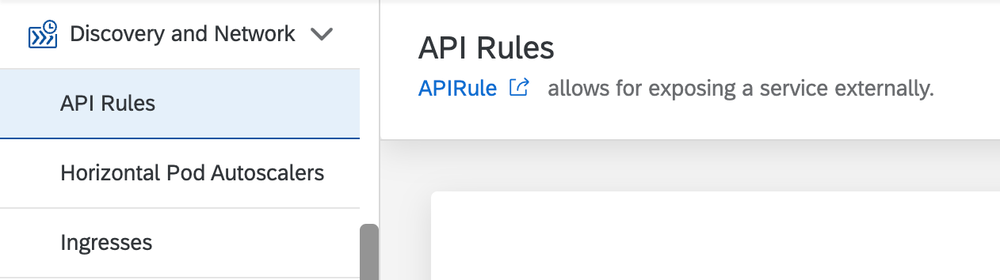

# Create Tenant Specific API Rules in Kyma

Once you subscribe the application and launch it, you get the `404 Not Found` error. This is because there is no application with this route deployed. Now, you need to create an API rule in Kyma for the web application (approuter).

1. In the SAP BTP cockpit, navigate to the provider subaccount. Provider Subaccount is the place where the multitenant applications is deployed.

2. Open the Kyma dashboard from the Kyma environment section.

    

3. Choose the correct namespace where the application is deployed and navigate to `API Rules` in the `Discovery and Network` section.

    

4. Create a new API  rule with the following details

| Property        | Value       |
| ------------- |:-------------:|
| Name          | (Fill the subscriber account name or subdomain) |
| Service Name  | incidents-approuter |
| Port          | 8080   |
| Namespace     | kyma-system |
| Name          | kyma-gateway |
| Host          | (copy the application url resulted in 404 error above) |
| Methods       | `GET` `POST` `PUT` `DELETE` `PATCH` `HEAD` | 

5. Choose **Create**.

You're ready to run the application.

# Next Steps

Continue to [Assigning Roles to User](./subscribe-to-multitenant-app.md#assigning-roles-to-user).