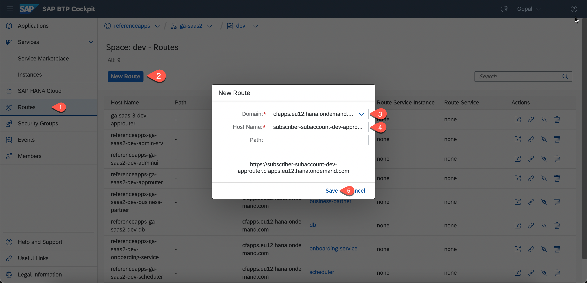

# Create Tenant-Specific Route in Cloud Foundry

Once you create the application and try to launch it, you get the following error `404 Not Found`

This error occurs because there is no application with this route deployed. Now, you need to create a route for this subaccount and target it to the approuter. 

The approuter will then route the traffic to the application using the tenant host pattern. See the [SaaS Application Registration in Cloud Foundry](https://www.npmjs.com/package/@sap/approuter#saas-application-registration-in-cloud-foundry).

You can create the route automatically or with Cloud Foundry APIs during onboarding, or manually using the Cloud Foundry command-line interface(cf CLI).

### Option 1: Using SAP BTP Cockpit
1. In the SAP BTP cockpit, navigate to the provider subaccount. Provider Subaccount is the place where the multitenant applications is deployed.
2. Choose Cloud Foundry &rarr; Spaces, and then choose the space where the Incident Management application is deployed.
3. Choose **Routes**, and then choose **New Route**.
4. Select the domain from the dropdown menu.
5. Enter your subaccount-specific route.
      
6. Choose **Save**.
7. From the routes list, select the route you created.
8. Choose **Actions** &rarr; **Map Route**.
9. From the **Application** dropdown menu, select `Incidents-approuter`. Choose **Save**.

You're ready to run the application.

### Option 2: Using Cf CLI
You can create the route using the cf CLI. Change the hostname and the application name depending on the host and domain of your deployed application.

1. Log in to cf CLI and navigate to your provider's Cloud Foundry space where the Incident Management application is deployed.
2. Run the following command:
   ```sh
    cf map-route approuter cfapps.eu12.hana.ondemand.com --hostname  ga-subscriber2-referenceapps-ga-cls-upduevll-dev-approuter
   ```

### Details
-  `approuter` is the name of the approuter application
- `cfapps.eu12.hana.ondemand.com` is the domain of the approuter application
- `--hostname` is the hostname obtained after subscribing to the approuter


### Option 3: Using Cloud Foundry APIs
Another option to create the route is to use the Cloud Foundry APIs during onboarding automatically. Different API calls can be used to create the route and map it to the approuter. See the [API Reference.](https://v3-apidocs.cloudfoundry.org/version/3.117.0/index.html#the-service-route-binding-object)


   
## Next Steps

Continue [Assigning Roles to User](../operate/subscribe-to-multitenant-app.md#assigning-roles-to-user).
  