## Integrate Your Application with SAP Build Work Zone, Standard Edition

In this tutorial, you learn how to subscribe to SAP Build Work Zone, standard edition, how to assign the SAP Build Work Zone, standard edition role collection to your user, and how to integrate your application with SAP Build Work Zone, standard edition.

## Prerequisites

- You've created a role collection and assigned it to a user. Follow the steps in the [Assign the User Roles](user-role-assignment) tutorial that is part of the [Deploy a Full-Stack CAP Application in SAP BTP, Cloud Foundry Runtime Following SAP BTP Developer’s Guide](https://developers.sap.com/group.deploy-full-stack-cap-application.html) tutorial group.
- You have an [enterprise global account](https://help.sap.com/docs/btp/sap-business-technology-platform/getting-global-account#loiod61c2819034b48e68145c45c36acba6e) in SAP BTP. To use services for free, you can sign up for an SAP BTPEA (SAP BTP Enterprise Agreement) or a Pay-As-You-Go for SAP BTP global account and use the free tier services only. See [Using Free Service Plans](https://help.sap.com/docs/btp/sap-business-technology-platform/using-free-service-plans?version=Cloud).
- You have a platform user. See [User and Member Management](https://help.sap.com/docs/btp/sap-business-technology-platform/user-and-member-management).
- You're an administrator of the global account in SAP BTP.
- You have a subaccount in SAP BTP to deploy the services and applications.
- You have a tenant of SAP Cloud Identity Services. See [Get Your Tenant](https://help.sap.com/docs/cloud-identity-services/cloud-identity-services/get-your-tenant) for details how to get a tenant of SAP Cloud Identity Services if you don't have one yet.
- You've established trust between your tenant of SAP Cloud Identity Services and your SAP BTP account. This established trust allows you to use your SAP Cloud Identity Services tenant as an identity provider or a proxy to your own identity provider hosting your business users. See [Establish Trust and Federation Between SAP Authorization and Trust Management Service and SAP Cloud Identity Services](https://help.sap.com/docs/btp/sap-business-technology-platform/establish-trust-and-federation-between-uaa-and-identity-authentication).
- You have one of the following browsers that are supported for working in SAP Business Application Studio:
    - Mozilla Firefox
    - Google Chrome
    - Microsoft Edge

> This tutorial follows the guidance provided in the [SAP BTP Developer's Guide](https://help.sap.com/docs/btp/btp-developers-guide/what-is-btp-developers-guide).

### Subscribe to SAP Build Work Zone, standard edition

1. Navigate to your subaccount and choose **Services** &rarr; **Service Marketplace** on the left.

2. Search for the **SAP Build Work Zone, standard edition** tile and choose **Create**.

    <!-- border; size:540px -->
    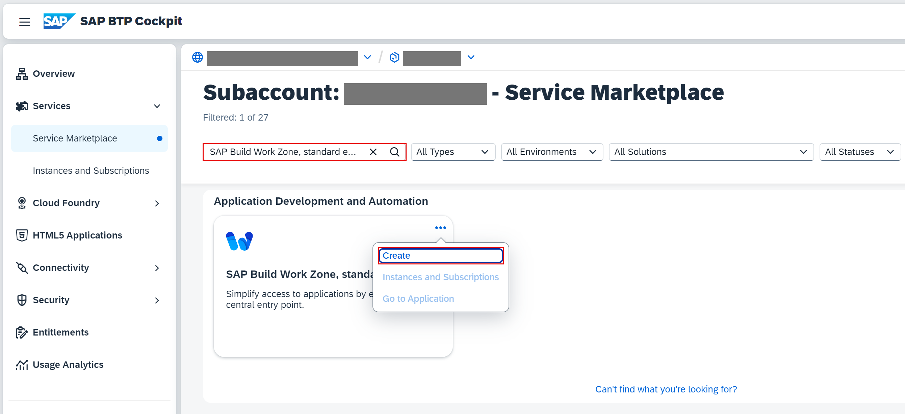

3. Keep the default setting for **Service** and choose **free** for **Plan**.

4. Choose **Create**.

    <!-- border; size:540px -->
    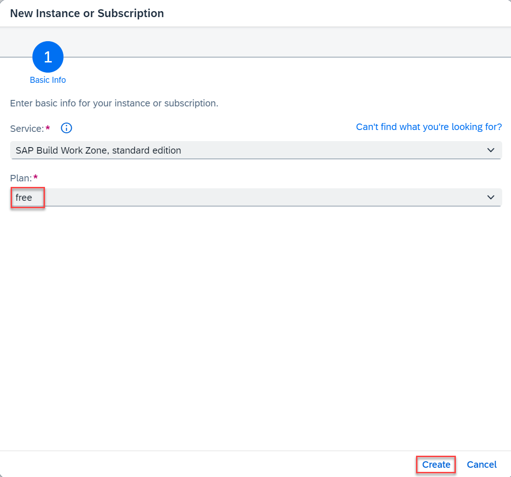

You have now subscribed to the SAP Build Work Zone, standard edition.

### Assign SAP Build Work Zone, standard edition role collection

You need to assign your user to the **Launchpad_Admin** role collection, so you don't get an error accessing the **SAP Build Work Zone, standard edition** site later on.

1. Choose **Security** &rarr; **Users** on the left.

2. Choose your user.

3. Under **Role Collections** on the right, choose **Assign Role Collection** and assign the **Launchpad_Admin** role collection to your user.

    <!-- border; size:540px -->
    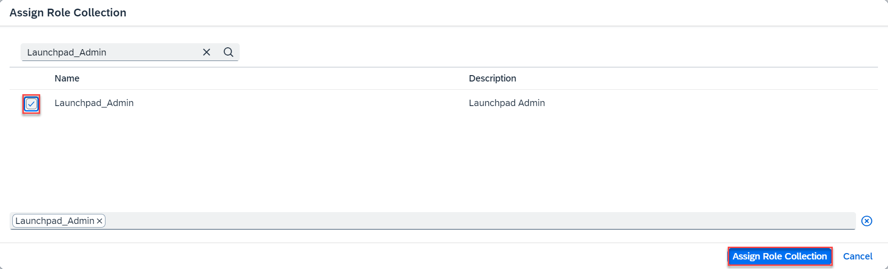

    You've assigned the **Launchpad_Admin** role collection to your user.

> Log out and log back in to make sure your new role collection is considered.

> See section [Initial Setup](https://help.sap.com/viewer/8c8e1958338140699bd4811b37b82ece/Cloud/en-US/fd79b232967545569d1ae4d8f691016b.html) in the SAP Build Work Zone, standard edition's documentation for more details.
   
###  Integrate your application with SAP Build Work Zone, standard edition

#### Update content

1. Open your subaccount and navigate to **Instances and Subscriptions**.

2. Choose the application **SAP Build Work Zone, standard edition**.

    <!-- border; size:540px -->
    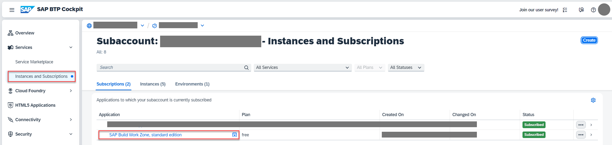

3. In the menu on the left side, choose the icon for **Channel Manager**.

4. Fetch the updated content.

    <!-- border; size:540px -->
    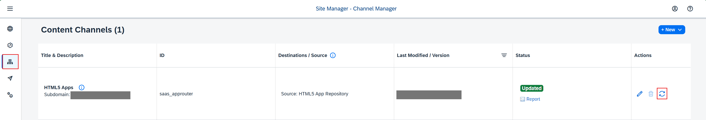

    > [!IMPORTANT]
    > **HTML5 Apps shows "No data" after refresh:** This happens when the `incident-management-html5-repository` destination is at `instance` level instead of `subaccount` level in `mta.yaml`. Work Zone's Channel Manager only reads subaccount-level destinations. See the fix in the [Add configuration for SAP Build Work Zone, standard edition](https://developers.sap.com/tutorials/prep-for-prod.html#add-configuration-for-sap-build-work-zone-standard-edition) step of the Prepare for Production tutorial.

#### Add application to Content Explorer

1. Choose **Content Manager** in the menu on the left and choose **Content Explorer**.

    <!-- border; size:540px -->
    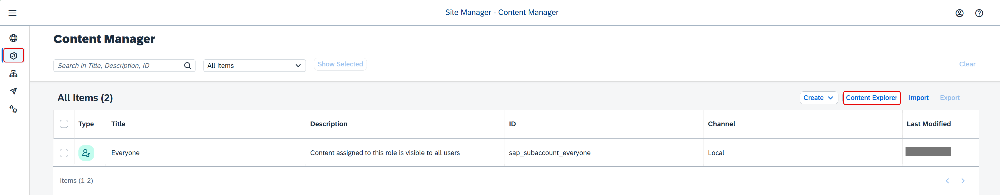

2. Select the tile **HTML5 Apps** with your respective subdomain name.

    <!-- border; size:540px -->
    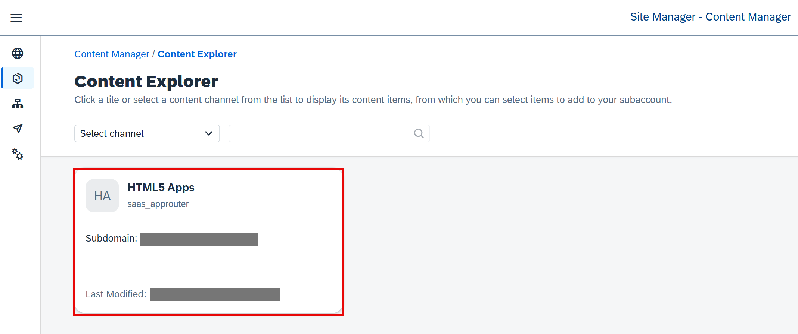

3. In the items table, select the checkbox for **incident-management** app and choose **Add**.

    <!-- border; size:540px -->
    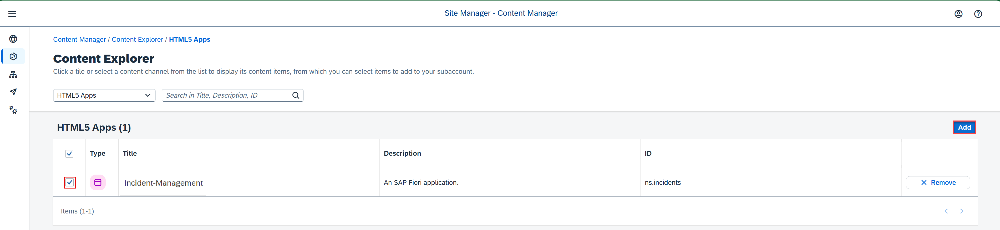

#### Create a group

1. Go back to the **Content Manager** and choose **Create** &rarr; **Group**.

    <!-- border; size:540px -->
    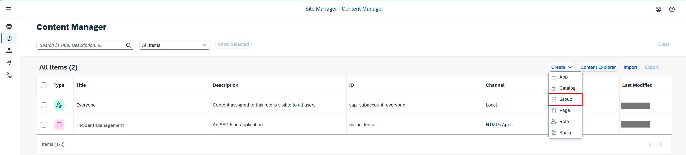

2. In the **Group title** field, enter **Incident Management Group**.

3. Assign the **Incident-Management** app to the group.

4. Choose **Save**.

    <!-- border; size:540px -->
    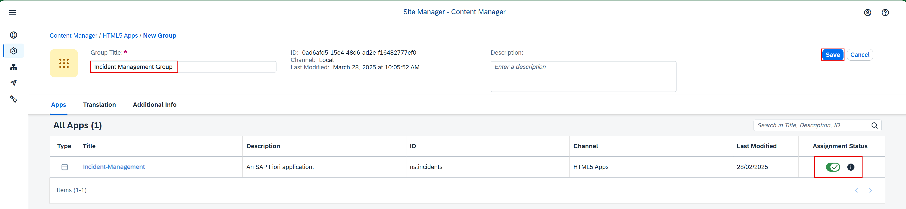

#### Add application to the Everyone role

1. Back in the **Content Manager**, choose the **Everyone** role and choose **Edit**.

2. In the **Assignment Status**, assign the **Incident-Management** app to the role.

3. Choose **Save**.

    <!-- border; size:540px -->
    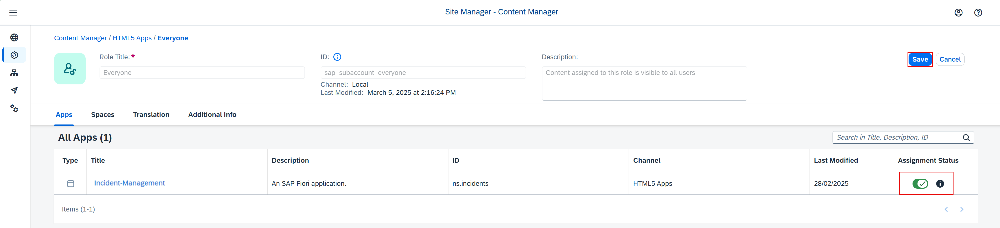

#### Create site

1. Navigate to **Site Directory** and choose **Create Site**.

    <!-- border; size:540px -->
    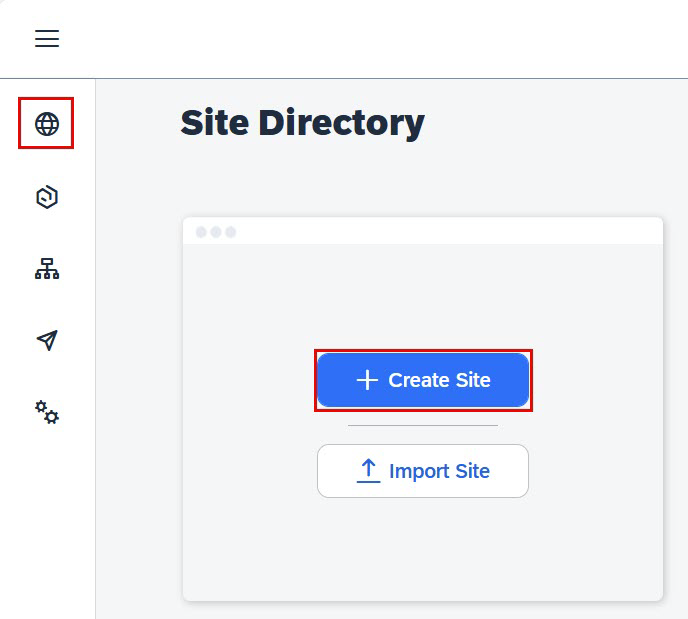

2. In the **Site Name** field, enter **Incident Management Site** and choose **Create**.

    <!-- border; size:540px -->
    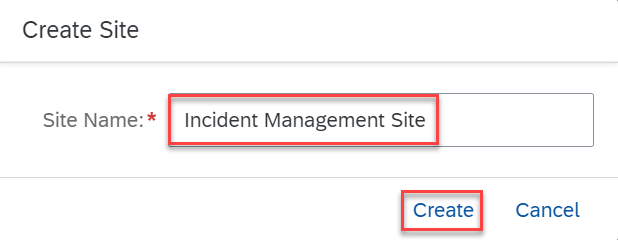

3. Now, you're forwarded to your created site.

### Test your site

1. Navigate to **Site Directory** and find your site.

    <!-- border; size:540px -->
    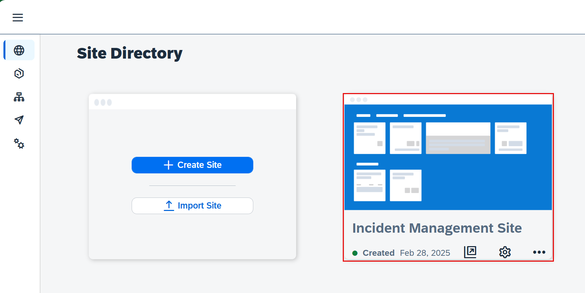

2. Choose **Go to the site**.

    <!-- border; size:540px -->
    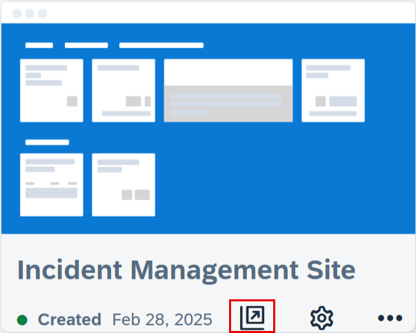

3. Choose the Incident Management application from the launch page. 

    <!-- border; size:540px -->
    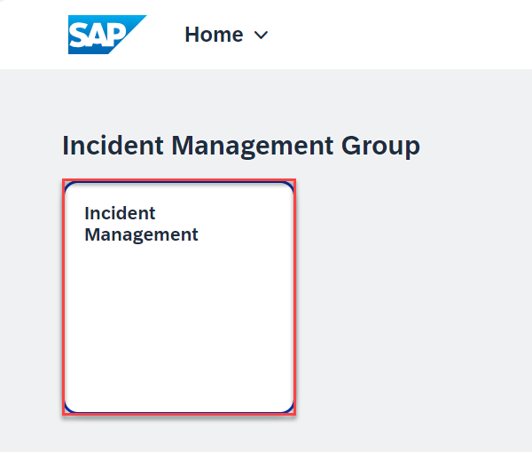

    You see the list report page.

### Summary

Congratulations! You have finished the development of your application and you've integrated SAP Build Work Zone, standard edition to have one central entry point to show all of your SAP BTP applications.
