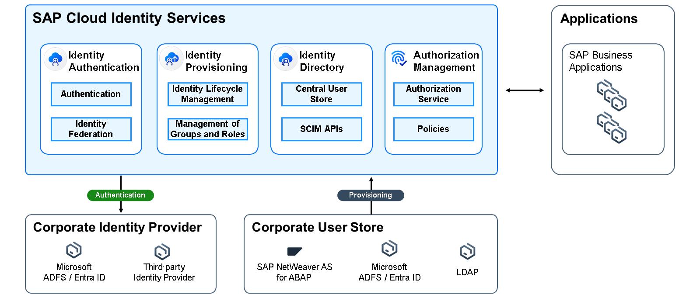

# Introduction
SAP Cloud Identity Services are a group of services of SAP Business Technology Platform (SAP BTP), which enable you to integrate identity and access management between systems. SAP Cloud Identity Services is the central solution for managing authentication, Single Sign-On (SSO), and the identity lifecycle. They improve system integration, provide a seamless user experience, and enhance security and compliance.

The SAP Cloud Identity Services consists of four services:

- [Identity Authentication](https://help.sap.com/docs/cloud-identity-services/cloud-identity-services/scenarios)
- [Identity Provisioning](https://help.sap.com/docs/identity-provisioning/identity-provisioning/bundle-tenants-and-connectors?version=Cloud#how-to-use-bundle-tenants)
- [Identity Directory](https://help.sap.com/docs/identity-provisioning/identity-provisioning/local-identity-directory?version=Cloud)
- [Authorization Management](https://help.sap.com/docs/cloud-identity-services/cloud-identity-services/configuring-authorization-policies?version=Cloud)

In this tutorial, we will focus on the Authorization Management Service (AMS) and how to integrate it with a CAP application deployed on SAP BTP Cloud Foundry runtime.
[Read more about SAP Cloud Identity Services](https://help.sap.com/docs/cloud-identity-services/cloud-identity-services/what-is-identity-authentication)

### Authorization Management Service(AMS) and CAP

The Authorization Management Service (AMS) as part of SAP Cloud Identity Services (SCI) provides libraries and services for developers of cloud business applications to declare, enforce and manage instance-based authorization checks. When used together with CAP the AMS "Policies” can contain the CAP roles as well as additional filter criteria, for instance, based authorizations that can be defined in the CAP model. transformed to AMS policies and later on refined by customers user and authorization administrators in the SCI administration console and assigned to business users.

### Use AMS as Authorization Management System on SAP BTP
For newly build applications the usage of AMS is generally recommended. The only constraint that comes with the usage of AMS is that customers need to copy their users to the Identity Directory Service as the central place to manage users for SAP BTP applications. This is also the general SAP strategy to simplify user management in the future.

### CDS-Based Authorization
Authorization means restricting access to data by adding respective declarations to CDS models, which are then enforced in service implementations. By adding such declarations, we essentially revoke all default access and then grant individual privileges.

[Read More about CDS-based Authorization](https://cap.cloud.sap/docs/guides/security/authorization#cds-based-authorization)

## Solution Diagram

<image src="./images/Solution-Diagram-ams.png" height="600" width="800"/>
