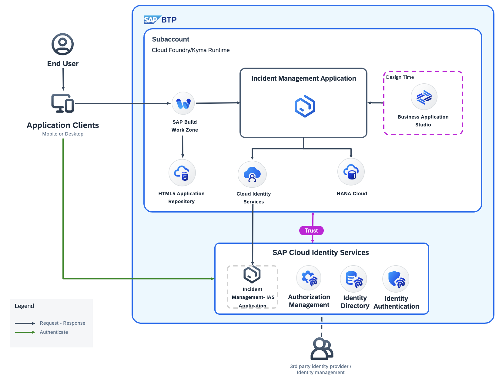

# Introduction

## About Authorization Management Service

The Authorization Management of SAP Cloud Identity Services provides libraries and services for developers of cloud business applications to declare, enforce and manage instance based authorization checks. Authorizations are declared as code-based "Policies" in the project of the cloud business application, assigned to users and enforced with client libraries for Node.js and Java.

## Solution Diagram

